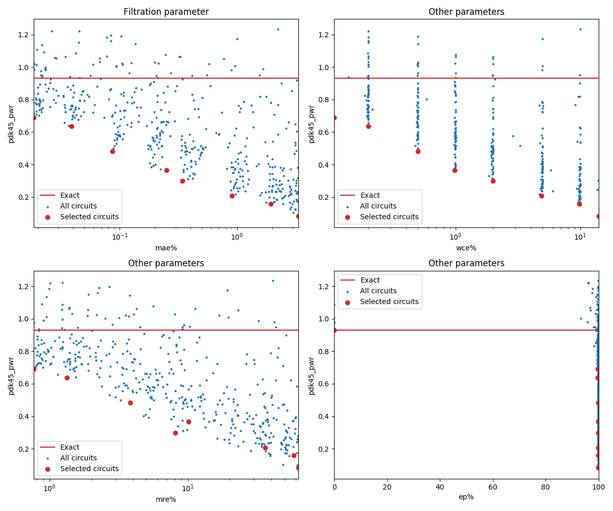

Selected circuits
===================
 - **Circuit**: 11-bit unsigned multiplier
 - **Selection criteria**: pareto optimal sub-set wrt. pwr and mae parameters

Parameters of selected circuits
----------------------------

| Circuit name | MAE% | WCE% | EP% | MRE% | MSE | Download |
| --- |  --- | --- | --- | --- | --- | --- | 
| mul11u_pwr_0_930_mae_00_0000 | 0.00 | 0.00 | 0.00 | 0.00 | 0 |  [[Veriloggeneric](mul11u_pwr_0_930_mae_00_0000_gen.v)]  [[C](mul11u_pwr_0_930_mae_00_0000.c)] |
| mul11u_pwr_0_707_mae_00_0195 | 0.019 | 0.098 | 99.71 | 0.80 | 10360.917e2 |  [[Veriloggeneric](mul11u_pwr_0_707_mae_00_0195_gen.v)]  [[C](mul11u_pwr_0_707_mae_00_0195.c)] |
| mul11u_pwr_0_657_mae_00_0337 | 0.034 | 0.20 | 99.84 | 1.15 | 31888.497e2 |  [[Veriloggeneric](mul11u_pwr_0_657_mae_00_0337_gen.v)]  [[C](mul11u_pwr_0_657_mae_00_0337.c)] |
| mul11u_pwr_0_517_mae_00_0903 | 0.09 | 0.47 | 99.87 | 3.00 | 22556.998e3 |  [[Veriloggeneric](mul11u_pwr_0_517_mae_00_0903_gen.v)]  [[C](mul11u_pwr_0_517_mae_00_0903.c)] |
| mul11u_pwr_0_410_mae_00_1801 | 0.18 | 0.99 | 99.88 | 4.96 | 89807.495e3 |  [[Veriloggeneric](mul11u_pwr_0_410_mae_00_1801_gen.v)]  [[C](mul11u_pwr_0_410_mae_00_1801.c)] |
| mul11u_pwr_0_311_mae_00_3835 | 0.38 | 1.99 | 99.89 | 9.18 | 40139.971e4 |  [[Veriloggeneric](mul11u_pwr_0_311_mae_00_3835_gen.v)]  [[C](mul11u_pwr_0_311_mae_00_3835.c)] |
| mul11u_pwr_0_236_mae_01_1764 | 1.18 | 6.03 | 99.90 | 19.95 | 37290.89e5 |  [[Veriloggeneric](mul11u_pwr_0_236_mae_01_1764_gen.v)]  [[C](mul11u_pwr_0_236_mae_01_1764.c)] |
    
Parameters
--------------

References
--------------
   - V. Mrazek, S. S. Sarwar, L. Sekanina, Z. Vasicek and K. Roy, "Design of power-efficient approximate multipliers for approximate artificial neural networks," 2016 IEEE/ACM International Conference on Computer-Aided Design (ICCAD), Austin, TX, 2016, pp. 1-7. doi: [10.1145/2966986.2967021](https://dx.doi.org/10.1145/2966986.2967021)

             