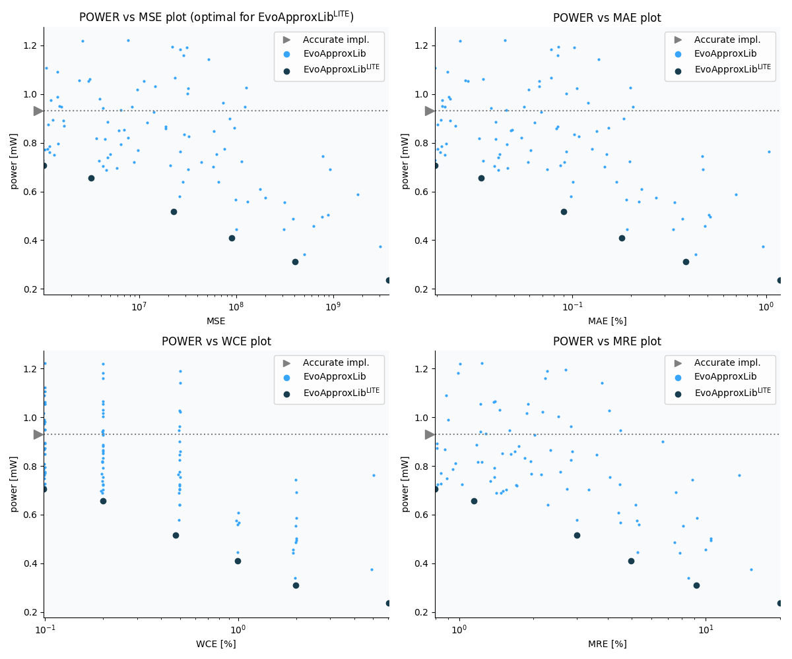

Selected circuits
===================
 - **Circuit**: 11-bit unsigned multiplier
 - **Selection criteria**: pareto optimal sub-set wrt. pwr and mse parameters
 - **References**: 
   - V. Mrazek, S. S. Sarwar, L. Sekanina, Z. Vasicek and K. Roy, "Design of power-efficient approximate multipliers for approximate artificial neural networks," 2016 IEEE/ACM International Conference on Computer-Aided Design (ICCAD), Austin, TX, 2016, pp. 1-7. doi: [10.1145/2966986.2967021](https://dx.doi.org/10.1145/2966986.2967021)

Parameters of selected circuits
----------------------------

| Circuit name | MAE | WCE | EP | MRE | MSE | Download |
| --- |  --- | --- | --- | --- | --- | --- | 
| mul11u_pwr_0_930_mse_00_0000 | 0.00 % | 0 % | 0.00 % | 0.00 % | 0 |  [[Veriloggeneric](mul11u_pwr_0_930_mse_00_0000_gen.v)] [[VerilogPDK45](mul11u_pwr_0_930_mse_00_0000_pdk45.v)]  [[C](mul11u_pwr_0_930_mse_00_0000.c)] |
| mul11u_pwr_0_707_mse_1036091_6684 | 0.019 % | 0.098 % | 99.71 % | 0.80 % | 1036092 |  [[Veriloggeneric](mul11u_pwr_0_707_mse_1036091_6684_gen.v)] [[VerilogPDK45](mul11u_pwr_0_707_mse_1036091_6684_pdk45.v)]  [[C](mul11u_pwr_0_707_mse_1036091_6684.c)] |
| mul11u_pwr_0_657_mse_3188849_7275 | 0.034 % | 0.2 % | 99.84 % | 1.15 % | 3188850 |  [[Veriloggeneric](mul11u_pwr_0_657_mse_3188849_7275_gen.v)] [[VerilogPDK45](mul11u_pwr_0_657_mse_3188849_7275_pdk45.v)]  [[C](mul11u_pwr_0_657_mse_3188849_7275.c)] |
| mul11u_pwr_0_517_mse_22556998_2624 | 0.09 % | 0.47 % | 99.87 % | 3.00 % | 22556998 |  [[Veriloggeneric](mul11u_pwr_0_517_mse_22556998_2624_gen.v)] [[VerilogPDK45](mul11u_pwr_0_517_mse_22556998_2624_pdk45.v)]  [[C](mul11u_pwr_0_517_mse_22556998_2624.c)] |
| mul11u_pwr_0_410_mse_89807495_0269 | 0.18 % | 0.99 % | 99.88 % | 4.96 % | 89807495 |  [[Veriloggeneric](mul11u_pwr_0_410_mse_89807495_0269_gen.v)] [[VerilogPDK45](mul11u_pwr_0_410_mse_89807495_0269_pdk45.v)]  [[C](mul11u_pwr_0_410_mse_89807495_0269.c)] |
| mul11u_pwr_0_311_mse_401399709_0391 | 0.38 % | 2. % | 99.89 % | 9.18 % | 401399709 |  [[Veriloggeneric](mul11u_pwr_0_311_mse_401399709_0391_gen.v)] [[VerilogPDK45](mul11u_pwr_0_311_mse_401399709_0391_pdk45.v)]  [[C](mul11u_pwr_0_311_mse_401399709_0391.c)] |
| mul11u_pwr_0_236_mse_3729088972_4880 | 1.18 % | 6. % | 99.90 % | 19.95 % | 3729088972 |  [[Veriloggeneric](mul11u_pwr_0_236_mse_3729088972_4880_gen.v)] [[VerilogPDK45](mul11u_pwr_0_236_mse_3729088972_4880_pdk45.v)]  [[C](mul11u_pwr_0_236_mse_3729088972_4880.c)] |
    
Parameters
--------------

             