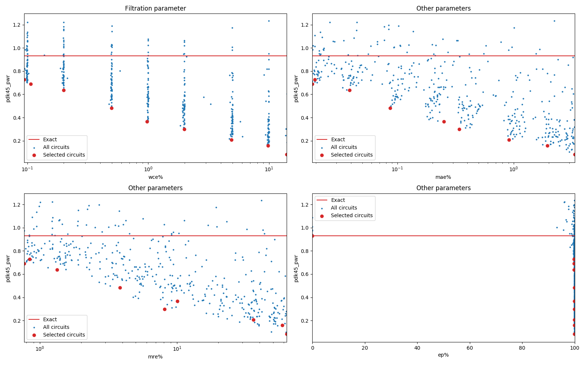

Selected circuits
===================
 - **Bitwidth**: 11
 - **Pareto filtration critera**: pwr - wce

Parameters of selected circuits
----------------------------

| Circuit name | MAE | WCE | EP | MRE | Download |
| --- |  --- | --- | --- | --- | --- | 
| mul11u_pwr_0_930_wce_00_0000 | 0.0 | 0 | 0.0 | 0.0 |  [Verilog generic](mul11u_pwr_0_930_wce_00_0000_gen.v) [Verilog PDK45](mul11u_pwr_0_930_wce_00_0000_pdk45.v)  [C](mul11u_pwr_0_930_wce_00_0000.c) |
| mul11u_pwr_0_728_wce_00_0942 | 817.31932 | 3953 | 99.7510433197 | 0.8411172367 |  [Verilog generic](mul11u_pwr_0_728_wce_00_0942_gen.v) [Verilog PDK45](mul11u_pwr_0_728_wce_00_0942_pdk45.v)  [C](mul11u_pwr_0_728_wce_00_0942.c) |
| mul11u_pwr_0_690_wce_00_1062 | 778.46827 | 4455 | 99.6997594833 | 0.7711579881 |  [Verilog generic](mul11u_pwr_0_690_wce_00_1062_gen.v) [Verilog PDK45](mul11u_pwr_0_690_wce_00_1062_pdk45.v)  [C](mul11u_pwr_0_690_wce_00_1062.c) |
| mul11u_pwr_0_637_wce_00_1989 | 1629.40986 | 8342 | 99.7320652008 | 1.3374605277 |  [Verilog generic](mul11u_pwr_0_637_wce_00_1989_gen.v) [Verilog PDK45](mul11u_pwr_0_637_wce_00_1989_pdk45.v)  [C](mul11u_pwr_0_637_wce_00_1989.c) |
| mul11u_pwr_0_483_wce_00_4973 | 3635.32145 | 20860 | 99.8380184174 | 3.8375181669 |  [Verilog generic](mul11u_pwr_0_483_wce_00_4973_gen.v) [Verilog PDK45](mul11u_pwr_0_483_wce_00_4973_pdk45.v)  [C](mul11u_pwr_0_483_wce_00_4973.c) |
| mul11u_pwr_0_367_wce_00_9789 | 10517.23153 | 41058 | 99.8795032501 | 10.0622115417 |  [Verilog generic](mul11u_pwr_0_367_wce_00_9789_gen.v) [Verilog PDK45](mul11u_pwr_0_367_wce_00_9789_pdk45.v)  [C](mul11u_pwr_0_367_wce_00_9789.c) |
| mul11u_pwr_0_300_wce_01_9887 | 14306.13117 | 83411 | 99.8944282532 | 8.0970764444 |  [Verilog generic](mul11u_pwr_0_300_wce_01_9887_gen.v) [Verilog PDK45](mul11u_pwr_0_300_wce_01_9887_pdk45.v)  [C](mul11u_pwr_0_300_wce_01_9887.c) |
| mul11u_pwr_0_208_wce_04_8792 | 38145.88022 | 204649 | 99.8986244202 | 36.0396990935 |  [Verilog generic](mul11u_pwr_0_208_wce_04_8792_gen.v) [Verilog PDK45](mul11u_pwr_0_208_wce_04_8792_pdk45.v)  [C](mul11u_pwr_0_208_wce_04_8792.c) |
| mul11u_pwr_0_159_wce_09_8461 | 81738.52399 | 412975 | 99.9011039734 | 58.2859280171 |  [Verilog generic](mul11u_pwr_0_159_wce_09_8461_gen.v) [Verilog PDK45](mul11u_pwr_0_159_wce_09_8461_pdk45.v)  [C](mul11u_pwr_0_159_wce_09_8461.c) |
| mul11u_pwr_0_084_wce_14_0323 | 140134.75906 | 588559 | 99.9018669128 | 62.9040345803 |  [Verilog generic](mul11u_pwr_0_084_wce_14_0323_gen.v) [Verilog PDK45](mul11u_pwr_0_084_wce_14_0323_pdk45.v)  [C](mul11u_pwr_0_084_wce_14_0323.c) |
    
Parameters
--------------

             