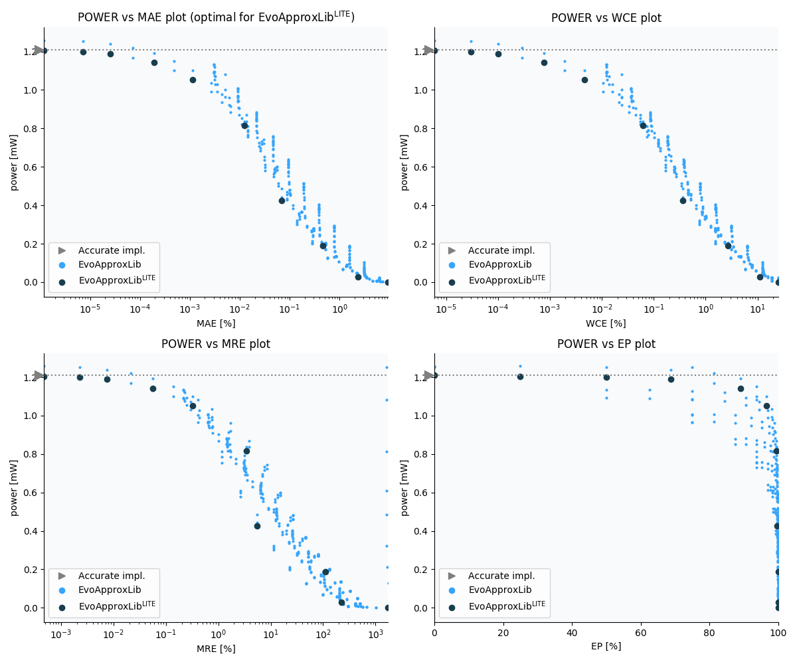

    Selected circuits
    ===================
     - **Bitwidth**: 12
     - **Pareto filtration critera**: pwr - mae
    
    
    Parameters of selected circuits
    ----------------------------
    
    | Circuit name | MAE | WCE | EP | MRE | Download |
    | --- |  --- | --- | --- | --- | --- | 
| mul12s_pwr_1_210_mae_00_0000 | 0.0 | 0 | 0.0 | 0.0 |  [Verilog generic](mul12s_pwr_1_210_mae_00_0000_gen.v) [Verilog PDK45](mul12s_pwr_1_210_mae_00_0000_pdk45.v)  [C](mul12s_pwr_1_210_mae_00_0000.c) |
| mul12s_pwr_1_205_mae_00_0000 | 0.2 | 1 | 25.0 | 0.0004718265 |  [Verilog generic](mul12s_pwr_1_205_mae_00_0000_gen.v) [Verilog PDK45](mul12s_pwr_1_205_mae_00_0000_pdk45.v)  [C](mul12s_pwr_1_205_mae_00_0000.c) |
| mul12s_pwr_1_200_mae_00_0000 | 1.2 | 5 | 50.0 | 0.0022855977 |  [Verilog generic](mul12s_pwr_1_200_mae_00_0000_gen.v) [Verilog PDK45](mul12s_pwr_1_200_mae_00_0000_pdk45.v)  [C](mul12s_pwr_1_200_mae_00_0000.c) |
| mul12s_pwr_1_189_mae_00_0000 | 4.2 | 17 | 68.75 | 0.007582707 |  [Verilog generic](mul12s_pwr_1_189_mae_00_0000_gen.v) [Verilog PDK45](mul12s_pwr_1_189_mae_00_0000_pdk45.v)  [C](mul12s_pwr_1_189_mae_00_0000.c) |
| mul12s_pwr_1_142_mae_00_0002 | 32.2 | 129 | 89.0625 | 0.0556570713 |  [Verilog generic](mul12s_pwr_1_142_mae_00_0002_gen.v) [Verilog PDK45](mul12s_pwr_1_142_mae_00_0002_pdk45.v)  [C](mul12s_pwr_1_142_mae_00_0002.c) |
| mul12s_pwr_1_053_mae_00_0011 | 192.2 | 769 | 96.484375 | 0.325317619 |  [Verilog generic](mul12s_pwr_1_053_mae_00_0011_gen.v) [Verilog PDK45](mul12s_pwr_1_053_mae_00_0011_pdk45.v)  [C](mul12s_pwr_1_053_mae_00_0011.c) |
| mul12s_pwr_0_816_mae_00_0126 | 2112.8 | 10241 | 99.4506835938 | 3.4353393274 |  [Verilog generic](mul12s_pwr_0_816_mae_00_0126_gen.v) [Verilog PDK45](mul12s_pwr_0_816_mae_00_0126_pdk45.v)  [C](mul12s_pwr_0_816_mae_00_0126.c) |
| mul12s_pwr_0_425_mae_00_0686 | 11508.91763 | 61215 | 99.5635986328 | 5.5615576664 |  [Verilog generic](mul12s_pwr_0_425_mae_00_0686_gen.v) [Verilog PDK45](mul12s_pwr_0_425_mae_00_0686_pdk45.v)  [C](mul12s_pwr_0_425_mae_00_0686.c) |
| mul12s_pwr_0_189_mae_00_4653 | 78064.4 | 454657 | 99.946975708 | 109.602037631 |  [Verilog generic](mul12s_pwr_0_189_mae_00_4653_gen.v) [Verilog PDK45](mul12s_pwr_0_189_mae_00_4653_pdk45.v)  [C](mul12s_pwr_0_189_mae_00_4653.c) |
| mul12s_pwr_0_029_mae_02_3161 | 388576.65207 | 1831935 | 99.9508857727 | 225.122032379 |  [Verilog generic](mul12s_pwr_0_029_mae_02_3161_gen.v) [Verilog PDK45](mul12s_pwr_0_029_mae_02_3161_pdk45.v)  [C](mul12s_pwr_0_029_mae_02_3161.c) |
| mul12s_pwr_0_000_mae_09_3719 | 1572351.9 | 4194303 | 99.951171875 | 1732.6494993 |  [Verilog generic](mul12s_pwr_0_000_mae_09_3719_gen.v) [Verilog PDK45](mul12s_pwr_0_000_mae_09_3719_pdk45.v)  [C](mul12s_pwr_0_000_mae_09_3719.c) |
    
    Parameters
    --------------
    
             