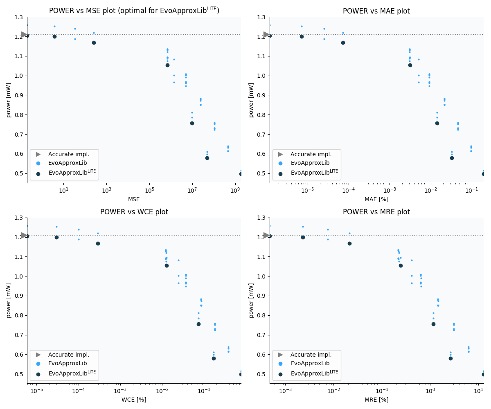

Selected circuits
===================
 - **Circuit**: 12-bit signed multiplier
 - **Selection criteria**: pareto optimal sub-set wrt. pwr and mse parameters

Parameters of selected circuits
----------------------------

| Circuit name | MAE% | WCE% | EP% | MRE% | MSE | Download |
| --- |  --- | --- | --- | --- | --- | --- | 
| mul12s_2PP | 0.00 | 0.00 | 0.00 | 0.00 | 0 |  [[Verilog](mul12s_2PP.v)] [[VerilogPDK45](mul12s_2PP_pdk45.v)] [[C](mul12s_2PP.c)] |
| mul12s_2PQ | 0.0000012 | 0.000006 | 25.00 | 0.00047 | 0.2 |  [[Verilog](mul12s_2PQ.v)] [[VerilogPDK45](mul12s_2PQ_pdk45.v)] [[C](mul12s_2PQ.c)] |
| mul12s_2PR | 0.0000072 | 0.00003 | 50.00 | 0.0023 | 3.8 |  [[Verilog](mul12s_2PR.v)] [[VerilogPDK45](mul12s_2PR_pdk45.v)] [[C](mul12s_2PR.c)] |
| mul12s_2PT | 0.000073 | 0.00029 | 81.25 | 0.021 | 248 |  [[Verilog](mul12s_2PT.v)] [[VerilogPDK45](mul12s_2PT_pdk45.v)] [[C](mul12s_2PT.c)] |
| mul12s_2QH | 0.0031 | 0.013 | 90.61 | 0.25 | 700070 |  [[Verilog](mul12s_2QH.v)] [[VerilogPDK45](mul12s_2QH_pdk45.v)] [[C](mul12s_2QH.c)] |
| mul12s_34M | 0.014 | 0.073 | 93.71 | 1.17 | 97867.163e2 |  [[Verilog](mul12s_34M.v)] [[VerilogPDK45](mul12s_34M_pdk45.v)] [[C](mul12s_34M.c)] |
| mul12s_34P | 0.032 | 0.17 | 98.39 | 2.64 | 48933.638e3 |  [[Verilog](mul12s_34P.v)] [[VerilogPDK45](mul12s_34P_pdk45.v)] [[C](mul12s_34P.c)] |
| mul12s_2TE | 0.19 | 0.77 | 98.41 | 12.72 | 18643.684e5 |  [[Verilog](mul12s_2TE.v)] [[VerilogPDK45](mul12s_2TE_pdk45.v)] [[C](mul12s_2TE.c)] |
    
Parameters
--------------

References
--------------
   - V. Mrazek, Z. Vasicek, L. Sekanina, H. Jiang and J. Han, "Scalable Construction of Approximate Multipliers With Formally Guaranteed Worst Case Error" in IEEE Transactions on Very Large Scale Integration (VLSI) Systems, vol. 26, no. 11, pp. 2572-2576, Nov. 2018. doi: [10.1109/TVLSI.2018.2856362](https://dx.doi.org/10.1109/TVLSI.2018.2856362)

             