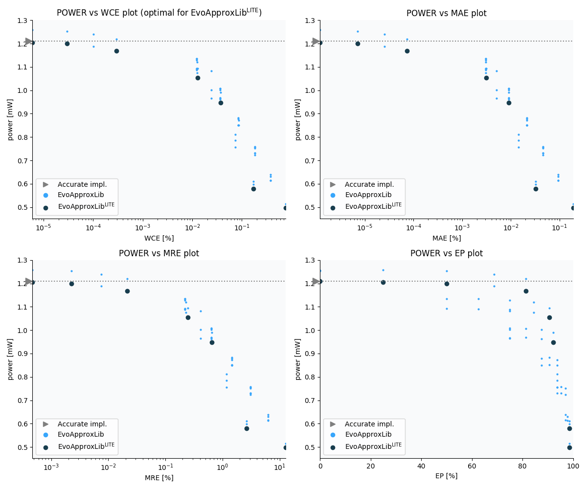

Selected circuits
===================
 - **Bitwidth**: 12
 - **Pareto filtration critera**: pwr - wce

Parameters of selected circuits
----------------------------

| Circuit name | MAE | WCE | EP | MRE | Download |
| --- |  --- | --- | --- | --- | --- | 
| mul12s_pwr_1_210_wce_00_0000 | 0.0 | 0 | 0.0 | 0.0 |  [Verilog generic](mul12s_pwr_1_210_wce_00_0000_gen.v) [Verilog PDK45](mul12s_pwr_1_210_wce_00_0000_pdk45.v)  [C](mul12s_pwr_1_210_wce_00_0000.c) |
| mul12s_pwr_1_205_wce_00_0000 | 0.2 | 1 | 25.0 | 0.0004718265 |  [Verilog generic](mul12s_pwr_1_205_wce_00_0000_gen.v) [Verilog PDK45](mul12s_pwr_1_205_wce_00_0000_pdk45.v)  [C](mul12s_pwr_1_205_wce_00_0000.c) |
| mul12s_pwr_1_200_wce_00_0000 | 1.2 | 5 | 50.0 | 0.0022855977 |  [Verilog generic](mul12s_pwr_1_200_wce_00_0000_gen.v) [Verilog PDK45](mul12s_pwr_1_200_wce_00_0000_pdk45.v)  [C](mul12s_pwr_1_200_wce_00_0000.c) |
| mul12s_pwr_1_189_wce_00_0001 | 4.2 | 17 | 68.75 | 0.007582707 |  [Verilog generic](mul12s_pwr_1_189_wce_00_0001_gen.v) [Verilog PDK45](mul12s_pwr_1_189_wce_00_0001_pdk45.v)  [C](mul12s_pwr_1_189_wce_00_0001.c) |
| mul12s_pwr_1_142_wce_00_0008 | 32.2 | 129 | 89.0625 | 0.0556570713 |  [Verilog generic](mul12s_pwr_1_142_wce_00_0008_gen.v) [Verilog PDK45](mul12s_pwr_1_142_wce_00_0008_pdk45.v)  [C](mul12s_pwr_1_142_wce_00_0008.c) |
| mul12s_pwr_1_053_wce_00_0046 | 192.2 | 769 | 96.484375 | 0.325317619 |  [Verilog generic](mul12s_pwr_1_053_wce_00_0046_gen.v) [Verilog PDK45](mul12s_pwr_1_053_wce_00_0046_pdk45.v)  [C](mul12s_pwr_1_053_wce_00_0046.c) |
| mul12s_pwr_0_869_wce_00_0443 | 1633.1 | 7425 | 98.4191894531 | 1.0153578942 |  [Verilog generic](mul12s_pwr_0_869_wce_00_0443_gen.v) [Verilog PDK45](mul12s_pwr_0_869_wce_00_0443_pdk45.v)  [C](mul12s_pwr_0_869_wce_00_0443.c) |
| mul12s_pwr_0_549_wce_00_2686 | 8025.8 | 45057 | 99.8443603516 | 12.0633950813 |  [Verilog generic](mul12s_pwr_0_549_wce_00_2686_gen.v) [Verilog PDK45](mul12s_pwr_0_549_wce_00_2686_pdk45.v)  [C](mul12s_pwr_0_549_wce_00_2686.c) |
| mul12s_pwr_0_200_wce_01_5144 | 47921.04906 | 254079 | 99.927520752 | 23.1513539381 |  [Verilog generic](mul12s_pwr_0_200_wce_01_5144_gen.v) [Verilog PDK45](mul12s_pwr_0_200_wce_01_5144_pdk45.v)  [C](mul12s_pwr_0_200_wce_01_5144.c) |
| mul12s_pwr_0_057_wce_09_3506 | 299701.0 | 1568769 | 99.9506473541 | 184.40494911 |  [Verilog generic](mul12s_pwr_0_057_wce_09_3506_gen.v) [Verilog PDK45](mul12s_pwr_0_057_wce_09_3506_pdk45.v)  [C](mul12s_pwr_0_057_wce_09_3506.c) |
| mul12s_pwr_0_000_wce_25_0000 | 1572351.9 | 4194303 | 99.951171875 | 1732.6494993 |  [Verilog generic](mul12s_pwr_0_000_wce_25_0000_gen.v) [Verilog PDK45](mul12s_pwr_0_000_wce_25_0000_pdk45.v)  [C](mul12s_pwr_0_000_wce_25_0000.c) |
    
Parameters
--------------

             