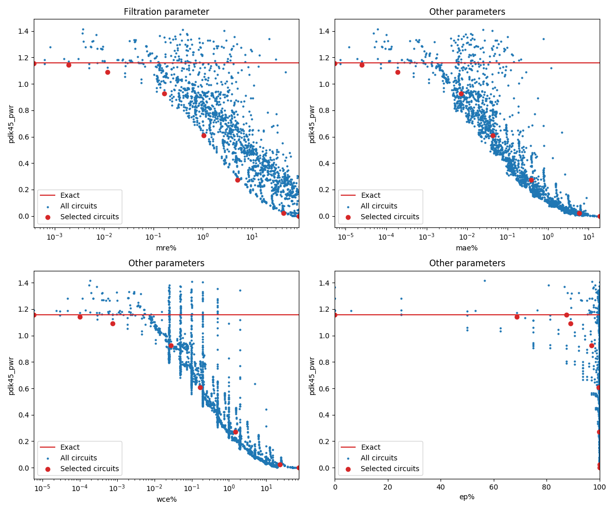

Selected circuits
===================
 - **Circuit**: 12-bit unsigned multiplier
 - **Selection criteria**: pareto optimal sub-set wrt. pwr and mre parameters

Parameters of selected circuits
----------------------------

| Circuit name | MAE% | WCE% | EP% | MRE% | MSE | Download |
| --- |  --- | --- | --- | --- | --- | --- | 
| mul12u_332 | 0.00 | 0.00 | 0.00 | 0.00 | 0 |  [[Verilog](mul12u_332.v)] [[VerilogPDK45](mul12u_332_pdk45.v)] [[C](mul12u_332.c)] |
| mul12u_22U | 0.0000054 | 0.000006 | 87.50 | 0.00038 | 0.9 |  [[Verilog](mul12u_22U.v)] [[VerilogPDK45](mul12u_22U_pdk45.v)] [[C](mul12u_22U.c)] |
| mul12u_2BS | 0.000025 | 0.0001 | 68.75 | 0.0019 | 34 |  [[Verilog](mul12u_2BS.v)] [[VerilogPDK45](mul12u_2BS_pdk45.v)] [[C](mul12u_2BS.c)] |
| mul12u_2BT | 0.000073 | 0.00029 | 81.25 | 0.005 | 248 |  [[Verilog](mul12u_2BT.v)] [[VerilogPDK45](mul12u_2BT_pdk45.v)] [[C](mul12u_2BT.c)] |
| mul12u_2BV | 0.00048 | 0.0019 | 93.75 | 0.026 | 9158 |  [[Verilog](mul12u_2BV.v)] [[VerilogPDK45](mul12u_2BV_pdk45.v)] [[C](mul12u_2BV.c)] |
| mul12u_2CJ | 0.0071 | 0.028 | 96.86 | 0.16 | 31611.022e2 |  [[Verilog](mul12u_2CJ.v)] [[VerilogPDK45](mul12u_2CJ_pdk45.v)] [[C](mul12u_2CJ.c)] |
| mul12u_2C1 | 0.031 | 0.12 | 99.68 | 0.87 | 32042.894e3 |  [[Verilog](mul12u_2C1.v)] [[VerilogPDK45](mul12u_2C1_pdk45.v)] [[C](mul12u_2C1.c)] |
| mul12u_2EF | 0.18 | 0.73 | 99.90 | 3.29 | 12148.233e5 |  [[Verilog](mul12u_2EF.v)] [[VerilogPDK45](mul12u_2EF_pdk45.v)] [[C](mul12u_2EF.c)] |
| mul12u_33H | 1.53 | 6.10 | 99.95 | 15.79 | 92062.713e6 |  [[Verilog](mul12u_33H.v)] [[VerilogPDK45](mul12u_33H_pdk45.v)] [[C](mul12u_33H.c)] |
| mul12u_34G | 18.74 | 74.95 | 99.95 | 87.98 | 15865.376e9 |  [[Verilog](mul12u_34G.v)]  [[C](mul12u_34G.c)] |
    
Parameters
--------------

References
--------------
   - V. Mrazek, Z. Vasicek, L. Sekanina, H. Jiang and J. Han, "Scalable Construction of Approximate Multipliers With Formally Guaranteed Worst Case Error" in IEEE Transactions on Very Large Scale Integration (VLSI) Systems, vol. 26, no. 11, pp. 2572-2576, Nov. 2018. doi: [10.1109/TVLSI.2018.2856362](https://dx.doi.org/10.1109/TVLSI.2018.2856362)
   - V. Mrazek, Z. Vasicek and R. Hrbacek, "Role of circuit representation in evolutionary design of energy-efficient approximate circuits" in IET Computers & Digital Techniques, vol. 12, no. 4, pp. 139-149, 7 2018. doi: [10.1049/iet-cdt.2017.0188](https://dx.doi.org/10.1049/iet-cdt.2017.0188)

             