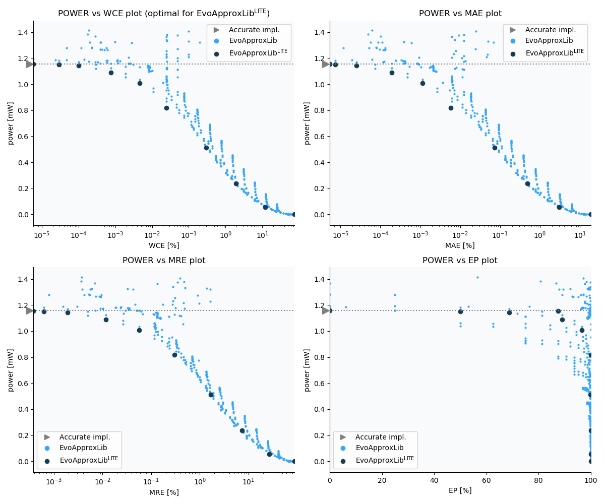

Selected circuits
===================
 - **Circuit**: 12-bit unsigned multiplier
 - **Selection criteria**: pareto optimal sub-set wrt. pwr and wce parameters
 - **References**: 
   - V. Mrazek, Z. Vasicek and R. Hrbacek, "Role of circuit representation in evolutionary design of energy-efficient approximate circuits" in IET Computers & Digital Techniques, vol. 12, no. 4, pp. 139-149, 7 2018. doi: [10.1049/iet-cdt.2017.0188](https://dx.doi.org/10.1049/iet-cdt.2017.0188)
   - V. Mrazek, Z. Vasicek, L. Sekanina, H. Jiang and J. Han, "Scalable Construction of Approximate Multipliers With Formally Guaranteed Worst Case Error" in IEEE Transactions on Very Large Scale Integration (VLSI) Systems, vol. 26, no. 11, pp. 2572-2576, Nov. 2018. doi: [10.1109/TVLSI.2018.2856362](https://dx.doi.org/10.1109/TVLSI.2018.2856362)
   - H. R. Mahdiani, A. Ahmadi, S. M. Fakhraie and C. Lucas, "Bio-Inspired Imprecise Computational Blocks for Efficient VLSI Implementation of Soft-Computing Applications" in IEEE Transactions on Circuits and Systems I: Regular Papers, vol. 57, no. 4, pp. 850-862, April 2010. doi: [10.1109/TCSI.2009.2027626](https://dx.doi.org/10.1109/TCSI.2009.2027626)

Parameters of selected circuits
----------------------------

| Circuit name | MAE% | WCE% | EP% | MRE% | MSE | Download |
| --- |  --- | --- | --- | --- | --- | --- | 
| mul12u_pwr_1_157_wce_00_0000 | 0.00 | 0 | 0.00 | 0.00 | 0 |  [[Veriloggeneric](mul12u_pwr_1_157_wce_00_0000_gen.v)] [[VerilogPDK45](mul12u_pwr_1_157_wce_00_0000_pdk45.v)]  [[C](mul12u_pwr_1_157_wce_00_0000.c)] |
| mul12u_pwr_1_156_wce_00_0000 | 0.0000054 | 0.000006 | 87.50 | 0.00038 | 0.9 |  [[Veriloggeneric](mul12u_pwr_1_156_wce_00_0000_gen.v)] [[VerilogPDK45](mul12u_pwr_1_156_wce_00_0000_pdk45.v)]  [[C](mul12u_pwr_1_156_wce_00_0000.c)] |
| mul12u_pwr_1_152_wce_00_0000 | 0.0000075 | 0.00003 | 50.00 | 0.00062 | 3.8 |  [[Veriloggeneric](mul12u_pwr_1_152_wce_00_0000_gen.v)] [[VerilogPDK45](mul12u_pwr_1_152_wce_00_0000_pdk45.v)]  [[C](mul12u_pwr_1_152_wce_00_0000.c)] |
| mul12u_pwr_1_142_wce_00_0001 | 0.000025 | 0.0001 | 68.75 | 0.0019 | 34 |  [[Veriloggeneric](mul12u_pwr_1_142_wce_00_0001_gen.v)] [[VerilogPDK45](mul12u_pwr_1_142_wce_00_0001_pdk45.v)]  [[C](mul12u_pwr_1_142_wce_00_0001.c)] |
| mul12u_pwr_1_090_wce_00_0008 | 0.00019 | 0.00077 | 89.06 | 0.012 | 1574 |  [[Veriloggeneric](mul12u_pwr_1_090_wce_00_0008_gen.v)] [[VerilogPDK45](mul12u_pwr_1_090_wce_00_0008_pdk45.v)]  [[C](mul12u_pwr_1_090_wce_00_0008.c)] |
| mul12u_pwr_1_009_wce_00_0046 | 0.0011 | 0.0046 | 96.48 | 0.057 | 50190 |  [[Veriloggeneric](mul12u_pwr_1_009_wce_00_0046_gen.v)] [[VerilogPDK45](mul12u_pwr_1_009_wce_00_0046_pdk45.v)]  [[C](mul12u_pwr_1_009_wce_00_0046.c)] |
| mul12u_pwr_0_817_wce_00_0249 | 0.0058 | 0.025 | 99.99 | 0.30 | 1461125 |  [[Veriloggeneric](mul12u_pwr_0_817_wce_00_0249_gen.v)] [[VerilogPDK45](mul12u_pwr_0_817_wce_00_0249_pdk45.v)]  [[C](mul12u_pwr_0_817_wce_00_0249.c)] |
| mul12u_pwr_0_511_wce_00_2930 | 0.073 | 0.29 | 99.84 | 1.67 | 183040910 |  [[Veriloggeneric](mul12u_pwr_0_511_wce_00_2930_gen.v)] [[VerilogPDK45](mul12u_pwr_0_511_wce_00_2930_pdk45.v)]  [[C](mul12u_pwr_0_511_wce_00_2930.c)] |
| mul12u_pwr_0_237_wce_01_9043 | 0.48 | 1.9 | 99.94 | 7.43 | 7807314830 |  [[Veriloggeneric](mul12u_pwr_0_237_wce_01_9043_gen.v)] [[VerilogPDK45](mul12u_pwr_0_237_wce_01_9043_pdk45.v)]  [[C](mul12u_pwr_0_237_wce_01_9043.c)] |
| mul12u_pwr_0_055_wce_12_0606 | 3.02 | 12 | 99.95 | 26.71 | 362199608206 |  [[Veriloggeneric](mul12u_pwr_0_055_wce_12_0606_gen.v)] [[VerilogPDK45](mul12u_pwr_0_055_wce_12_0606_pdk45.v)]  [[C](mul12u_pwr_0_055_wce_12_0606.c)] |
| mul12u_pwr_0_000_wce_74_9512 | 18.74 | 75 | 99.95 | 87.98 | 15865376115632 |  [[Veriloggeneric](mul12u_pwr_0_000_wce_74_9512_gen.v)] [[VerilogPDK45](mul12u_pwr_0_000_wce_74_9512_pdk45.v)]  [[C](mul12u_pwr_0_000_wce_74_9512.c)] |
    
Parameters
--------------

             