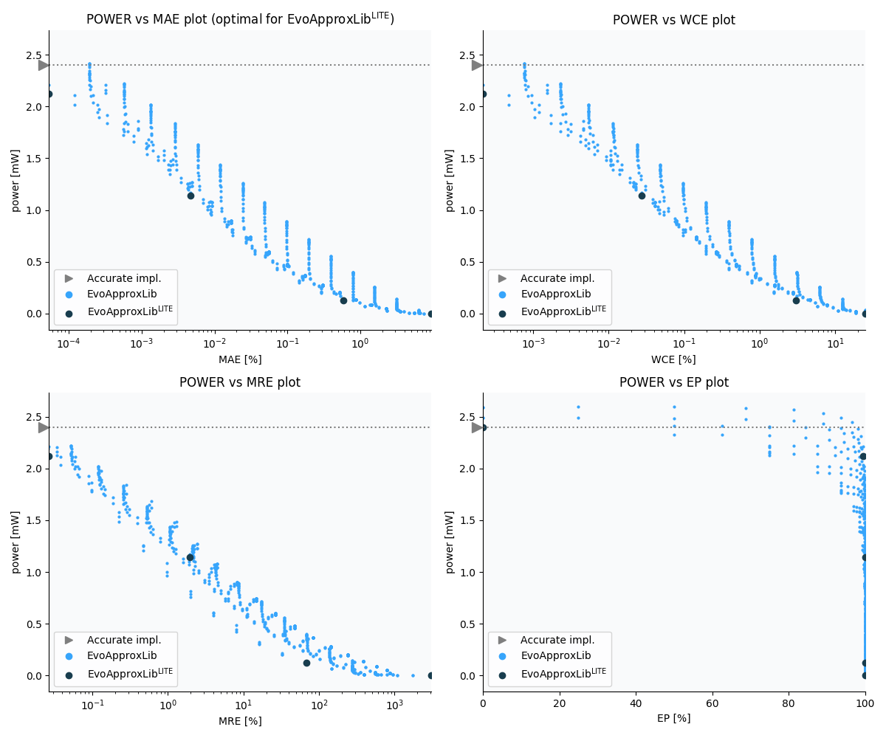

    Selected circuits
    ===================
     - **Bitwidth**: 16
     - **Pareto filtration critera**: pwr - mae
    
    
    Parameters of selected circuits
    ----------------------------
    
    | Circuit name | MAE | WCE | EP | MRE | Download |
    | --- |  --- | --- | --- | --- | --- | 
| mul16s_pwr_2_400_mae_00_0000 | 0.0 | 0 | 0.0 | 0.0 |  [Verilog generic](mul16s_pwr_2_400_mae_00_0000_gen.v) [Verilog PDK45](mul16s_pwr_2_400_mae_00_0000_pdk45.v)  [C](mul16s_pwr_2_400_mae_00_0000.c) |
| mul16s_pwr_2_121_mae_00_0001 | 2304.2 | 9217 | 99.4140625 | 0.0265686136 |  [Verilog generic](mul16s_pwr_2_121_mae_00_0001_gen.v) [Verilog PDK45](mul16s_pwr_2_121_mae_00_0001_pdk45.v)  [C](mul16s_pwr_2_121_mae_00_0001.c) |
| mul16s_pwr_1_143_mae_00_0047 | 202599.6 | 1179649 | 99.9878883362 | 1.9241269897 |  [Verilog generic](mul16s_pwr_1_143_mae_00_0047_gen.v) [Verilog PDK45](mul16s_pwr_1_143_mae_00_0047_pdk45.v)  [C](mul16s_pwr_1_143_mae_00_0047.c) |
| mul16s_pwr_0_126_mae_00_5786 | 24849053.9333 | 129961983 | 99.9969258904 | 67.5122493158 |  [Verilog generic](mul16s_pwr_0_126_mae_00_5786_gen.v) [Verilog PDK45](mul16s_pwr_0_126_mae_00_5786_pdk45.v)  [C](mul16s_pwr_0_126_mae_00_5786.c) |
| mul16s_pwr_0_000_mae_09_3748 | 402644991.9 | 1073741823 | 99.9969482422 | 3061.04794552 |  [Verilog generic](mul16s_pwr_0_000_mae_09_3748_gen.v) [Verilog PDK45](mul16s_pwr_0_000_mae_09_3748_pdk45.v)  [C](mul16s_pwr_0_000_mae_09_3748.c) |
    
    Parameters
    --------------
    
             