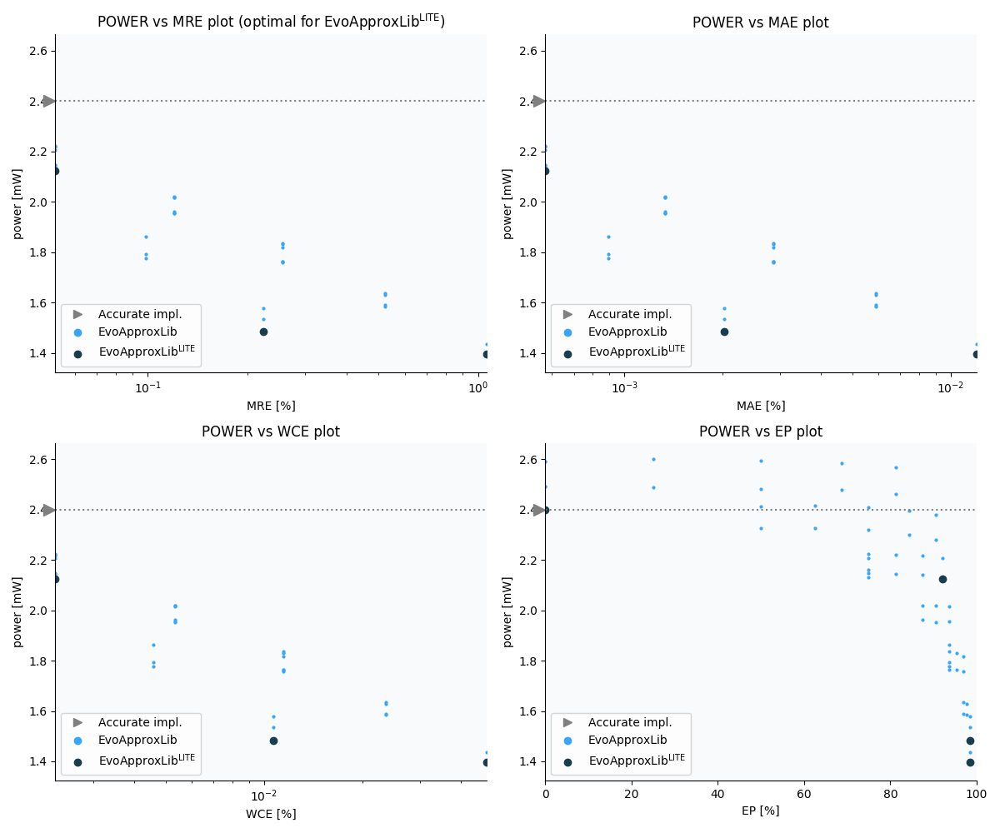

Selected circuits
===================
 - **Circuit**: 16-bit signed multiplier
 - **Selection criteria**: pareto optimal sub-set wrt. pwr and mre parameters
 - **References**: V. Mrazek, Z. Vasicek, L. Sekanina, H. Jiang and J. Han, "Scalable Construction of Approximate Multipliers With Formally Guaranteed Worst Case Error" in IEEE Transactions on Very Large Scale Integration (VLSI) Systems, vol. 26, no. 11, pp. 2572-2576, Nov. 2018. doi: 10.1109/TVLSI.2018.2856362, H. R. Mahdiani, A. Ahmadi, S. M. Fakhraie and C. Lucas, "Bio-Inspired Imprecise Computational Blocks for Efficient VLSI Implementation of Soft-Computing Applications" in IEEE Transactions on Circuits and Systems I: Regular Papers, vol. 57, no. 4, pp. 850-862, April 2010. doi: 10.1109/TCSI.2009.2027626

Parameters of selected circuits
----------------------------

| Circuit name | MAE | WCE | EP | MRE | Download |
| --- |  --- | --- | --- | --- | --- | 
| mul16s_pwr_2_400_mre_00_0000 | 0.0 | 0 | 0.0 | 0.0 |  [Verilog generic](mul16s_pwr_2_400_mre_00_0000_gen.v) [Verilog PDK45](mul16s_pwr_2_400_mre_00_0000_pdk45.v)  [C](mul16s_pwr_2_400_mre_00_0000.c) |
| mul16s_pwr_2_124_mre_00_0524 | 24580.3 | 98369 | 92.1863555908 | 0.0524365337 |  [Verilog generic](mul16s_pwr_2_124_mre_00_0524_gen.v) [Verilog PDK45](mul16s_pwr_2_124_mre_00_0524_pdk45.v)  [C](mul16s_pwr_2_124_mre_00_0524.c) |
| mul16s_pwr_1_483_mre_00_2243 | 87011.55577 | 458703 | 98.4348297119 | 0.2243367325 |  [Verilog generic](mul16s_pwr_1_483_mre_00_2243_gen.v) [Verilog PDK45](mul16s_pwr_1_483_mre_00_2243_pdk45.v)  [C](mul16s_pwr_1_483_mre_00_2243.c) |
| mul16s_pwr_1_396_mre_01_0613 | 516096.0 | 2064384 | 98.435997963 | 1.061337539 |  [Verilog generic](mul16s_pwr_1_396_mre_01_0613_gen.v) [Verilog PDK45](mul16s_pwr_1_396_mre_01_0613_pdk45.v)  [C](mul16s_pwr_1_396_mre_01_0613.c) |
    
Parameters
--------------

             