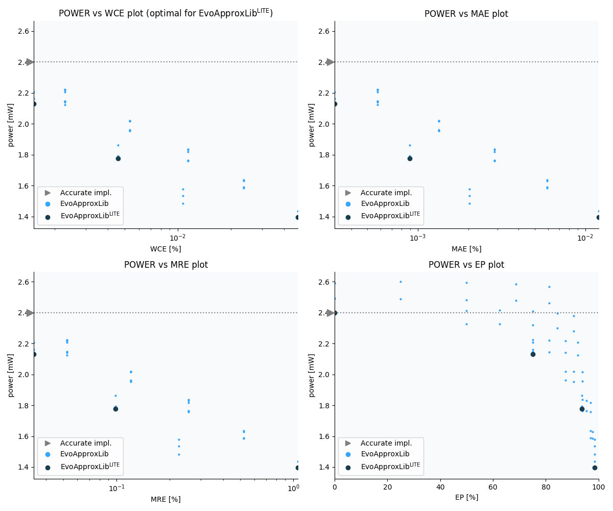

Selected circuits
===================
 - **Bitwidth**: 16
 - **Pareto filtration critera**: pwr - wce

Parameters of selected circuits
----------------------------

| Circuit name | MAE | WCE | EP | MRE | Download |
| --- |  --- | --- | --- | --- | --- | 
| mul16s_pwr_2_400_wce_00_0000 | 0.0 | 0 | 0.0 | 0.0 |  [Verilog generic](mul16s_pwr_2_400_wce_00_0000_gen.v) [Verilog PDK45](mul16s_pwr_2_400_wce_00_0000_pdk45.v)  [C](mul16s_pwr_2_400_wce_00_0000.c) |
| mul16s_pwr_2_121_wce_00_0002 | 2304.2 | 9217 | 99.4140625 | 0.0265686136 |  [Verilog generic](mul16s_pwr_2_121_wce_00_0002_gen.v) [Verilog PDK45](mul16s_pwr_2_121_wce_00_0002_pdk45.v)  [C](mul16s_pwr_2_121_wce_00_0002.c) |
| mul16s_pwr_0_952_wce_00_0534 | 387695.3 | 2293761 | 99.9927997589 | 3.4834626759 |  [Verilog generic](mul16s_pwr_0_952_wce_00_0534_gen.v) [Verilog PDK45](mul16s_pwr_0_952_wce_00_0534_pdk45.v)  [C](mul16s_pwr_0_952_wce_00_0534.c) |
| mul16s_pwr_0_067_wce_05_8580 | 49730146.6677 | 251600895 | 99.9969430268 | 146.845776774 |  [Verilog generic](mul16s_pwr_0_067_wce_05_8580_gen.v) [Verilog PDK45](mul16s_pwr_0_067_wce_05_8580_pdk45.v)  [C](mul16s_pwr_0_067_wce_05_8580.c) |
| mul16s_pwr_0_000_wce_25_0000 | 402644991.9 | 1073741823 | 99.9969482422 | 3061.04794552 |  [Verilog generic](mul16s_pwr_0_000_wce_25_0000_gen.v) [Verilog PDK45](mul16s_pwr_0_000_wce_25_0000_pdk45.v)  [C](mul16s_pwr_0_000_wce_25_0000.c) |
    
Parameters
--------------

             