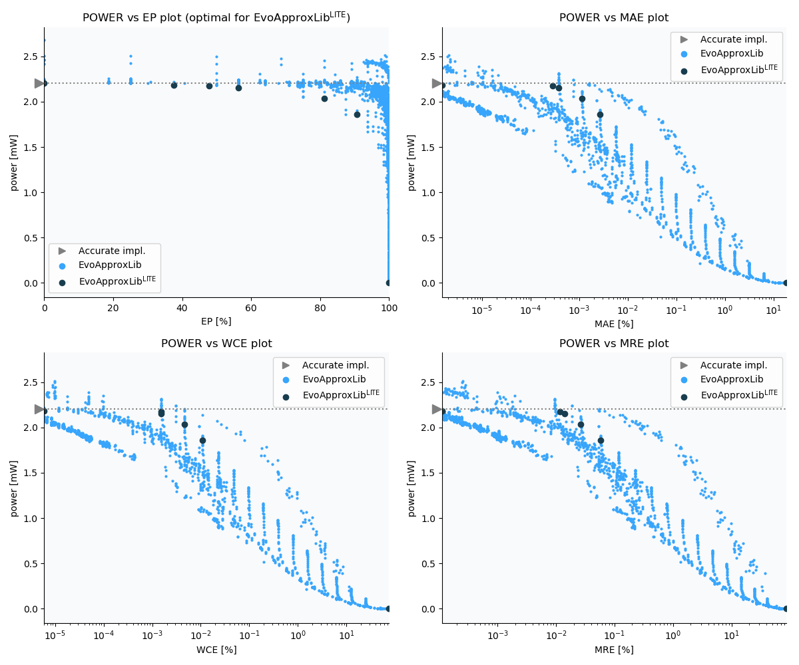

Selected circuits
===================
 - **Circuit**: 16-bit unsigned multiplier
 - **Selection criteria**: pareto optimal sub-set wrt. pwr and ep parameters

Parameters of selected circuits
----------------------------

| Circuit name | MAE% | WCE% | EP% | MRE% | MSE | Download |
| --- |  --- | --- | --- | --- | --- | --- | 
| mul16u_9DU | 0.00 | 0.00 | 0.00 | 0.00 | 0 |  [[Verilog](mul16u_9DU.v)] [[VerilogPDK45](mul16u_9DU_pdk45.v)] [[C](mul16u_9DU.c)] |
| mul16u_1K3 | 0.0000015 | 0.000006 | 37.50 | 0.00011 | 16416 |  [[Verilog](mul16u_1K3.v)] [[VerilogPDK45](mul16u_1K3_pdk45.v)] [[C](mul16u_1K3.c)] |
| mul16u_21M | 0.00029 | 0.0015 | 47.90 | 0.012 | 80900.511e4 |  [[Verilog](mul16u_21M.v)]  [[C](mul16u_21M.c)] |
| mul16u_21Q | 0.00038 | 0.0015 | 56.25 | 0.014 | 10779.731e5 |  [[Verilog](mul16u_21Q.v)]  [[C](mul16u_21Q.c)] |
| mul16u_0Z6 | 1.39 | 22.22 | 80.98 | 3.32 | 27897.246e12 |  [[Verilog](mul16u_0Z6.v)]  [[C](mul16u_0Z6.c)] |
| mul16u_G4R | 0.0027 | 0.011 | 90.62 | 0.058 | 25053.861e6 |  [[Verilog](mul16u_G4R.v)] [[VerilogPDK45](mul16u_G4R_pdk45.v)] [[C](mul16u_G4R.c)] |
| mul16u_HE5 | 18.75 | 75.00 | 100.00 | 87.99 | 10407.645e14 |  [[Verilog](mul16u_HE5.v)]  [[C](mul16u_HE5.c)] |
    
Parameters
--------------

References
--------------
   - V. Mrazek, Z. Vasicek, L. Sekanina, H. Jiang and J. Han, "Scalable Construction of Approximate Multipliers With Formally Guaranteed Worst Case Error" in IEEE Transactions on Very Large Scale Integration (VLSI) Systems, vol. 26, no. 11, pp. 2572-2576, Nov. 2018. doi: [10.1109/TVLSI.2018.2856362](https://dx.doi.org/10.1109/TVLSI.2018.2856362)
   - Z. Vasicek and L. Sekanina, "Evolutionary Approach to Approximate Digital Circuits Design" in IEEE Transactions on Evolutionary Computation, vol. 19, no. 3, pp. 432-444, June 2015. doi: [10.1109/TEVC.2014.2336175](https://dx.doi.org/10.1109/TEVC.2014.2336175)

             