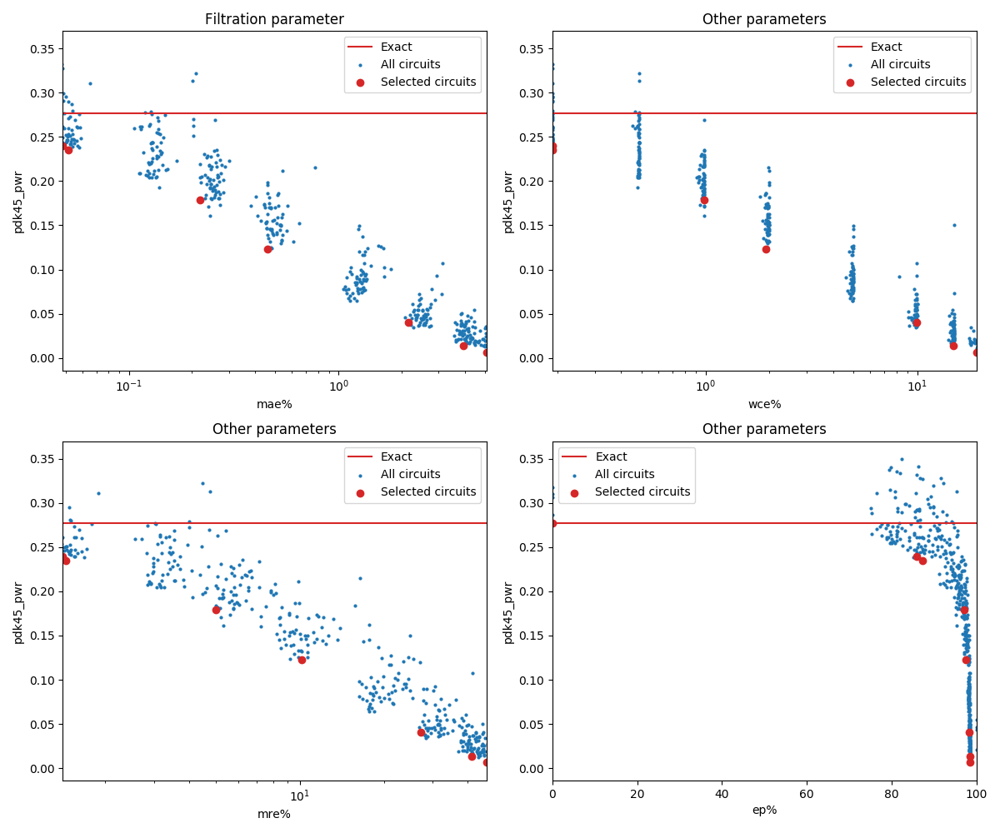

Selected circuits
===================
 - **Desired bitwidth**: XX
 - **Optimized for**: XX - YY

Parameters of circuits
----------------------------

| Circuit name | MAE | WCE | EP | MRE | Download |
| --- |  --- | --- | --- | --- | --- | 
| mul7u_pwr_0_277_mae_00_0000 | 0.0 | 0 | 0.0 | 0.0 |  [Verilog](mul7u_pwr_0_277_mae_00_0000.v) [C](mul7u_pwr_0_277_mae_00_0000.c) |
| mul7u_pwr_0_239_mae_00_0484 | 7.92529 | 31 | 85.9619140625 | 1.4075778168 |  [Verilog](mul7u_pwr_0_239_mae_00_0484.v) [C](mul7u_pwr_0_239_mae_00_0484.c) |
| mul7u_pwr_0_235_mae_00_0515 | 8.43427 | 31 | 87.3474121094 | 1.444038235 |  [Verilog](mul7u_pwr_0_235_mae_00_0515.v) [C](mul7u_pwr_0_235_mae_00_0515.c) |
| mul7u_pwr_0_179_mae_00_2194 | 35.94397 | 162 | 97.1252441406 | 4.9975491919 |  [Verilog](mul7u_pwr_0_179_mae_00_2194.v) [C](mul7u_pwr_0_179_mae_00_2194.c) |
| mul7u_pwr_0_123_mae_00_4582 | 75.07788 | 317 | 97.5280761719 | 10.1232678879 |  [Verilog](mul7u_pwr_0_123_mae_00_4582.v) [C](mul7u_pwr_0_123_mae_00_4582.c) |
| mul7u_pwr_0_040_mae_02_1601 | 353.90698 | 1624 | 98.2971191406 | 27.0751822321 |  [Verilog](mul7u_pwr_0_040_mae_02_1601.v) [C](mul7u_pwr_0_040_mae_02_1601.c) |
| mul7u_pwr_0_014_mae_03_9444 | 646.24536 | 2433 | 98.4008789062 | 41.2234942438 |  [Verilog](mul7u_pwr_0_014_mae_03_9444.v) [C](mul7u_pwr_0_014_mae_03_9444.c) |
| mul7u_pwr_0_007_mae_05_0934 | 834.51025 | 3121 | 98.4130859375 | 46.830856844 |  [Verilog](mul7u_pwr_0_007_mae_05_0934.v) [C](mul7u_pwr_0_007_mae_05_0934.c) |

Parameters
--------------

         