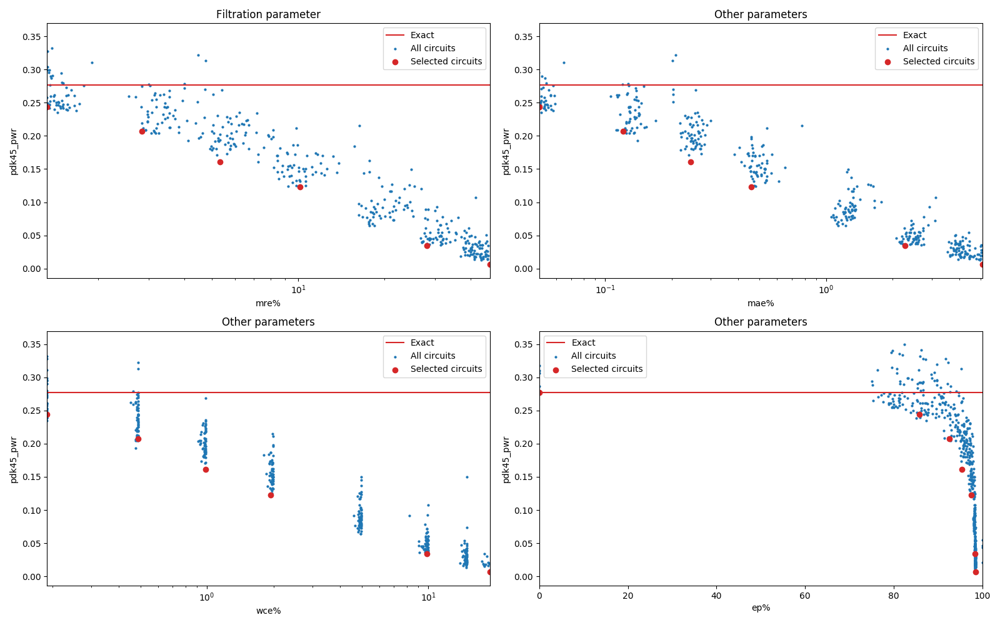

    Selected circuits
    ===================
     - **Bitwidth**: 7
     - **Pareto filtration critera**: pwr - mre
    
    
    Parameters of selected circuits
    ----------------------------
    
    | Circuit name | MAE | WCE | EP | MRE | Download |
    | --- |  --- | --- | --- | --- | --- | 
| mul7u_pwr_0_277_mre_00_0000 | 0.0 | 0 | 0.0 | 0.0 |  [Verilog generic](mul7u_pwr_0_277_mre_00_0000_gen.v) [Verilog PDK45](mul7u_pwr_0_277_mre_00_0000_pdk45.v)  [C](mul7u_pwr_0_277_mre_00_0000.c) |
| mul7u_pwr_0_244_mre_01_3241 | 8.23737 | 31 | 85.83984375 | 1.3240934884 |  [Verilog generic](mul7u_pwr_0_244_mre_01_3241_gen.v) [Verilog PDK45](mul7u_pwr_0_244_mre_01_3241_pdk45.v)  [C](mul7u_pwr_0_244_mre_01_3241.c) |
| mul7u_pwr_0_207_mre_02_8449 | 19.69788 | 80 | 92.5964355469 | 2.8449478503 |  [Verilog generic](mul7u_pwr_0_207_mre_02_8449_gen.v) [Verilog PDK45](mul7u_pwr_0_207_mre_02_8449_pdk45.v)  [C](mul7u_pwr_0_207_mre_02_8449.c) |
| mul7u_pwr_0_161_mre_05_3229 | 39.78003 | 162 | 95.3979492188 | 5.3228638822 |  [Verilog generic](mul7u_pwr_0_161_mre_05_3229_gen.v) [Verilog PDK45](mul7u_pwr_0_161_mre_05_3229_pdk45.v)  [C](mul7u_pwr_0_161_mre_05_3229.c) |
| mul7u_pwr_0_123_mre_10_1233 | 75.07788 | 317 | 97.5280761719 | 10.1232678879 |  [Verilog generic](mul7u_pwr_0_123_mre_10_1233_gen.v) [Verilog PDK45](mul7u_pwr_0_123_mre_10_1233_pdk45.v)  [C](mul7u_pwr_0_123_mre_10_1233.c) |
| mul7u_pwr_0_034_mre_28_2272 | 372.51978 | 1617 | 98.3093261719 | 28.2272457234 |  [Verilog generic](mul7u_pwr_0_034_mre_28_2272_gen.v) [Verilog PDK45](mul7u_pwr_0_034_mre_28_2272_pdk45.v)  [C](mul7u_pwr_0_034_mre_28_2272.c) |
| mul7u_pwr_0_007_mre_46_8309 | 834.51025 | 3121 | 98.4130859375 | 46.830856844 |  [Verilog generic](mul7u_pwr_0_007_mre_46_8309_gen.v) [Verilog PDK45](mul7u_pwr_0_007_mre_46_8309_pdk45.v)  [C](mul7u_pwr_0_007_mre_46_8309.c) |
    
    Parameters
    --------------
    
             