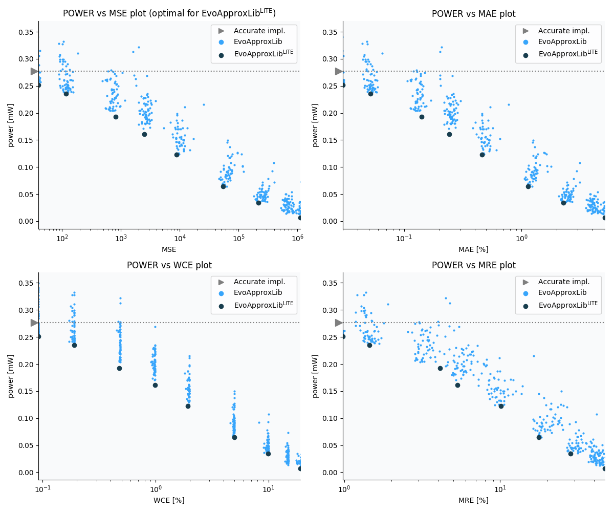

Selected circuits
===================
 - **Circuit**: 7-bit unsigned multiplier
 - **Selection criteria**: pareto optimal sub-set wrt. pwr and mse parameters

Parameters of selected circuits
----------------------------

| Circuit name | MAE% | WCE% | EP% | MRE% | MSE | Download |
| --- |  --- | --- | --- | --- | --- | --- | 
| mul7u_01L | 0.00 | 0.00 | 0.00 | 0.00 | 0 |  [[Verilog](mul7u_01L.v)]  [[C](mul7u_01L.c)] |
| mul7u_03M | 0.03 | 0.092 | 82.61 | 0.98 | 40 |  [[Verilog](mul7u_03M.v)]  [[C](mul7u_03M.c)] |
| mul7u_0DE | 0.051 | 0.19 | 87.35 | 1.44 | 115 |  [[Verilog](mul7u_0DE.v)]  [[C](mul7u_0DE.c)] |
| mul7u_069 | 0.14 | 0.48 | 94.74 | 4.12 | 817 |  [[Verilog](mul7u_069.v)]  [[C](mul7u_069.c)] |
| mul7u_093 | 0.24 | 0.99 | 95.40 | 5.32 | 2487 |  [[Verilog](mul7u_093.v)]  [[C](mul7u_093.c)] |
| mul7u_09J | 0.46 | 1.93 | 97.53 | 10.12 | 8789 |  [[Verilog](mul7u_09J.v)]  [[C](mul7u_09J.c)] |
| mul7u_0B6 | 1.13 | 4.96 | 98.23 | 17.68 | 54027 |  [[Verilog](mul7u_0B6.v)]  [[C](mul7u_0B6.c)] |
| mul7u_013 | 2.27 | 9.87 | 98.31 | 28.23 | 215095 |  [[Verilog](mul7u_013.v)]  [[C](mul7u_013.c)] |
| mul7u_0CA | 5.09 | 19.05 | 98.41 | 46.83 | 11107.118e2 |  [[Verilog](mul7u_0CA.v)]  [[C](mul7u_0CA.c)] |
    
Parameters
--------------

References
--------------
   - V. Mrazek, S. S. Sarwar, L. Sekanina, Z. Vasicek and K. Roy, "Design of power-efficient approximate multipliers for approximate artificial neural networks," 2016 IEEE/ACM International Conference on Computer-Aided Design (ICCAD), Austin, TX, 2016, pp. 1-7. doi: [10.1145/2966986.2967021](https://dx.doi.org/10.1145/2966986.2967021)

             