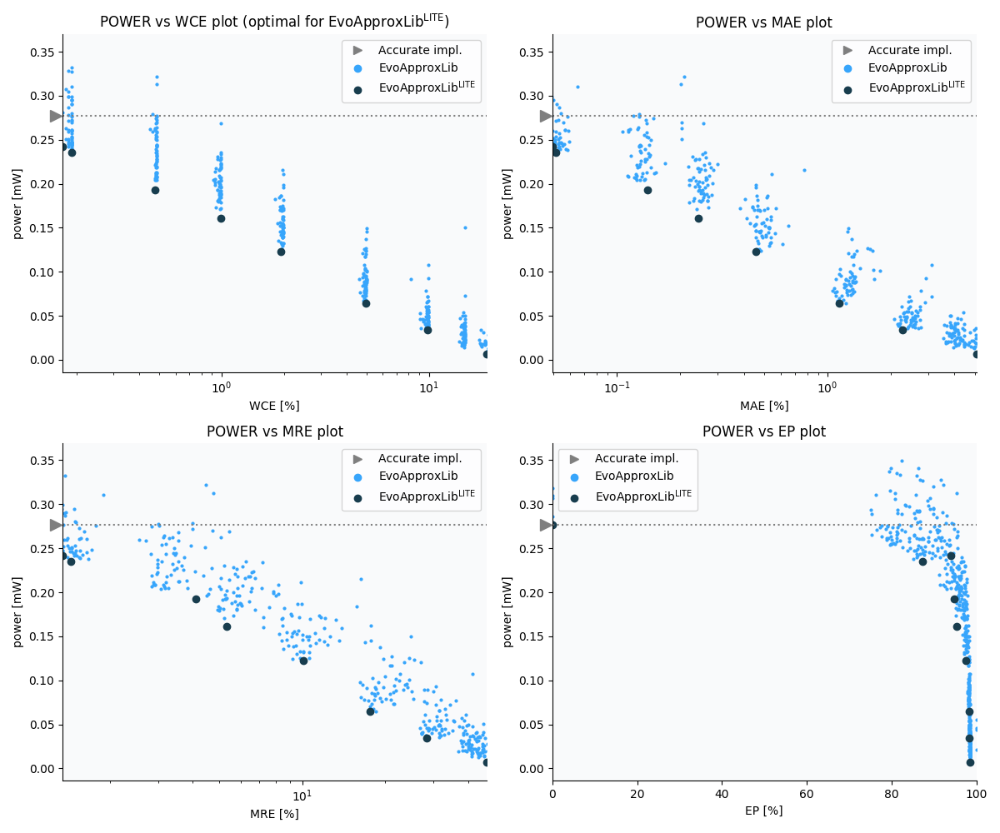

Selected circuits
===================
 - **Circuit**: 7-bit unsigned multiplier
 - **Selection criteria**: pareto optimal sub-set wrt. pwr and wce parameters

Parameters of selected circuits
----------------------------

| Circuit name | MAE% | WCE% | EP% | MRE% | MSE | Download |
| --- |  --- | --- | --- | --- | --- | --- | 
| mul7u_pwr_0_277_wce_00_0000 | 0.00 | 0.00 | 0.00 | 0.00 | 0 |  [[Veriloggeneric](mul7u_pwr_0_277_wce_00_0000_gen.v)]  [[C](mul7u_pwr_0_277_wce_00_0000.c)] |
| mul7u_pwr_0_252_wce_00_0916 | 0.03 | 0.092 | 82.61 | 0.98 | 40 |  [[Veriloggeneric](mul7u_pwr_0_252_wce_00_0916_gen.v)]  [[C](mul7u_pwr_0_252_wce_00_0916.c)] |
| mul7u_pwr_0_235_wce_00_1892 | 0.051 | 0.19 | 87.35 | 1.44 | 115 |  [[Veriloggeneric](mul7u_pwr_0_235_wce_00_1892_gen.v)]  [[C](mul7u_pwr_0_235_wce_00_1892.c)] |
| mul7u_pwr_0_193_wce_00_4761 | 0.14 | 0.48 | 94.74 | 4.12 | 817 |  [[Veriloggeneric](mul7u_pwr_0_193_wce_00_4761_gen.v)]  [[C](mul7u_pwr_0_193_wce_00_4761.c)] |
| mul7u_pwr_0_173_wce_00_9399 | 0.27 | 0.94 | 95.21 | 5.62 | 3099 |  [[Veriloggeneric](mul7u_pwr_0_173_wce_00_9399_gen.v)]  [[C](mul7u_pwr_0_173_wce_00_9399.c)] |
| mul7u_pwr_0_161_wce_00_9888 | 0.24 | 0.99 | 95.40 | 5.32 | 2487 |  [[Veriloggeneric](mul7u_pwr_0_161_wce_00_9888_gen.v)]  [[C](mul7u_pwr_0_161_wce_00_9888.c)] |
| mul7u_pwr_0_123_wce_01_9348 | 0.46 | 1.93 | 97.53 | 10.12 | 8789 |  [[Veriloggeneric](mul7u_pwr_0_123_wce_01_9348_gen.v)]  [[C](mul7u_pwr_0_123_wce_01_9348.c)] |
| mul7u_pwr_0_065_wce_04_9561 | 1.13 | 4.96 | 98.23 | 17.68 | 54027 |  [[Veriloggeneric](mul7u_pwr_0_065_wce_04_9561_gen.v)]  [[C](mul7u_pwr_0_065_wce_04_9561.c)] |
| mul7u_pwr_0_034_wce_09_8694 | 2.27 | 9.87 | 98.31 | 28.23 | 215095 |  [[Veriloggeneric](mul7u_pwr_0_034_wce_09_8694_gen.v)]  [[C](mul7u_pwr_0_034_wce_09_8694.c)] |
| mul7u_pwr_0_007_wce_19_0491 | 5.09 | 19.05 | 98.41 | 46.83 | 11107.118e2 |  [[Veriloggeneric](mul7u_pwr_0_007_wce_19_0491_gen.v)]  [[C](mul7u_pwr_0_007_wce_19_0491.c)] |
    
Parameters
--------------

References
--------------
   - V. Mrazek, S. S. Sarwar, L. Sekanina, Z. Vasicek and K. Roy, "Design of power-efficient approximate multipliers for approximate artificial neural networks," 2016 IEEE/ACM International Conference on Computer-Aided Design (ICCAD), Austin, TX, 2016, pp. 1-7. doi: [10.1145/2966986.2967021](https://dx.doi.org/10.1145/2966986.2967021)

             