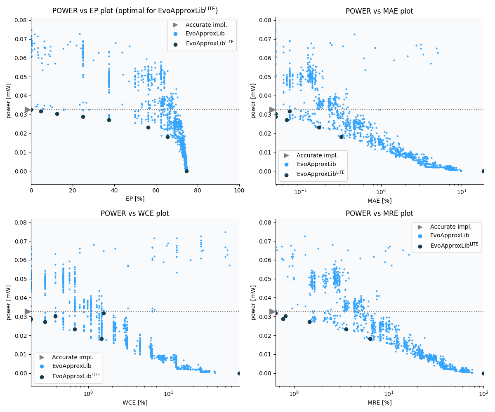

Selected circuits
===================
 - **Circuit**: 8x2-bit unsigned multiplier
 - **Selection criteria**: pareto optimal sub-set wrt. pwr and ep parameters

Parameters of selected circuits
----------------------------

| Circuit name | MAE% | WCE% | EP% | MRE% | MSE | Download |
| --- |  --- | --- | --- | --- | --- | --- | 
| mul8x2u_0C8 | 0.00 | 0.00 | 0.00 | 0.00 | 0 |  [[Verilog](mul8x2u_0C8.v)]  [[C](mul8x2u_0C8.c)] |
| mul8x2u_00D | 0.073 | 1.56 | 4.69 | 0.64 | 12 |  [[Verilog](mul8x2u_00D.v)]  [[C](mul8x2u_00D.c)] |
| mul8x2u_07P | 0.049 | 0.39 | 12.50 | 0.81 | 2.0 |  [[Verilog](mul8x2u_07P.v)]  [[C](mul8x2u_07P.c)] |
| mul8x2u_100 | 0.049 | 0.20 | 25.00 | 0.76 | 1.0 |  [[Verilog](mul8x2u_100.v)]  [[C](mul8x2u_100.c)] |
| mul8x2u_14L | 0.067 | 0.29 | 37.50 | 1.45 | 1.5 |  [[Verilog](mul8x2u_14L.v)]  [[C](mul8x2u_14L.c)] |
| mul8x2u_07G | 0.17 | 0.68 | 56.25 | 3.54 | 7.0 |  [[Verilog](mul8x2u_07G.v)]  [[C](mul8x2u_07G.c)] |
| mul8x2u_0VN | 0.32 | 1.46 | 65.62 | 6.33 | 23 |  [[Verilog](mul8x2u_0VN.v)]  [[C](mul8x2u_0VN.c)] |
| mul8x2u_02A | 18.68 | 74.71 | 74.71 | 100.00 | 76011 |  [[Verilog](mul8x2u_02A.v)]  [[C](mul8x2u_02A.c)] |
    
Parameters
--------------

References
--------------
   - V. Mrazek, L. Sekanina, Z. Vasicek "Libraries of Approximate Circuits: Automated Design and Application in CNN Accelerators" IEEE Journal on Emerging and Selected Topics in Circuits and Systems, Vol 10, No 4, 2020

             