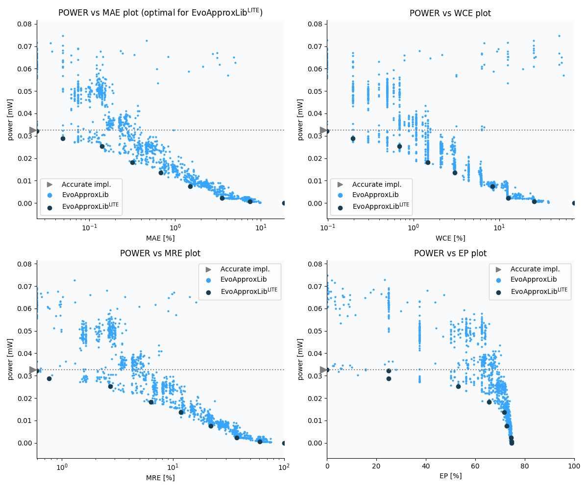

Selected circuits
===================
 - **Circuit**: 8x2-bit unsigned multiplier
 - **Selection criteria**: pareto optimal sub-set wrt. pwr and mae parameters

Parameters of selected circuits
----------------------------

| Circuit name | MAE% | WCE% | EP% | MRE% | MSE | Download |
| --- |  --- | --- | --- | --- | --- | --- | 
| mul8x2u_0C8 | 0.00 | 0.00 | 0.00 | 0.00 | 0 |  [[Verilog](mul8x2u_0C8.v)]  [[C](mul8x2u_0C8.c)] |
| mul8x2u_13H | 0.024 | 0.098 | 25.00 | 0.59 | 0.25 |  [[Verilog](mul8x2u_13H.v)]  [[C](mul8x2u_13H.c)] |
| mul8x2u_100 | 0.049 | 0.20 | 25.00 | 0.76 | 1.0 |  [[Verilog](mul8x2u_100.v)]  [[C](mul8x2u_100.c)] |
| mul8x2u_079 | 0.14 | 0.68 | 53.12 | 2.72 | 5.0 |  [[Verilog](mul8x2u_079.v)]  [[C](mul8x2u_079.c)] |
| mul8x2u_0VN | 0.32 | 1.46 | 65.62 | 6.33 | 23 |  [[Verilog](mul8x2u_0VN.v)]  [[C](mul8x2u_0VN.c)] |
| mul8x2u_16X | 0.68 | 3.03 | 71.78 | 11.78 | 105 |  [[Verilog](mul8x2u_16X.v)]  [[C](mul8x2u_16X.c)] |
| mul8x2u_0TD | 1.50 | 8.30 | 72.75 | 21.82 | 528 |  [[Verilog](mul8x2u_0TD.v)]  [[C](mul8x2u_0TD.c)] |
| mul8x2u_014 | 3.53 | 12.70 | 74.41 | 37.40 | 2582 |  [[Verilog](mul8x2u_014.v)]  [[C](mul8x2u_014.c)] |
| mul8x2u_0H8 | 7.50 | 25.39 | 74.71 | 60.33 | 10903 |  [[Verilog](mul8x2u_0H8.v)]  [[C](mul8x2u_0H8.c)] |
| mul8x2u_02A | 18.68 | 74.71 | 74.71 | 100.00 | 76011 |  [[Verilog](mul8x2u_02A.v)]  [[C](mul8x2u_02A.c)] |
    
Parameters
--------------

References
--------------
   - V. Mrazek, L. Sekanina, Z. Vasicek "Libraries of Approximate Circuits: Automated Design and Application in CNN Accelerators" IEEE Journal on Emerging and Selected Topics in Circuits and Systems, Vol 10, No 4, 2020

             