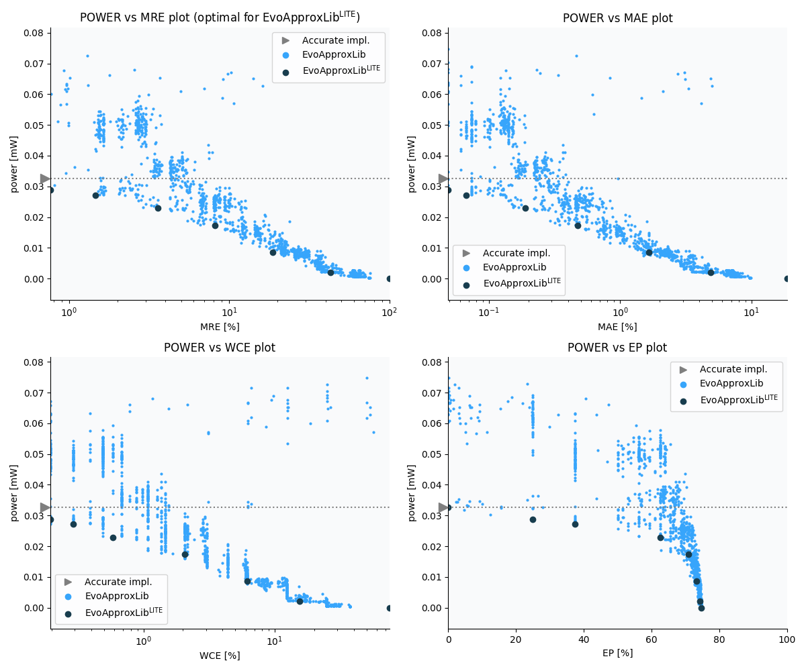

Selected circuits
===================
 - **Circuit**: 8x2-bit unsigned multiplier
 - **Selection criteria**: pareto optimal sub-set wrt. pwr and mre parameters

Parameters of selected circuits
----------------------------

| Circuit name | MAE% | WCE% | EP% | MRE% | MSE | Download |
| --- |  --- | --- | --- | --- | --- | --- | 
| mul8x2u_0C8 | 0.00 | 0.00 | 0.00 | 0.00 | 0 |  [[Verilog](mul8x2u_0C8.v)]  [[C](mul8x2u_0C8.c)] |
| mul8x2u_100 | 0.049 | 0.20 | 25.00 | 0.76 | 1.0 |  [[Verilog](mul8x2u_100.v)]  [[C](mul8x2u_100.c)] |
| mul8x2u_14L | 0.067 | 0.29 | 37.50 | 1.45 | 1.5 |  [[Verilog](mul8x2u_14L.v)]  [[C](mul8x2u_14L.c)] |
| mul8x2u_07F | 0.19 | 0.59 | 62.50 | 3.58 | 7.5 |  [[Verilog](mul8x2u_07F.v)]  [[C](mul8x2u_07F.c)] |
| mul8x2u_11M | 0.47 | 2.05 | 70.90 | 8.16 | 49 |  [[Verilog](mul8x2u_11M.v)]  [[C](mul8x2u_11M.c)] |
| mul8x2u_0NU | 1.66 | 6.15 | 73.24 | 18.64 | 615 |  [[Verilog](mul8x2u_0NU.v)]  [[C](mul8x2u_0NU.c)] |
| mul8x2u_16T | 4.90 | 15.53 | 74.22 | 43.01 | 5217 |  [[Verilog](mul8x2u_16T.v)]  [[C](mul8x2u_16T.c)] |
| mul8x2u_02A | 18.68 | 74.71 | 74.71 | 100.00 | 76011 |  [[Verilog](mul8x2u_02A.v)]  [[C](mul8x2u_02A.c)] |
    
Parameters
--------------

References
--------------
   - V. Mrazek, L. Sekanina, Z. Vasicek "Libraries of Approximate Circuits: Automated Design and Application in CNN Accelerators" IEEE Journal on Emerging and Selected Topics in Circuits and Systems, Vol 10, No 4, 2020

             