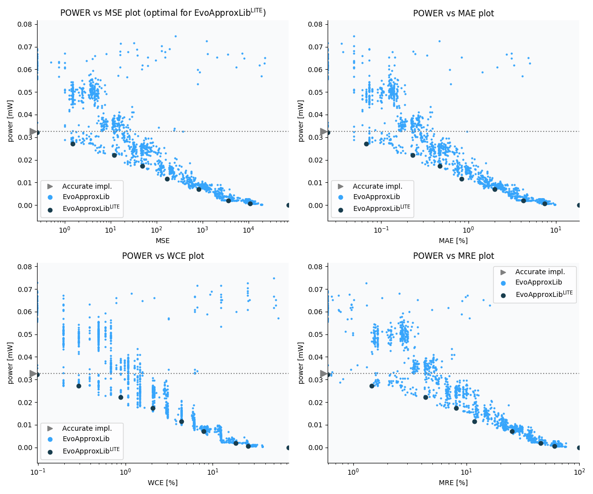

Selected circuits
===================
 - **Circuit**: 8x2-bit unsigned multiplier
 - **Selection criteria**: pareto optimal sub-set wrt. pwr and mse parameters

Parameters of selected circuits
----------------------------

| Circuit name | MAE% | WCE% | EP% | MRE% | MSE | Download |
| --- |  --- | --- | --- | --- | --- | --- | 
| mul8x2u_0C8 | 0.00 | 0.00 | 0.00 | 0.00 | 0 |  [[Verilog](mul8x2u_0C8.v)]  [[C](mul8x2u_0C8.c)] |
| mul8x2u_13H | 0.024 | 0.098 | 25.00 | 0.59 | 0.25 |  [[Verilog](mul8x2u_13H.v)]  [[C](mul8x2u_13H.c)] |
| mul8x2u_14L | 0.067 | 0.29 | 37.50 | 1.45 | 1.5 |  [[Verilog](mul8x2u_14L.v)]  [[C](mul8x2u_14L.c)] |
| mul8x2u_0CY | 0.23 | 0.88 | 64.06 | 4.34 | 12 |  [[Verilog](mul8x2u_0CY.v)]  [[C](mul8x2u_0CY.c)] |
| mul8x2u_11M | 0.47 | 2.05 | 70.90 | 8.16 | 49 |  [[Verilog](mul8x2u_11M.v)]  [[C](mul8x2u_11M.c)] |
| mul8x2u_00J | 0.83 | 4.39 | 71.78 | 11.82 | 168 |  [[Verilog](mul8x2u_00J.v)]  [[C](mul8x2u_00J.c)] |
| mul8x2u_0X3 | 2.00 | 7.91 | 73.83 | 25.39 | 829 |  [[Verilog](mul8x2u_0X3.v)]  [[C](mul8x2u_0X3.c)] |
| mul8x2u_0AJ | 4.25 | 18.46 | 74.32 | 45.58 | 3672 |  [[Verilog](mul8x2u_0AJ.v)]  [[C](mul8x2u_0AJ.c)] |
| mul8x2u_0H8 | 7.50 | 25.39 | 74.71 | 60.33 | 10903 |  [[Verilog](mul8x2u_0H8.v)]  [[C](mul8x2u_0H8.c)] |
| mul8x2u_02A | 18.68 | 74.71 | 74.71 | 100.00 | 76011 |  [[Verilog](mul8x2u_02A.v)]  [[C](mul8x2u_02A.c)] |
    
Parameters
--------------

References
--------------
   - V. Mrazek, L. Sekanina, Z. Vasicek "Libraries of Approximate Circuits: Automated Design and Application in CNN Accelerators" IEEE Journal on Emerging and Selected Topics in Circuits and Systems, Vol 10, No 4, 2020

             