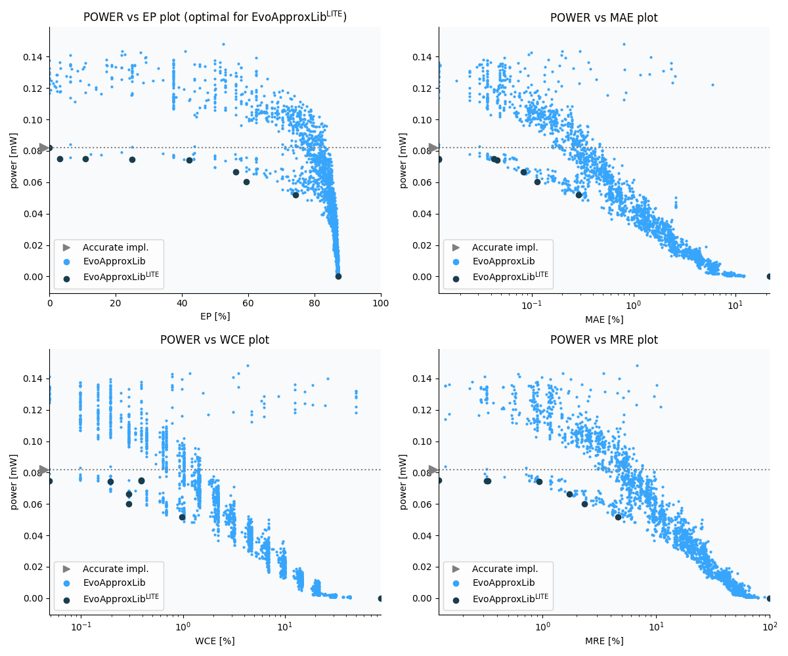

Selected circuits
===================
 - **Circuit**: 8x3-bit unsigned multiplier
 - **Selection criteria**: pareto optimal sub-set wrt. pwr and ep parameters

Parameters of selected circuits
----------------------------

| Circuit name | MAE% | WCE% | EP% | MRE% | MSE | Download |
| --- |  --- | --- | --- | --- | --- | --- | 
| mul8x3u_003 | 0.00 | 0.00 | 0.00 | 0.00 | 0 |  [[Verilog](mul8x3u_003.v)]  [[C](mul8x3u_003.c)] |
| mul8x3u_0TU | 0.012 | 0.39 | 3.12 | 0.12 | 2.0 |  [[Verilog](mul8x3u_0TU.v)]  [[C](mul8x3u_0TU.c)] |
| mul8x3u_0TV | 0.043 | 0.39 | 10.94 | 0.33 | 7.0 |  [[Verilog](mul8x3u_0TV.v)]  [[C](mul8x3u_0TV.c)] |
| mul8x3u_03V | 0.012 | 0.049 | 25.00 | 0.32 | 0.25 |  [[Verilog](mul8x3u_03V.v)]  [[C](mul8x3u_03V.c)] |
| mul8x3u_060 | 0.046 | 0.20 | 42.19 | 0.93 | 2.2 |  [[Verilog](mul8x3u_060.v)]  [[C](mul8x3u_060.c)] |
| mul8x3u_0GJ | 0.082 | 0.29 | 56.25 | 1.71 | 6.0 |  [[Verilog](mul8x3u_0GJ.v)]  [[C](mul8x3u_0GJ.c)] |
| mul8x3u_0GA | 0.11 | 0.29 | 59.38 | 2.34 | 10 |  [[Verilog](mul8x3u_0GA.v)]  [[C](mul8x3u_0GA.c)] |
| mul8x3u_24Z | 0.29 | 0.98 | 74.22 | 4.60 | 64 |  [[Verilog](mul8x3u_24Z.v)]  [[C](mul8x3u_24Z.c)] |
| mul8x3u_242 | 21.79 | 87.16 | 87.16 | 100.00 | 380056 |  [[Verilog](mul8x3u_242.v)]  [[C](mul8x3u_242.c)] |
    
Parameters
--------------

References
--------------
   - V. Mrazek, L. Sekanina, Z. Vasicek "Libraries of Approximate Circuits: Automated Design and Application in CNN Accelerators" IEEE Journal on Emerging and Selected Topics in Circuits and Systems, Vol 10, No 4, 2020

             