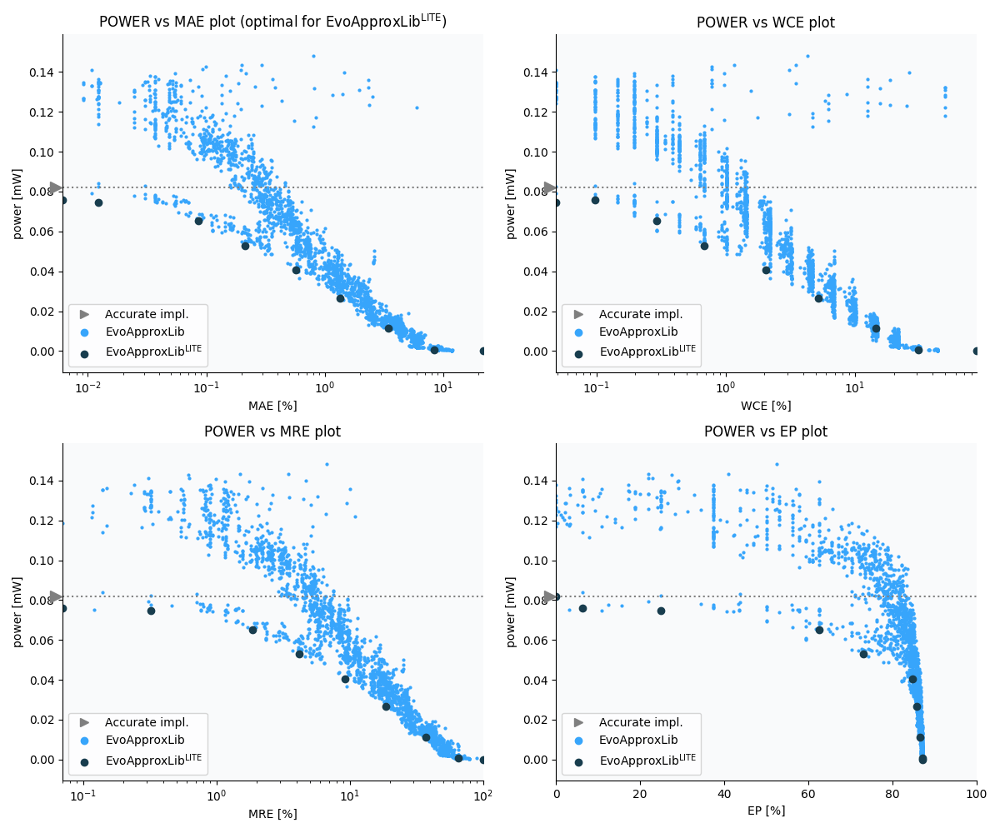

Selected circuits
===================
 - **Circuit**: 8x3-bit unsigned multiplier
 - **Selection criteria**: pareto optimal sub-set wrt. pwr and mae parameters

Parameters of selected circuits
----------------------------

| Circuit name | MAE% | WCE% | EP% | MRE% | MSE | Download |
| --- |  --- | --- | --- | --- | --- | --- | 
| mul8x3u_003 | 0.00 | 0.00 | 0.00 | 0.00 | 0 |  [[Verilog](mul8x3u_003.v)]  [[C](mul8x3u_003.c)] |
| mul8x3u_1XD | 0.0061 | 0.098 | 6.25 | 0.07 | 0.25 |  [[Verilog](mul8x3u_1XD.v)]  [[C](mul8x3u_1XD.c)] |
| mul8x3u_03V | 0.012 | 0.049 | 25.00 | 0.32 | 0.25 |  [[Verilog](mul8x3u_03V.v)]  [[C](mul8x3u_03V.c)] |
| mul8x3u_0GL | 0.085 | 0.29 | 62.50 | 1.86 | 6.2 |  [[Verilog](mul8x3u_0GL.v)]  [[C](mul8x3u_0GL.c)] |
| mul8x3u_0YV | 0.21 | 0.68 | 73.05 | 4.15 | 36 |  [[Verilog](mul8x3u_0YV.v)]  [[C](mul8x3u_0YV.c)] |
| mul8x3u_0D0 | 0.57 | 2.05 | 84.72 | 9.25 | 235 |  [[Verilog](mul8x3u_0D0.v)]  [[C](mul8x3u_0D0.c)] |
| mul8x3u_1U0 | 1.34 | 5.22 | 85.69 | 18.70 | 1309 |  [[Verilog](mul8x3u_1U0.v)]  [[C](mul8x3u_1U0.c)] |
| mul8x3u_0RU | 3.46 | 14.50 | 86.62 | 37.23 | 8553 |  [[Verilog](mul8x3u_0RU.v)]  [[C](mul8x3u_0RU.c)] |
| mul8x3u_1AZ | 8.59 | 31.01 | 87.01 | 67.11 | 53366 |  [[Verilog](mul8x3u_1AZ.v)]  [[C](mul8x3u_1AZ.c)] |
| mul8x3u_242 | 21.79 | 87.16 | 87.16 | 100.00 | 380056 |  [[Verilog](mul8x3u_242.v)]  [[C](mul8x3u_242.c)] |
    
Parameters
--------------

References
--------------
   - V. Mrazek, L. Sekanina, Z. Vasicek "Libraries of Approximate Circuits: Automated Design and Application in CNN Accelerators" IEEE Journal on Emerging and Selected Topics in Circuits and Systems, Vol 10, No 4, 2020

             