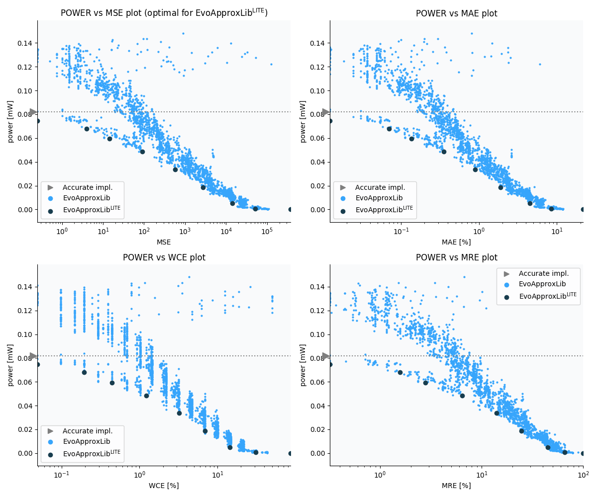

Selected circuits
===================
 - **Circuit**: 8x3-bit unsigned multiplier
 - **Selection criteria**: pareto optimal sub-set wrt. pwr and mse parameters

Parameters of selected circuits
----------------------------

| Circuit name | MAE% | WCE% | EP% | MRE% | MSE | Download |
| --- |  --- | --- | --- | --- | --- | --- | 
| mul8x3u_0KE | 0.00 | 0.00 | 0.00 | 0.00 | 0 |  [[Verilog](mul8x3u_0KE.v)]  [[C](mul8x3u_0KE.c)] |
| mul8x3u_1R5 | 0.012 | 0.049 | 25.00 | 0.32 | 0.25 |  [[Verilog](mul8x3u_1R5.v)]  [[C](mul8x3u_1R5.c)] |
| mul8x3u_0UB | 0.07 | 0.20 | 62.50 | 1.57 | 4.0 |  [[Verilog](mul8x3u_0UB.v)]  [[C](mul8x3u_0UB.c)] |
| mul8x3u_1FL | 0.14 | 0.44 | 74.37 | 2.79 | 14 |  [[Verilog](mul8x3u_1FL.v)]  [[C](mul8x3u_1FL.c)] |
| mul8x3u_1ZU | 0.35 | 1.22 | 83.25 | 6.40 | 90 |  [[Verilog](mul8x3u_1ZU.v)]  [[C](mul8x3u_1ZU.c)] |
| mul8x3u_085 | 0.89 | 3.22 | 85.79 | 13.98 | 580 |  [[Verilog](mul8x3u_085.v)]  [[C](mul8x3u_085.c)] |
| mul8x3u_0ET | 1.90 | 6.88 | 86.23 | 24.47 | 2709 |  [[Verilog](mul8x3u_0ET.v)]  [[C](mul8x3u_0ET.c)] |
| mul8x3u_0TM | 4.51 | 14.45 | 87.11 | 44.73 | 14111 |  [[Verilog](mul8x3u_0TM.v)]  [[C](mul8x3u_0TM.c)] |
| mul8x3u_0Q5 | 8.40 | 31.01 | 87.06 | 65.71 | 51275 |  [[Verilog](mul8x3u_0Q5.v)]  [[C](mul8x3u_0Q5.c)] |
| mul8x3u_0QB | 21.79 | 87.16 | 87.16 | 100.00 | 380056 |  [[Verilog](mul8x3u_0QB.v)]  [[C](mul8x3u_0QB.c)] |
    
Parameters
--------------

References
--------------
   - V. Mrazek, L. Sekanina and Z. Vasicek, "Libraries of Approximate Circuits: Design and Application in CNN Accelerators"

             