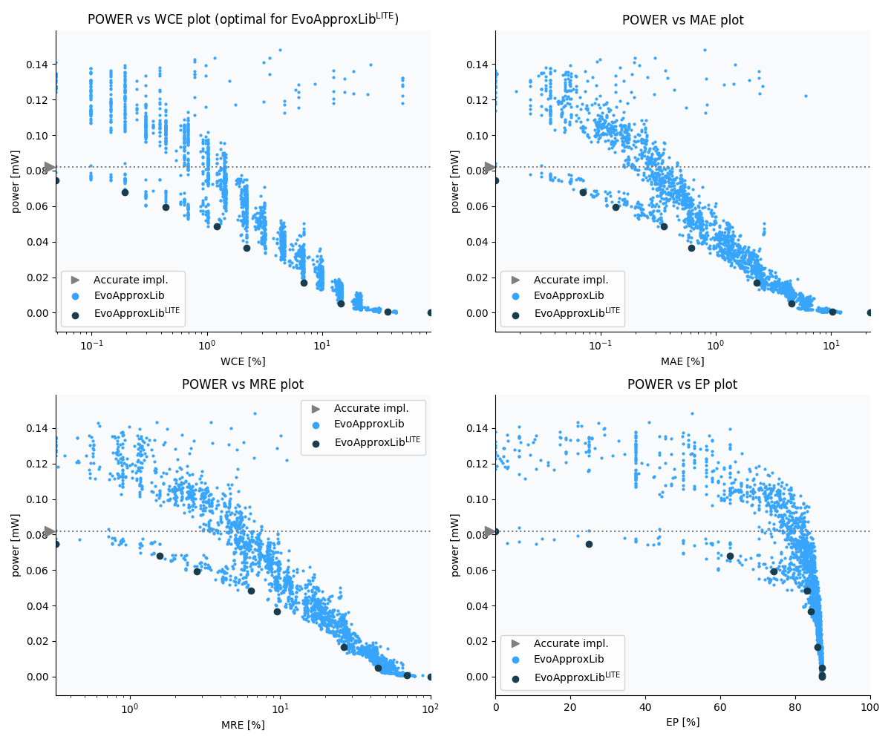

Selected circuits
===================
 - **Circuit**: 8x3-bit unsigned multiplier
 - **Selection criteria**: pareto optimal sub-set wrt. pwr and wce parameters

Parameters of selected circuits
----------------------------

| Circuit name | MAE% | WCE% | EP% | MRE% | MSE | Download |
| --- |  --- | --- | --- | --- | --- | --- | 
| mul8x3u_003 | 0.00 | 0.00 | 0.00 | 0.00 | 0 |  [[Verilog](mul8x3u_003.v)]  [[C](mul8x3u_003.c)] |
| mul8x3u_03V | 0.012 | 0.049 | 25.00 | 0.32 | 0.25 |  [[Verilog](mul8x3u_03V.v)]  [[C](mul8x3u_03V.c)] |
| mul8x3u_05X | 0.07 | 0.20 | 62.50 | 1.57 | 4.0 |  [[Verilog](mul8x3u_05X.v)]  [[C](mul8x3u_05X.c)] |
| mul8x3u_0U7 | 0.14 | 0.44 | 74.37 | 2.79 | 14 |  [[Verilog](mul8x3u_0U7.v)]  [[C](mul8x3u_0U7.c)] |
| mul8x3u_017 | 0.35 | 1.22 | 83.25 | 6.40 | 90 |  [[Verilog](mul8x3u_017.v)]  [[C](mul8x3u_017.c)] |
| mul8x3u_0CX | 0.61 | 2.20 | 84.18 | 9.54 | 265 |  [[Verilog](mul8x3u_0CX.v)]  [[C](mul8x3u_0CX.c)] |
| mul8x3u_1UZ | 2.26 | 6.88 | 85.89 | 26.44 | 3573 |  [[Verilog](mul8x3u_1UZ.v)]  [[C](mul8x3u_1UZ.c)] |
| mul8x3u_0RZ | 4.51 | 14.45 | 87.11 | 44.73 | 14111 |  [[Verilog](mul8x3u_0RZ.v)]  [[C](mul8x3u_0RZ.c)] |
| mul8x3u_1NH | 10.29 | 36.96 | 87.06 | 70.10 | 76819 |  [[Verilog](mul8x3u_1NH.v)]  [[C](mul8x3u_1NH.c)] |
| mul8x3u_242 | 21.79 | 87.16 | 87.16 | 100.00 | 380056 |  [[Verilog](mul8x3u_242.v)]  [[C](mul8x3u_242.c)] |
    
Parameters
--------------

References
--------------
   - V. Mrazek, L. Sekanina, Z. Vasicek "Libraries of Approximate Circuits: Automated Design and Application in CNN Accelerators" IEEE Journal on Emerging and Selected Topics in Circuits and Systems, Vol 10, No 4, 2020

             