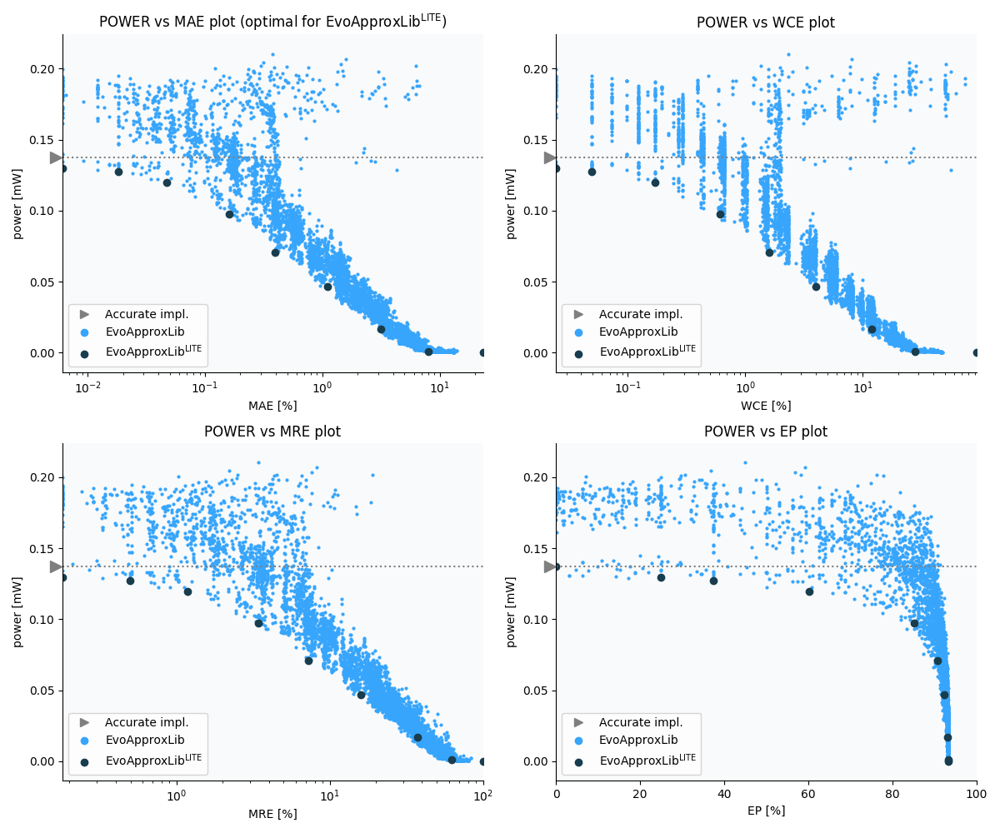

Selected circuits
===================
 - **Circuit**: 8x4-bit unsigned multiplier
 - **Selection criteria**: pareto optimal sub-set wrt. pwr and mae parameters

Parameters of selected circuits
----------------------------

| Circuit name | MAE% | WCE% | EP% | MRE% | MSE | Download |
| --- |  --- | --- | --- | --- | --- | --- | 
| mul8x4u_2UU | 0.00 | 0.00 | 0.00 | 0.00 | 0 |  [[Verilog](mul8x4u_2UU.v)]  [[C](mul8x4u_2UU.c)] |
| mul8x4u_2AN | 0.0061 | 0.024 | 25.00 | 0.18 | 0.25 |  [[Verilog](mul8x4u_2AN.v)]  [[C](mul8x4u_2AN.c)] |
| mul8x4u_3AA | 0.018 | 0.049 | 37.50 | 0.50 | 1.5 |  [[Verilog](mul8x4u_3AA.v)]  [[C](mul8x4u_3AA.c)] |
| mul8x4u_30G | 0.047 | 0.17 | 60.16 | 1.18 | 8.0 |  [[Verilog](mul8x4u_30G.v)]  [[C](mul8x4u_30G.c)] |
| mul8x4u_2D9 | 0.16 | 0.61 | 85.25 | 3.42 | 72 |  [[Verilog](mul8x4u_2D9.v)]  [[C](mul8x4u_2D9.c)] |
| mul8x4u_0S7 | 0.40 | 1.59 | 90.77 | 7.28 | 427 |  [[Verilog](mul8x4u_0S7.v)]  [[C](mul8x4u_0S7.c)] |
| mul8x4u_1XB | 1.10 | 4.00 | 92.21 | 15.94 | 3227 |  [[Verilog](mul8x4u_1XB.v)]  [[C](mul8x4u_1XB.c)] |
| mul8x4u_1YD | 3.14 | 11.94 | 93.12 | 37.30 | 26288 |  [[Verilog](mul8x4u_1YD.v)]  [[C](mul8x4u_1YD.c)] |
| mul8x4u_2FE | 7.95 | 27.91 | 93.36 | 62.04 | 184297 |  [[Verilog](mul8x4u_2FE.v)]  [[C](mul8x4u_2FE.c)] |
| mul8x4u_555 | 23.35 | 93.38 | 93.38 | 100.00 | 16831.062e2 |  [[Verilog](mul8x4u_555.v)]  [[C](mul8x4u_555.c)] |
    
Parameters
--------------

References
--------------
   - V. Mrazek, L. Sekanina, Z. Vasicek "Libraries of Approximate Circuits: Automated Design and Application in CNN Accelerators" IEEE Journal on Emerging and Selected Topics in Circuits and Systems, Vol 10, No 4, 2020

             