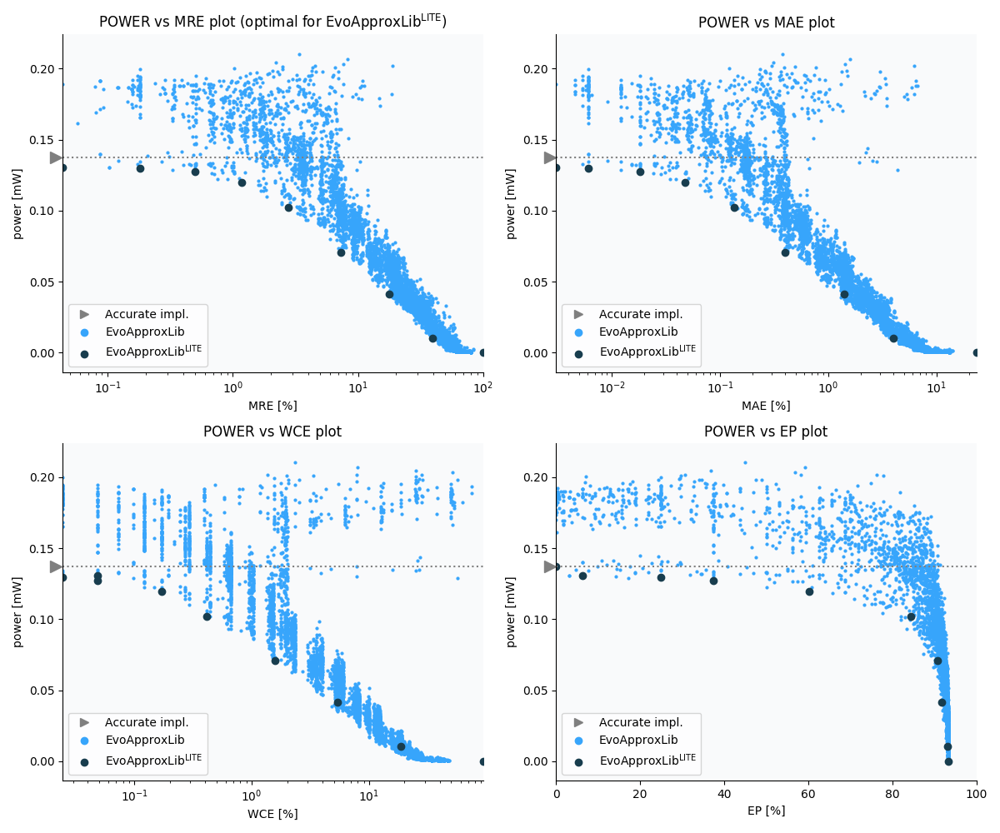

Selected circuits
===================
 - **Circuit**: 8x4-bit unsigned multiplier
 - **Selection criteria**: pareto optimal sub-set wrt. pwr and mre parameters

Parameters of selected circuits
----------------------------

| Circuit name | MAE% | WCE% | EP% | MRE% | MSE | Download |
| --- |  --- | --- | --- | --- | --- | --- | 
| mul8x4u_2DB | 0.00 | 0.00 | 0.00 | 0.00 | 0 |  [[Verilog](mul8x4u_2DB.v)]  [[C](mul8x4u_2DB.c)] |
| mul8x4u_2TZ | 0.0031 | 0.049 | 6.25 | 0.043 | 0.25 |  [[Verilog](mul8x4u_2TZ.v)]  [[C](mul8x4u_2TZ.c)] |
| mul8x4u_2L5 | 0.0061 | 0.024 | 25.00 | 0.18 | 0.25 |  [[Verilog](mul8x4u_2L5.v)]  [[C](mul8x4u_2L5.c)] |
| mul8x4u_29A | 0.018 | 0.049 | 37.50 | 0.50 | 1.5 |  [[Verilog](mul8x4u_29A.v)]  [[C](mul8x4u_29A.c)] |
| mul8x4u_3N3 | 0.047 | 0.17 | 60.16 | 1.18 | 8.0 |  [[Verilog](mul8x4u_3N3.v)]  [[C](mul8x4u_3N3.c)] |
| mul8x4u_579 | 0.13 | 0.42 | 84.38 | 2.76 | 50 |  [[Verilog](mul8x4u_579.v)]  [[C](mul8x4u_579.c)] |
| mul8x4u_167 | 0.40 | 1.59 | 90.77 | 7.28 | 427 |  [[Verilog](mul8x4u_167.v)]  [[C](mul8x4u_167.c)] |
| mul8x4u_2CC | 1.39 | 5.37 | 91.77 | 17.71 | 5418 |  [[Verilog](mul8x4u_2CC.v)]  [[C](mul8x4u_2CC.c)] |
| mul8x4u_3UF | 3.97 | 18.63 | 93.09 | 39.63 | 43327 |  [[Verilog](mul8x4u_3UF.v)]  [[C](mul8x4u_3UF.c)] |
| mul8x4u_3RR | 23.35 | 93.38 | 93.38 | 100.00 | 16831.062e2 |  [[Verilog](mul8x4u_3RR.v)]  [[C](mul8x4u_3RR.c)] |
    
Parameters
--------------

References
--------------
   - V. Mrazek, L. Sekanina, Z. Vasicek "Libraries of Approximate Circuits: Automated Design and Application in CNN Accelerators" IEEE Journal on Emerging and Selected Topics in Circuits and Systems, Vol 10, No 4, 2020

             