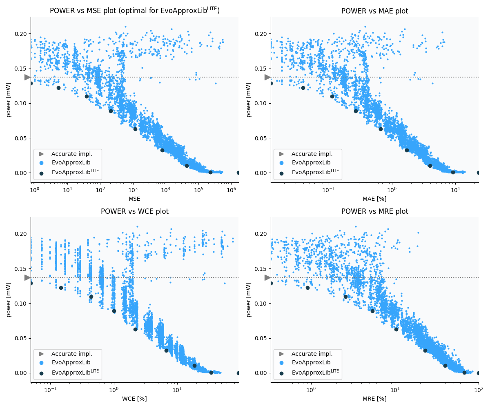

Selected circuits
===================
 - **Circuit**: 8x4-bit unsigned multiplier
 - **Selection criteria**: pareto optimal sub-set wrt. pwr and mse parameters

Parameters of selected circuits
----------------------------

| Circuit name | MAE% | WCE% | EP% | MRE% | MSE | Download |
| --- |  --- | --- | --- | --- | --- | --- | 
| mul8x4u_2DB | 0.00 | 0.00 | 0.00 | 0.00 | 0 |  [[Verilog](mul8x4u_2DB.v)]  [[C](mul8x4u_2DB.c)] |
| mul8x4u_29C | 0.012 | 0.049 | 37.50 | 0.33 | 0.75 |  [[Verilog](mul8x4u_29C.v)]  [[C](mul8x4u_29C.c)] |
| mul8x4u_3NP | 0.039 | 0.15 | 60.79 | 0.90 | 5.3 |  [[Verilog](mul8x4u_3NP.v)]  [[C](mul8x4u_3NP.c)] |
| mul8x4u_291 | 0.11 | 0.44 | 79.39 | 2.56 | 38 |  [[Verilog](mul8x4u_291.v)]  [[C](mul8x4u_291.c)] |
| mul8x4u_3BB | 0.27 | 1.00 | 86.43 | 5.37 | 209 |  [[Verilog](mul8x4u_3BB.v)]  [[C](mul8x4u_3BB.c)] |
| mul8x4u_409 | 0.66 | 2.17 | 91.16 | 10.34 | 1164 |  [[Verilog](mul8x4u_409.v)]  [[C](mul8x4u_409.c)] |
| mul8x4u_0S7 | 1.71 | 6.67 | 92.65 | 22.99 | 7822 |  [[Verilog](mul8x4u_0S7.v)]  [[C](mul8x4u_0S7.c)] |
| mul8x4u_3UF | 3.97 | 18.63 | 93.09 | 39.63 | 43327 |  [[Verilog](mul8x4u_3UF.v)]  [[C](mul8x4u_3UF.c)] |
| mul8x4u_04E | 9.08 | 34.11 | 93.33 | 67.10 | 230371 |  [[Verilog](mul8x4u_04E.v)]  [[C](mul8x4u_04E.c)] |
| mul8x4u_3RR | 23.35 | 93.38 | 93.38 | 100.00 | 16831.062e2 |  [[Verilog](mul8x4u_3RR.v)]  [[C](mul8x4u_3RR.c)] |
    
Parameters
--------------

References
--------------
   - V. Mrazek, L. Sekanina, Z. Vasicek "Libraries of Approximate Circuits: Automated Design and Application in CNN Accelerators" IEEE Journal on Emerging and Selected Topics in Circuits and Systems, Vol 10, No 4, 2020

             