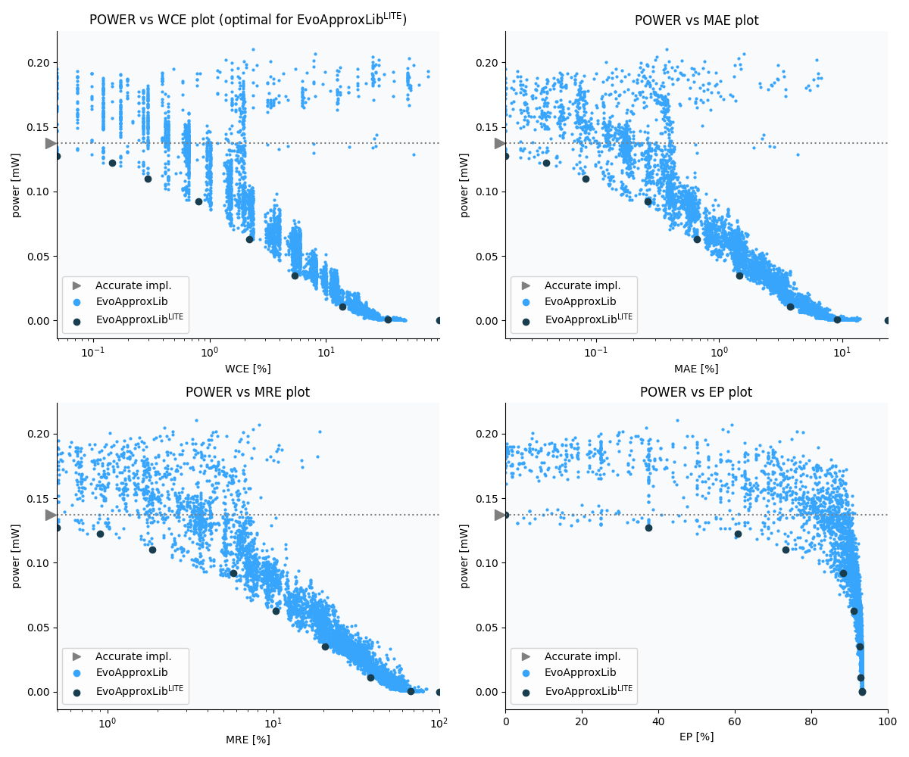

Selected circuits
===================
 - **Circuit**: 8x4-bit unsigned multiplier
 - **Selection criteria**: pareto optimal sub-set wrt. pwr and wce parameters

Parameters of selected circuits
----------------------------

| Circuit name | MAE% | WCE% | EP% | MRE% | MSE | Download |
| --- |  --- | --- | --- | --- | --- | --- | 
| mul8x4u_2DB | 0.00 | 0.00 | 0.00 | 0.00 | 0 |  [[Verilog](mul8x4u_2DB.v)]  [[C](mul8x4u_2DB.c)] |
| mul8x4u_29A | 0.018 | 0.049 | 37.50 | 0.50 | 1.5 |  [[Verilog](mul8x4u_29A.v)]  [[C](mul8x4u_29A.c)] |
| mul8x4u_3NP | 0.039 | 0.15 | 60.79 | 0.90 | 5.3 |  [[Verilog](mul8x4u_3NP.v)]  [[C](mul8x4u_3NP.c)] |
| mul8x4u_42Z | 0.082 | 0.29 | 73.34 | 1.86 | 20 |  [[Verilog](mul8x4u_42Z.v)]  [[C](mul8x4u_42Z.c)] |
| mul8x4u_3BP | 0.26 | 0.81 | 88.33 | 5.76 | 189 |  [[Verilog](mul8x4u_3BP.v)]  [[C](mul8x4u_3BP.c)] |
| mul8x4u_409 | 0.66 | 2.17 | 91.16 | 10.34 | 1164 |  [[Verilog](mul8x4u_409.v)]  [[C](mul8x4u_409.c)] |
| mul8x4u_2DH | 1.45 | 5.35 | 92.72 | 20.48 | 5621 |  [[Verilog](mul8x4u_2DH.v)]  [[C](mul8x4u_2DH.c)] |
| mul8x4u_1L6 | 3.76 | 13.75 | 92.99 | 38.63 | 37866 |  [[Verilog](mul8x4u_1L6.v)]  [[C](mul8x4u_1L6.c)] |
| mul8x4u_04E | 9.08 | 34.11 | 93.33 | 67.10 | 230371 |  [[Verilog](mul8x4u_04E.v)]  [[C](mul8x4u_04E.c)] |
| mul8x4u_3RR | 23.35 | 93.38 | 93.38 | 100.00 | 16831.062e2 |  [[Verilog](mul8x4u_3RR.v)]  [[C](mul8x4u_3RR.c)] |
    
Parameters
--------------

References
--------------
   - V. Mrazek, L. Sekanina, Z. Vasicek "Libraries of Approximate Circuits: Automated Design and Application in CNN Accelerators" IEEE Journal on Emerging and Selected Topics in Circuits and Systems, Vol 10, No 4, 2020

             