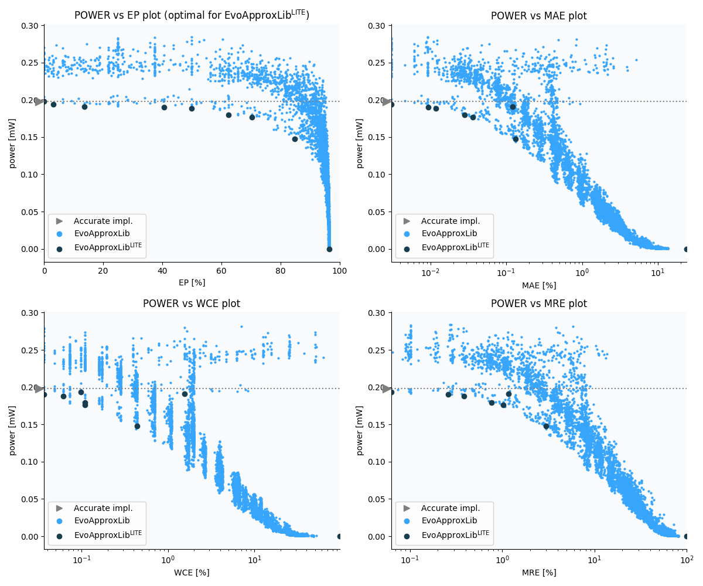

Selected circuits
===================
 - **Circuit**: 8x5-bit unsigned multiplier
 - **Selection criteria**: pareto optimal sub-set wrt. pwr and ep parameters

Parameters of selected circuits
----------------------------

| Circuit name | MAE% | WCE% | EP% | MRE% | MSE | Download |
| --- |  --- | --- | --- | --- | --- | --- | 
| mul8x5u_4HF | 0.00 | 0.00 | 0.00 | 0.00 | 0 |  [[Verilog](mul8x5u_4HF.v)]  [[C](mul8x5u_4HF.c)] |
| mul8x5u_41U | 0.0031 | 0.098 | 3.12 | 0.063 | 2.0 |  [[Verilog](mul8x5u_41U.v)]  [[C](mul8x5u_41U.c)] |
| mul8x5u_1F9 | 0.12 | 1.56 | 13.57 | 1.17 | 1020 |  [[Verilog](mul8x5u_1F9.v)]  [[C](mul8x5u_1F9.c)] |
| mul8x5u_378 | 0.0093 | 0.037 | 40.62 | 0.26 | 1.7 |  [[Verilog](mul8x5u_378.v)]  [[C](mul8x5u_378.c)] |
| mul8x5u_48G | 0.012 | 0.061 | 50.00 | 0.39 | 2.2 |  [[Verilog](mul8x5u_48G.v)]  [[C](mul8x5u_48G.c)] |
| mul8x5u_4RH | 0.028 | 0.11 | 62.50 | 0.77 | 11 |  [[Verilog](mul8x5u_4RH.v)]  [[C](mul8x5u_4RH.c)] |
| mul8x5u_4SM | 0.036 | 0.11 | 70.31 | 1.03 | 16 |  [[Verilog](mul8x5u_4SM.v)]  [[C](mul8x5u_4SM.c)] |
| mul8x5u_3P3 | 0.13 | 0.44 | 84.86 | 2.99 | 200 |  [[Verilog](mul8x5u_3P3.v)]  [[C](mul8x5u_3P3.c)] |
| mul8x5u_4PP | 24.12 | 96.50 | 96.50 | 100.00 | 70690.462e2 |  [[Verilog](mul8x5u_4PP.v)]  [[C](mul8x5u_4PP.c)] |
    
Parameters
--------------

References
--------------
   - V. Mrazek, L. Sekanina, Z. Vasicek "Libraries of Approximate Circuits: Automated Design and Application in CNN Accelerators" IEEE Journal on Emerging and Selected Topics in Circuits and Systems, Vol 10, No 4, 2020

             