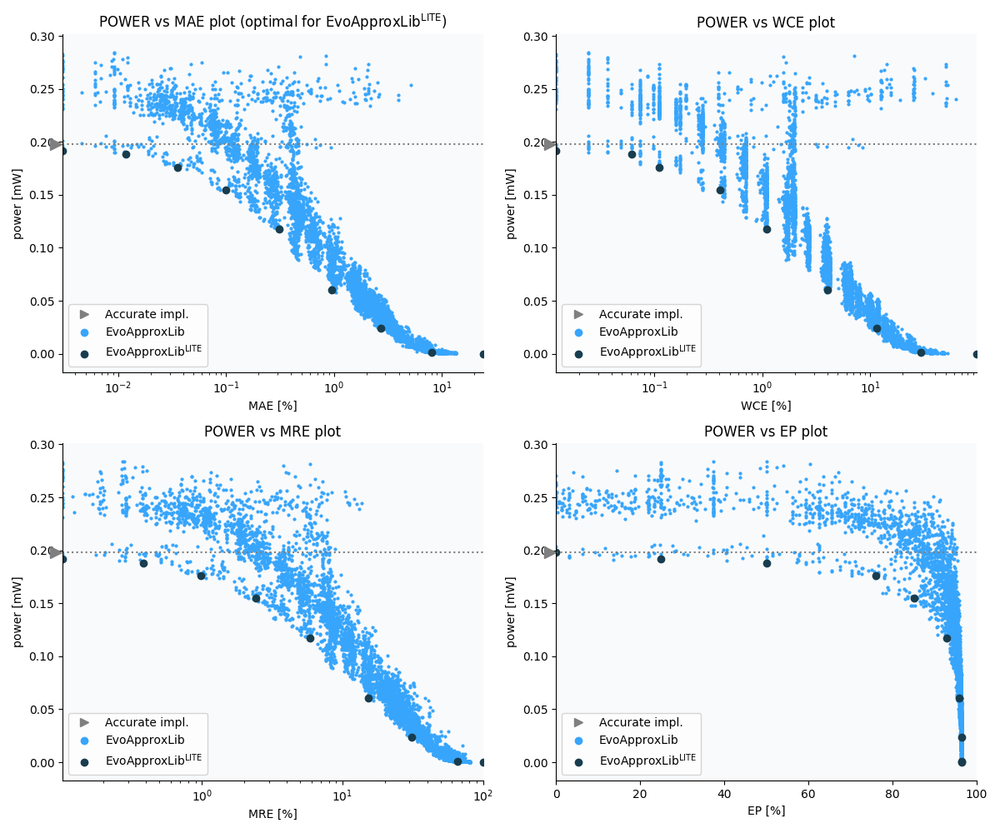

Selected circuits
===================
 - **Circuit**: 8x5-bit unsigned multiplier
 - **Selection criteria**: pareto optimal sub-set wrt. pwr and mae parameters

Parameters of selected circuits
----------------------------

| Circuit name | MAE% | WCE% | EP% | MRE% | MSE | Download |
| --- |  --- | --- | --- | --- | --- | --- | 
| mul8x5u_4HF | 0.00 | 0.00 | 0.00 | 0.00 | 0 |  [[Verilog](mul8x5u_4HF.v)]  [[C](mul8x5u_4HF.c)] |
| mul8x5u_2BB | 0.0031 | 0.012 | 25.00 | 0.10 | 0.25 |  [[Verilog](mul8x5u_2BB.v)]  [[C](mul8x5u_2BB.c)] |
| mul8x5u_48G | 0.012 | 0.061 | 50.00 | 0.39 | 2.2 |  [[Verilog](mul8x5u_48G.v)]  [[C](mul8x5u_48G.c)] |
| mul8x5u_4SL | 0.035 | 0.11 | 75.98 | 0.98 | 15 |  [[Verilog](mul8x5u_4SL.v)]  [[C](mul8x5u_4SL.c)] |
| mul8x5u_3NQ | 0.10 | 0.40 | 85.21 | 2.40 | 110 |  [[Verilog](mul8x5u_3NQ.v)]  [[C](mul8x5u_3NQ.c)] |
| mul8x5u_4TT | 0.31 | 1.10 | 92.87 | 5.91 | 1058 |  [[Verilog](mul8x5u_4TT.v)]  [[C](mul8x5u_4TT.c)] |
| mul8x5u_1EB | 0.95 | 4.00 | 95.95 | 15.33 | 9573 |  [[Verilog](mul8x5u_1EB.v)]  [[C](mul8x5u_1EB.c)] |
| mul8x5u_2PV | 2.75 | 11.49 | 96.39 | 31.14 | 82463 |  [[Verilog](mul8x5u_2PV.v)]  [[C](mul8x5u_2PV.c)] |
| mul8x5u_1D5 | 8.06 | 29.46 | 96.47 | 65.69 | 759638 |  [[Verilog](mul8x5u_1D5.v)]  [[C](mul8x5u_1D5.c)] |
| mul8x5u_4PP | 24.12 | 96.50 | 96.50 | 100.00 | 70690.462e2 |  [[Verilog](mul8x5u_4PP.v)]  [[C](mul8x5u_4PP.c)] |
    
Parameters
--------------

References
--------------
   - V. Mrazek, L. Sekanina, Z. Vasicek "Libraries of Approximate Circuits: Automated Design and Application in CNN Accelerators" IEEE Journal on Emerging and Selected Topics in Circuits and Systems, Vol 10, No 4, 2020

             