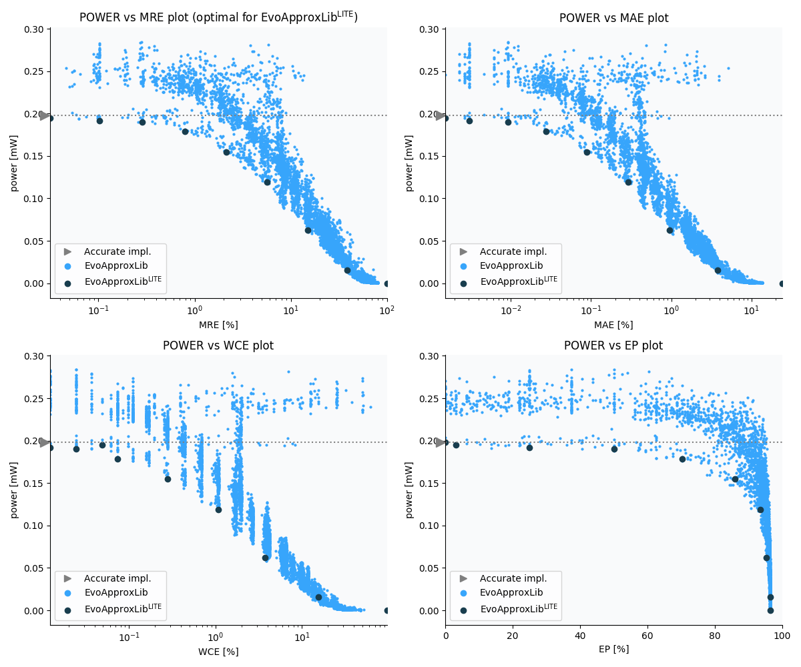

Selected circuits
===================
 - **Circuit**: 8x5-bit unsigned multiplier
 - **Selection criteria**: pareto optimal sub-set wrt. pwr and mre parameters

Parameters of selected circuits
----------------------------

| Circuit name | MAE% | WCE% | EP% | MRE% | MSE | Download |
| --- |  --- | --- | --- | --- | --- | --- | 
| mul8x5u_4HF | 0.00 | 0.00 | 0.00 | 0.00 | 0 |  [[Verilog](mul8x5u_4HF.v)]  [[C](mul8x5u_4HF.c)] |
| mul8x5u_1JZ | 0.0015 | 0.049 | 3.12 | 0.031 | 0.5 |  [[Verilog](mul8x5u_1JZ.v)]  [[C](mul8x5u_1JZ.c)] |
| mul8x5u_2BB | 0.0031 | 0.012 | 25.00 | 0.10 | 0.25 |  [[Verilog](mul8x5u_2BB.v)]  [[C](mul8x5u_2BB.c)] |
| mul8x5u_5VH | 0.0092 | 0.024 | 50.00 | 0.28 | 1.2 |  [[Verilog](mul8x5u_5VH.v)]  [[C](mul8x5u_5VH.c)] |
| mul8x5u_47N | 0.027 | 0.073 | 70.31 | 0.79 | 9.2 |  [[Verilog](mul8x5u_47N.v)]  [[C](mul8x5u_47N.c)] |
| mul8x5u_34Z | 0.089 | 0.28 | 85.94 | 2.15 | 86 |  [[Verilog](mul8x5u_34Z.v)]  [[C](mul8x5u_34Z.c)] |
| mul8x5u_4U7 | 0.29 | 1.09 | 93.44 | 5.70 | 892 |  [[Verilog](mul8x5u_4U7.v)]  [[C](mul8x5u_4U7.c)] |
| mul8x5u_3LT | 0.94 | 3.77 | 95.37 | 15.13 | 9467 |  [[Verilog](mul8x5u_3LT.v)]  [[C](mul8x5u_3LT.c)] |
| mul8x5u_1QQ | 3.81 | 15.44 | 96.37 | 38.51 | 154036 |  [[Verilog](mul8x5u_1QQ.v)]  [[C](mul8x5u_1QQ.c)] |
| mul8x5u_4PP | 24.12 | 96.50 | 96.50 | 100.00 | 70690.462e2 |  [[Verilog](mul8x5u_4PP.v)]  [[C](mul8x5u_4PP.c)] |
    
Parameters
--------------

References
--------------
   - V. Mrazek, L. Sekanina, Z. Vasicek "Libraries of Approximate Circuits: Automated Design and Application in CNN Accelerators" IEEE Journal on Emerging and Selected Topics in Circuits and Systems, Vol 10, No 4, 2020

             