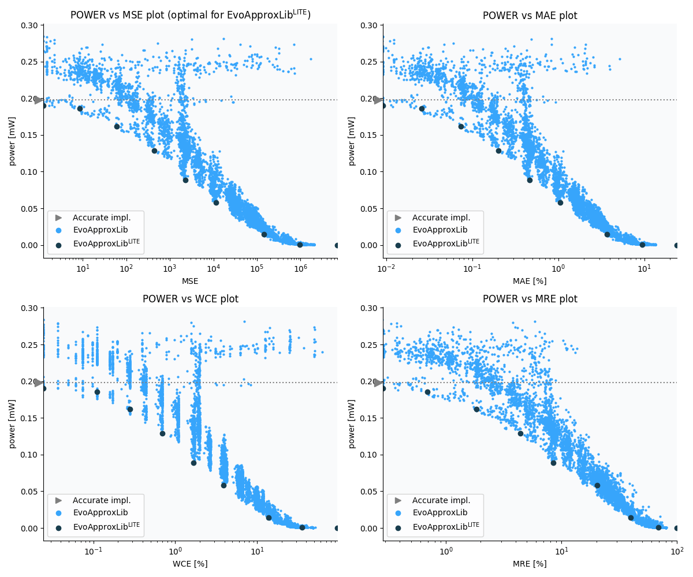

Selected circuits
===================
 - **Circuit**: 8x5-bit unsigned multiplier
 - **Selection criteria**: pareto optimal sub-set wrt. pwr and mse parameters

Parameters of selected circuits
----------------------------

| Circuit name | MAE% | WCE% | EP% | MRE% | MSE | Download |
| --- |  --- | --- | --- | --- | --- | --- | 
| mul8x5u_4HF | 0.00 | 0.00 | 0.00 | 0.00 | 0 |  [[Verilog](mul8x5u_4HF.v)]  [[C](mul8x5u_4HF.c)] |
| mul8x5u_5VH | 0.0092 | 0.024 | 50.00 | 0.28 | 1.2 |  [[Verilog](mul8x5u_5VH.v)]  [[C](mul8x5u_5VH.c)] |
| mul8x5u_4S1 | 0.026 | 0.11 | 71.36 | 0.69 | 8.6 |  [[Verilog](mul8x5u_4S1.v)]  [[C](mul8x5u_4S1.c)] |
| mul8x5u_34U | 0.073 | 0.28 | 83.25 | 1.85 | 61 |  [[Verilog](mul8x5u_34U.v)]  [[C](mul8x5u_34U.c)] |
| mul8x5u_44R | 0.20 | 0.70 | 91.80 | 4.40 | 434 |  [[Verilog](mul8x5u_44R.v)]  [[C](mul8x5u_44R.c)] |
| mul8x5u_5SU | 0.47 | 1.66 | 94.41 | 8.50 | 2287 |  [[Verilog](mul8x5u_5SU.v)]  [[C](mul8x5u_5SU.c)] |
| mul8x5u_1G4 | 1.05 | 3.91 | 95.95 | 20.33 | 11334 |  [[Verilog](mul8x5u_1G4.v)]  [[C](mul8x5u_1G4.c)] |
| mul8x5u_1VH | 3.70 | 13.88 | 96.36 | 39.67 | 142736 |  [[Verilog](mul8x5u_1VH.v)]  [[C](mul8x5u_1VH.c)] |
| mul8x5u_1GV | 9.33 | 35.66 | 96.50 | 68.64 | 959094 |  [[Verilog](mul8x5u_1GV.v)]  [[C](mul8x5u_1GV.c)] |
| mul8x5u_4PP | 24.12 | 96.50 | 96.50 | 100.00 | 70690.462e2 |  [[Verilog](mul8x5u_4PP.v)]  [[C](mul8x5u_4PP.c)] |
    
Parameters
--------------

References
--------------
   - V. Mrazek, L. Sekanina, Z. Vasicek "Libraries of Approximate Circuits: Automated Design and Application in CNN Accelerators" IEEE Journal on Emerging and Selected Topics in Circuits and Systems, Vol 10, No 4, 2020

             