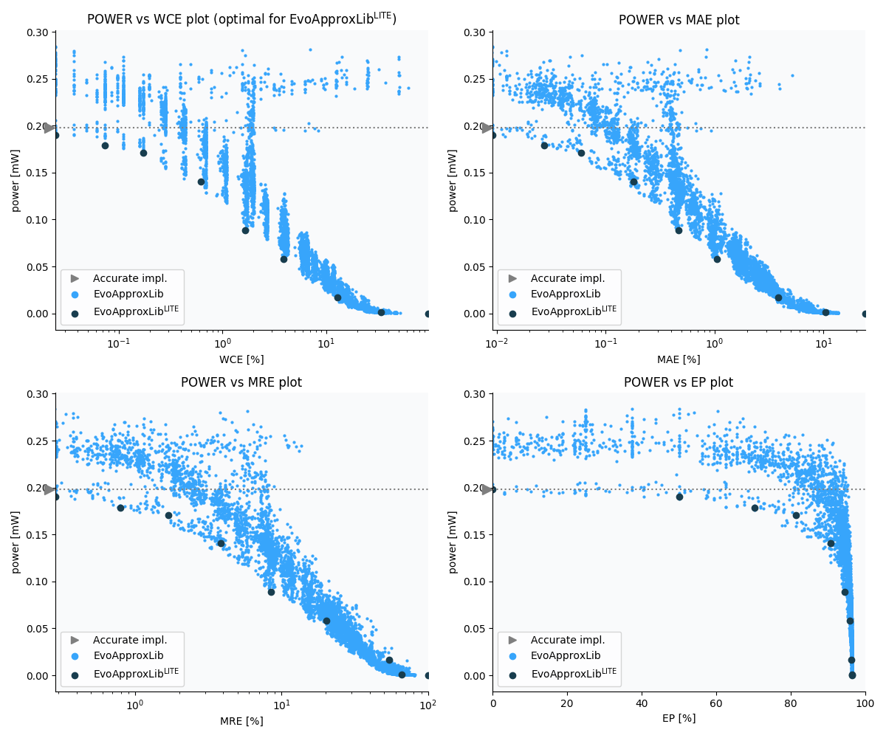

Selected circuits
===================
 - **Circuit**: 8x5-bit unsigned multiplier
 - **Selection criteria**: pareto optimal sub-set wrt. pwr and wce parameters

Parameters of selected circuits
----------------------------

| Circuit name | MAE% | WCE% | EP% | MRE% | MSE | Download |
| --- |  --- | --- | --- | --- | --- | --- | 
| mul8x5u_4HF | 0.00 | 0.00 | 0.00 | 0.00 | 0 |  [[Verilog](mul8x5u_4HF.v)]  [[C](mul8x5u_4HF.c)] |
| mul8x5u_5VH | 0.0092 | 0.024 | 50.00 | 0.28 | 1.2 |  [[Verilog](mul8x5u_5VH.v)]  [[C](mul8x5u_5VH.c)] |
| mul8x5u_47N | 0.027 | 0.073 | 70.31 | 0.79 | 9.2 |  [[Verilog](mul8x5u_47N.v)]  [[C](mul8x5u_47N.c)] |
| mul8x5u_5BY | 0.059 | 0.17 | 81.47 | 1.69 | 39 |  [[Verilog](mul8x5u_5BY.v)]  [[C](mul8x5u_5BY.c)] |
| mul8x5u_43C | 0.18 | 0.62 | 90.62 | 3.83 | 356 |  [[Verilog](mul8x5u_43C.v)]  [[C](mul8x5u_43C.c)] |
| mul8x5u_5SU | 0.47 | 1.66 | 94.41 | 8.50 | 2287 |  [[Verilog](mul8x5u_5SU.v)]  [[C](mul8x5u_5SU.c)] |
| mul8x5u_1G4 | 1.05 | 3.91 | 95.95 | 20.33 | 11334 |  [[Verilog](mul8x5u_1G4.v)]  [[C](mul8x5u_1G4.c)] |
| mul8x5u_202 | 3.85 | 12.89 | 96.31 | 54.36 | 154522 |  [[Verilog](mul8x5u_202.v)]  [[C](mul8x5u_202.c)] |
| mul8x5u_18L | 9.00 | 31.31 | 96.45 | 70.86 | 911969 |  [[Verilog](mul8x5u_18L.v)]  [[C](mul8x5u_18L.c)] |
| mul8x5u_4PP | 24.12 | 96.50 | 96.50 | 100.00 | 70690.462e2 |  [[Verilog](mul8x5u_4PP.v)]  [[C](mul8x5u_4PP.c)] |
    
Parameters
--------------

References
--------------
   - V. Mrazek, L. Sekanina, Z. Vasicek "Libraries of Approximate Circuits: Automated Design and Application in CNN Accelerators" IEEE Journal on Emerging and Selected Topics in Circuits and Systems, Vol 10, No 4, 2020

             