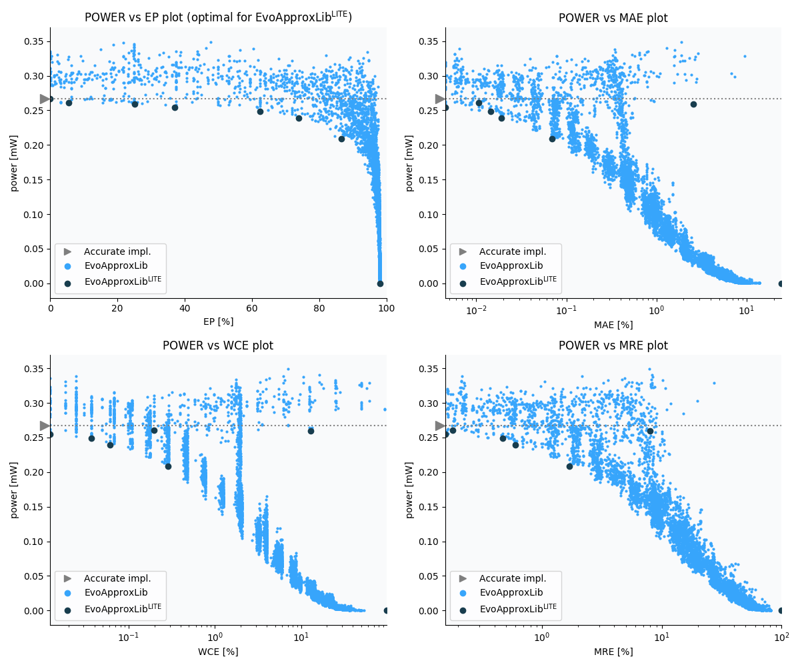

Selected circuits
===================
 - **Circuit**: 8x6-bit unsigned multiplier
 - **Selection criteria**: pareto optimal sub-set wrt. pwr and ep parameters

Parameters of selected circuits
----------------------------

| Circuit name | MAE% | WCE% | EP% | MRE% | MSE | Download |
| --- |  --- | --- | --- | --- | --- | --- | 
| mul8x6u_1NM | 0.00 | 0.00 | 0.00 | 0.00 | 0 |  [[Verilog](mul8x6u_1NM.v)]  [[C](mul8x6u_1NM.c)] |
| mul8x6u_0YZ | 0.011 | 0.20 | 5.47 | 0.18 | 56 |  [[Verilog](mul8x6u_0YZ.v)]  [[C](mul8x6u_0YZ.c)] |
| mul8x6u_1US | 2.57 | 12.89 | 25.20 | 7.96 | 856704 |  [[Verilog](mul8x6u_1US.v)]  [[C](mul8x6u_1US.c)] |
| mul8x6u_3GJ | 0.0045 | 0.012 | 37.11 | 0.16 | 1.5 |  [[Verilog](mul8x6u_3GJ.v)]  [[C](mul8x6u_3GJ.c)] |
| mul8x6u_54L | 0.014 | 0.037 | 62.50 | 0.47 | 10 |  [[Verilog](mul8x6u_54L.v)]  [[C](mul8x6u_54L.c)] |
| mul8x6u_5P0 | 0.019 | 0.061 | 73.83 | 0.60 | 17 |  [[Verilog](mul8x6u_5P0.v)]  [[C](mul8x6u_5P0.c)] |
| mul8x6u_4QT | 0.07 | 0.29 | 86.56 | 1.70 | 219 |  [[Verilog](mul8x6u_4QT.v)]  [[C](mul8x6u_4QT.c)] |
| mul8x6u_3GX | 24.51 | 98.05 | 98.05 | 100.00 | 28960.286e3 |  [[Verilog](mul8x6u_3GX.v)]  [[C](mul8x6u_3GX.c)] |
    
Parameters
--------------

References
--------------
   - V. Mrazek, L. Sekanina, Z. Vasicek "Libraries of Approximate Circuits: Automated Design and Application in CNN Accelerators" IEEE Journal on Emerging and Selected Topics in Circuits and Systems, Vol 10, No 4, 2020

             