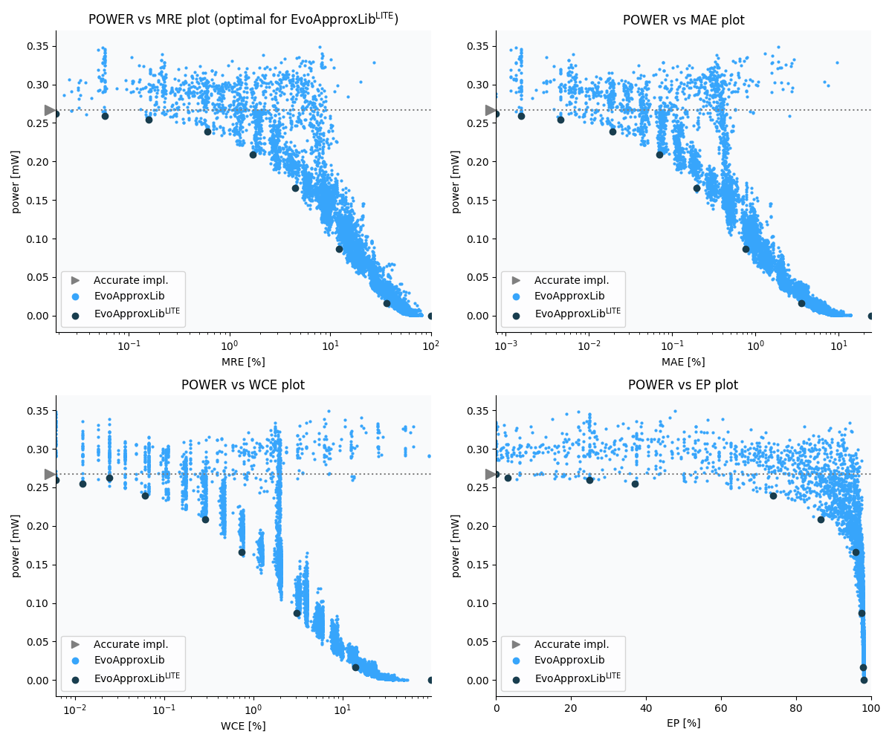

Selected circuits
===================
 - **Circuit**: 8x6-bit unsigned multiplier
 - **Selection criteria**: pareto optimal sub-set wrt. pwr and mre parameters

Parameters of selected circuits
----------------------------

| Circuit name | MAE% | WCE% | EP% | MRE% | MSE | Download |
| --- |  --- | --- | --- | --- | --- | --- | 
| mul8x6u_049 | 0.00 | 0.00 | 0.00 | 0.00 | 0 |  [[Verilog](mul8x6u_049.v)]  [[C](mul8x6u_049.c)] |
| mul8x6u_12E | 0.00076 | 0.024 | 3.12 | 0.019 | 0.5 |  [[Verilog](mul8x6u_12E.v)]  [[C](mul8x6u_12E.c)] |
| mul8x6u_5EZ | 0.0015 | 0.0061 | 25.00 | 0.058 | 0.25 |  [[Verilog](mul8x6u_5EZ.v)]  [[C](mul8x6u_5EZ.c)] |
| mul8x6u_5TS | 0.0045 | 0.012 | 37.11 | 0.16 | 1.5 |  [[Verilog](mul8x6u_5TS.v)]  [[C](mul8x6u_5TS.c)] |
| mul8x6u_446 | 0.019 | 0.061 | 73.83 | 0.60 | 17 |  [[Verilog](mul8x6u_446.v)]  [[C](mul8x6u_446.c)] |
| mul8x6u_3DQ | 0.07 | 0.29 | 86.56 | 1.70 | 219 |  [[Verilog](mul8x6u_3DQ.v)]  [[C](mul8x6u_3DQ.c)] |
| mul8x6u_3E7 | 0.20 | 0.74 | 95.88 | 4.51 | 1613 |  [[Verilog](mul8x6u_3E7.v)]  [[C](mul8x6u_3E7.c)] |
| mul8x6u_4RX | 0.76 | 3.06 | 97.53 | 12.27 | 24027 |  [[Verilog](mul8x6u_4RX.v)]  [[C](mul8x6u_4RX.c)] |
| mul8x6u_23K | 3.56 | 13.99 | 97.90 | 36.16 | 532474 |  [[Verilog](mul8x6u_23K.v)]  [[C](mul8x6u_23K.c)] |
| mul8x6u_51C | 24.51 | 98.05 | 98.05 | 100.00 | 28960.286e3 |  [[Verilog](mul8x6u_51C.v)]  [[C](mul8x6u_51C.c)] |
    
Parameters
--------------

References
--------------
   - V. Mrazek, L. Sekanina and Z. Vasicek, "Libraries of Approximate Circuits: Design and Application in CNN Accelerators"

             