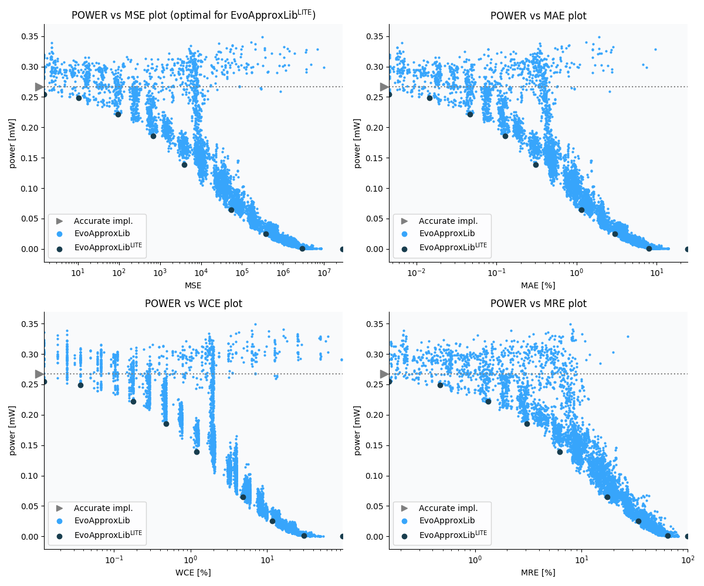

Selected circuits
===================
 - **Circuit**: 8x6-bit unsigned multiplier
 - **Selection criteria**: pareto optimal sub-set wrt. pwr and mse parameters

Parameters of selected circuits
----------------------------

| Circuit name | MAE% | WCE% | EP% | MRE% | MSE | Download |
| --- |  --- | --- | --- | --- | --- | --- | 
| mul8x6u_1NM | 0.00 | 0.00 | 0.00 | 0.00 | 0 |  [[Verilog](mul8x6u_1NM.v)]  [[C](mul8x6u_1NM.c)] |
| mul8x6u_3GJ | 0.0045 | 0.012 | 37.11 | 0.16 | 1.5 |  [[Verilog](mul8x6u_3GJ.v)]  [[C](mul8x6u_3GJ.c)] |
| mul8x6u_54L | 0.014 | 0.037 | 62.50 | 0.47 | 10 |  [[Verilog](mul8x6u_54L.v)]  [[C](mul8x6u_54L.c)] |
| mul8x6u_42R | 0.046 | 0.18 | 88.29 | 1.33 | 94 |  [[Verilog](mul8x6u_42R.v)]  [[C](mul8x6u_42R.c)] |
| mul8x6u_5GP | 0.13 | 0.48 | 92.97 | 3.06 | 682 |  [[Verilog](mul8x6u_5GP.v)]  [[C](mul8x6u_5GP.c)] |
| mul8x6u_3JY | 0.31 | 1.21 | 95.89 | 6.26 | 3923 |  [[Verilog](mul8x6u_3JY.v)]  [[C](mul8x6u_3JY.c)] |
| mul8x6u_5SA | 1.14 | 4.81 | 97.80 | 17.53 | 53634 |  [[Verilog](mul8x6u_5SA.v)]  [[C](mul8x6u_5SA.c)] |
| mul8x6u_1HE | 2.98 | 11.68 | 97.93 | 34.19 | 376281 |  [[Verilog](mul8x6u_1HE.v)]  [[C](mul8x6u_1HE.c)] |
| mul8x6u_36E | 7.98 | 30.23 | 98.02 | 64.72 | 29431.077e2 |  [[Verilog](mul8x6u_36E.v)]  [[C](mul8x6u_36E.c)] |
| mul8x6u_3GX | 24.51 | 98.05 | 98.05 | 100.00 | 28960.286e3 |  [[Verilog](mul8x6u_3GX.v)]  [[C](mul8x6u_3GX.c)] |
    
Parameters
--------------

References
--------------
   - V. Mrazek, L. Sekanina, Z. Vasicek "Libraries of Approximate Circuits: Automated Design and Application in CNN Accelerators" IEEE Journal on Emerging and Selected Topics in Circuits and Systems, Vol 10, No 4, 2020

             