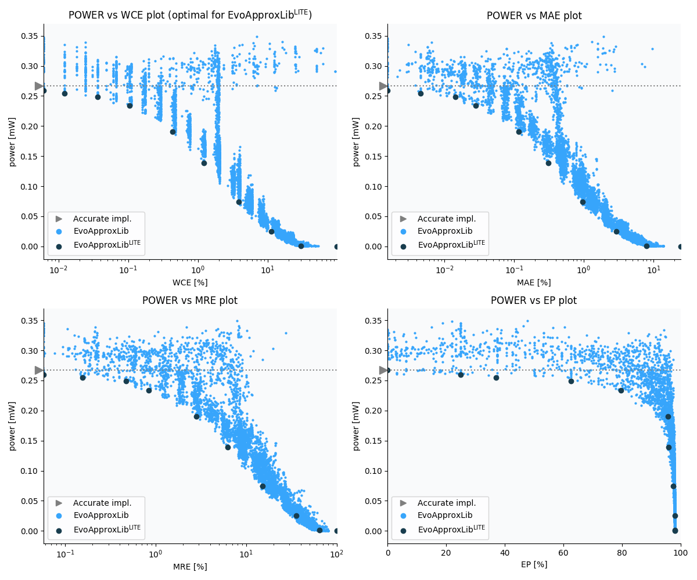

Selected circuits
===================
 - **Circuit**: 8x6-bit unsigned multiplier
 - **Selection criteria**: pareto optimal sub-set wrt. pwr and wce parameters

Parameters of selected circuits
----------------------------

| Circuit name | MAE% | WCE% | EP% | MRE% | MSE | Download |
| --- |  --- | --- | --- | --- | --- | --- | 
| mul8x6u_1NM | 0.00 | 0.00 | 0.00 | 0.00 | 0 |  [[Verilog](mul8x6u_1NM.v)]  [[C](mul8x6u_1NM.c)] |
| mul8x6u_6DG | 0.0015 | 0.0061 | 25.00 | 0.058 | 0.25 |  [[Verilog](mul8x6u_6DG.v)]  [[C](mul8x6u_6DG.c)] |
| mul8x6u_3GJ | 0.0045 | 0.012 | 37.11 | 0.16 | 1.5 |  [[Verilog](mul8x6u_3GJ.v)]  [[C](mul8x6u_3GJ.c)] |
| mul8x6u_54L | 0.014 | 0.037 | 62.50 | 0.47 | 10 |  [[Verilog](mul8x6u_54L.v)]  [[C](mul8x6u_54L.c)] |
| mul8x6u_3FS | 0.028 | 0.10 | 79.69 | 0.83 | 38 |  [[Verilog](mul8x6u_3FS.v)]  [[C](mul8x6u_3FS.c)] |
| mul8x6u_5HK | 0.12 | 0.43 | 95.75 | 2.81 | 556 |  [[Verilog](mul8x6u_5HK.v)]  [[C](mul8x6u_5HK.c)] |
| mul8x6u_3JY | 0.31 | 1.21 | 95.89 | 6.26 | 3923 |  [[Verilog](mul8x6u_3JY.v)]  [[C](mul8x6u_3JY.c)] |
| mul8x6u_2UB | 0.96 | 3.88 | 97.55 | 15.15 | 38505 |  [[Verilog](mul8x6u_2UB.v)]  [[C](mul8x6u_2UB.c)] |
| mul8x6u_12A | 2.90 | 11.38 | 97.96 | 35.91 | 353184 |  [[Verilog](mul8x6u_12A.v)]  [[C](mul8x6u_12A.c)] |
| mul8x6u_59L | 9.53 | 32.90 | 98.03 | 66.43 | 40099.659e2 |  [[Verilog](mul8x6u_59L.v)]  [[C](mul8x6u_59L.c)] |
| mul8x6u_3GX | 24.51 | 98.05 | 98.05 | 100.00 | 28960.286e3 |  [[Verilog](mul8x6u_3GX.v)]  [[C](mul8x6u_3GX.c)] |
    
Parameters
--------------

References
--------------
   - V. Mrazek, L. Sekanina, Z. Vasicek "Libraries of Approximate Circuits: Automated Design and Application in CNN Accelerators" IEEE Journal on Emerging and Selected Topics in Circuits and Systems, Vol 10, No 4, 2020

             