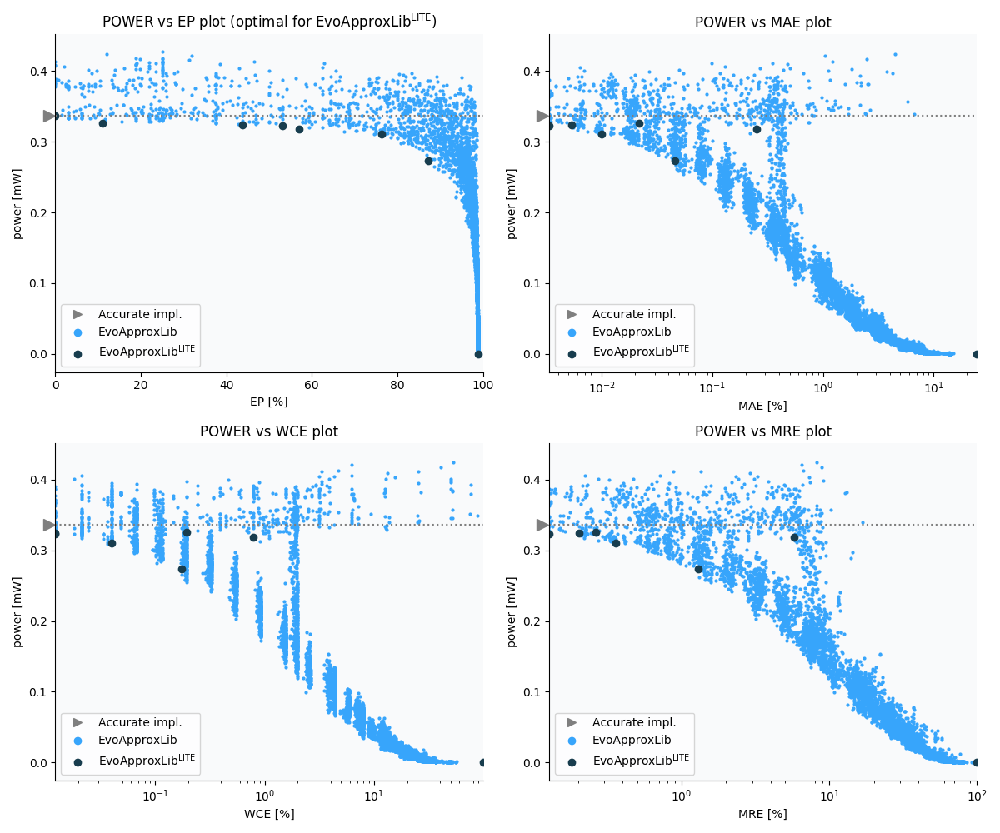

Selected circuits
===================
 - **Circuit**: 8x7-bit unsigned multiplier
 - **Selection criteria**: pareto optimal sub-set wrt. pwr and ep parameters

Parameters of selected circuits
----------------------------

| Circuit name | MAE% | WCE% | EP% | MRE% | MSE | Download |
| --- |  --- | --- | --- | --- | --- | --- | 
| mul8x7u_11N | 0.00 | 0.00 | 0.00 | 0.00 | 0 |  [[Verilog](mul8x7u_11N.v)]  [[C](mul8x7u_11N.c)] |
| mul8x7u_3ER | 0.022 | 0.20 | 11.13 | 0.26 | 456 |  [[Verilog](mul8x7u_3ER.v)]  [[C](mul8x7u_3ER.c)] |
| mul8x7u_524 | 0.0053 | 0.012 | 43.75 | 0.20 | 7.0 |  [[Verilog](mul8x7u_524.v)]  [[C](mul8x7u_524.c)] |
| mul8x7u_529 | 0.0033 | 0.012 | 53.12 | 0.13 | 2.8 |  [[Verilog](mul8x7u_529.v)]  [[C](mul8x7u_529.c)] |
| mul8x7u_2Y1 | 0.25 | 0.78 | 56.99 | 5.77 | 12964 |  [[Verilog](mul8x7u_2Y1.v)]  [[C](mul8x7u_2Y1.c)] |
| mul8x7u_6ZC | 0.01 | 0.04 | 76.38 | 0.36 | 19 |  [[Verilog](mul8x7u_6ZC.v)]  [[C](mul8x7u_6ZC.c)] |
| mul8x7u_5XL | 0.046 | 0.17 | 87.27 | 1.30 | 393 |  [[Verilog](mul8x7u_5XL.v)]  [[C](mul8x7u_5XL.c)] |
| mul8x7u_589 | 24.71 | 98.83 | 98.83 | 100.00 | 11722.021e4 |  [[Verilog](mul8x7u_589.v)]  [[C](mul8x7u_589.c)] |
    
Parameters
--------------

References
--------------
   - V. Mrazek, L. Sekanina, Z. Vasicek "Libraries of Approximate Circuits: Automated Design and Application in CNN Accelerators" IEEE Journal on Emerging and Selected Topics in Circuits and Systems, Vol 10, No 4, 2020

             