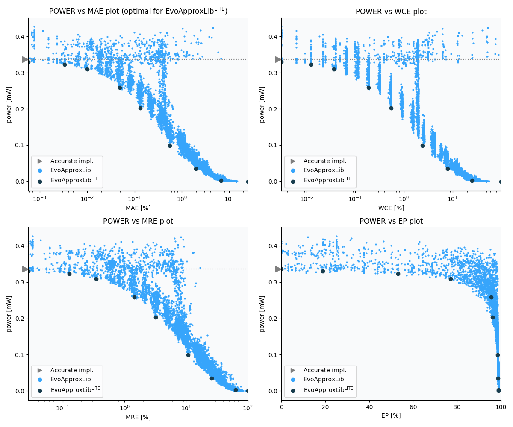

Selected circuits
===================
 - **Circuit**: 8x7-bit unsigned multiplier
 - **Selection criteria**: pareto optimal sub-set wrt. pwr and mae parameters

Parameters of selected circuits
----------------------------

| Circuit name | MAE% | WCE% | EP% | MRE% | MSE | Download |
| --- |  --- | --- | --- | --- | --- | --- | 
| mul8x7u_11N | 0.00 | 0.00 | 0.00 | 0.00 | 0 |  [[Verilog](mul8x7u_11N.v)]  [[C](mul8x7u_11N.c)] |
| mul8x7u_2Y0 | 0.00057 | 0.0031 | 18.75 | 0.028 | 0.19 |  [[Verilog](mul8x7u_2Y0.v)]  [[C](mul8x7u_2Y0.c)] |
| mul8x7u_529 | 0.0033 | 0.012 | 53.12 | 0.13 | 2.8 |  [[Verilog](mul8x7u_529.v)]  [[C](mul8x7u_529.c)] |
| mul8x7u_6XM | 0.01 | 0.037 | 76.98 | 0.35 | 19 |  [[Verilog](mul8x7u_6XM.v)]  [[C](mul8x7u_6XM.c)] |
| mul8x7u_5VZ | 0.049 | 0.19 | 95.65 | 1.43 | 416 |  [[Verilog](mul8x7u_5VZ.v)]  [[C](mul8x7u_5VZ.c)] |
| mul8x7u_3JD | 0.13 | 0.54 | 96.12 | 3.19 | 2949 |  [[Verilog](mul8x7u_3JD.v)]  [[C](mul8x7u_3JD.c)] |
| mul8x7u_6EP | 0.56 | 2.39 | 98.57 | 10.75 | 51673 |  [[Verilog](mul8x7u_6EP.v)]  [[C](mul8x7u_6EP.c)] |
| mul8x7u_2VL | 1.97 | 7.96 | 98.73 | 25.98 | 638557 |  [[Verilog](mul8x7u_2VL.v)]  [[C](mul8x7u_2VL.c)] |
| mul8x7u_18U | 6.79 | 25.20 | 98.82 | 63.75 | 79116.74e2 |  [[Verilog](mul8x7u_18U.v)]  [[C](mul8x7u_18U.c)] |
| mul8x7u_589 | 24.71 | 98.83 | 98.83 | 100.00 | 11722.021e4 |  [[Verilog](mul8x7u_589.v)]  [[C](mul8x7u_589.c)] |
    
Parameters
--------------

References
--------------
   - V. Mrazek, L. Sekanina, Z. Vasicek "Libraries of Approximate Circuits: Automated Design and Application in CNN Accelerators" IEEE Journal on Emerging and Selected Topics in Circuits and Systems, Vol 10, No 4, 2020

             