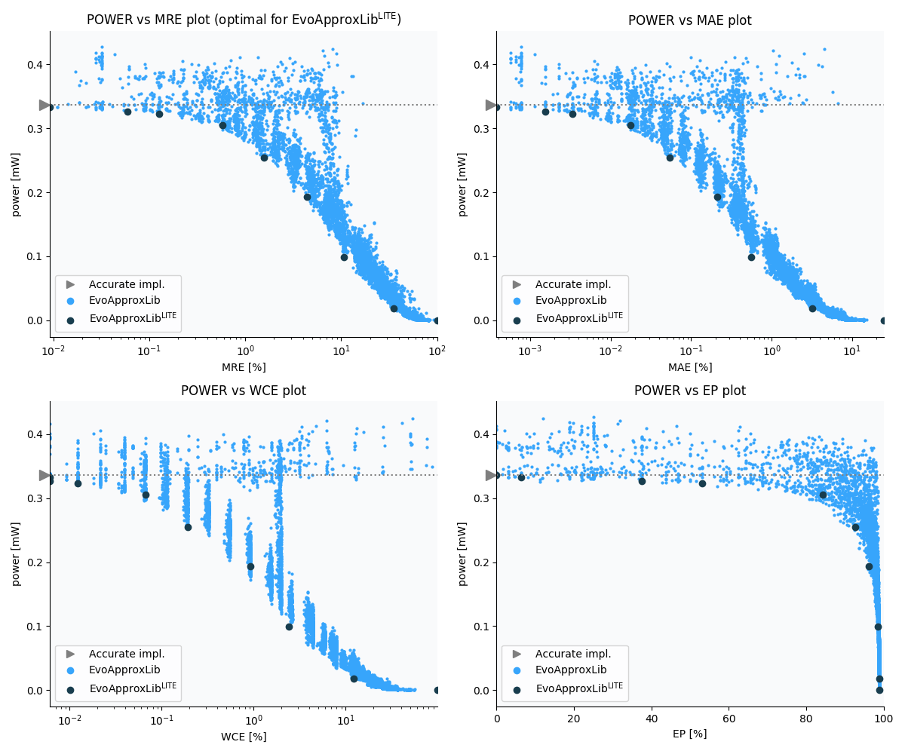

Selected circuits
===================
 - **Circuit**: 8x7-bit unsigned multiplier
 - **Selection criteria**: pareto optimal sub-set wrt. pwr and mre parameters

Parameters of selected circuits
----------------------------

| Circuit name | MAE% | WCE% | EP% | MRE% | MSE | Download |
| --- |  --- | --- | --- | --- | --- | --- | 
| mul8x7u_11N | 0.00 | 0.00 | 0.00 | 0.00 | 0 |  [[Verilog](mul8x7u_11N.v)]  [[C](mul8x7u_11N.c)] |
| mul8x7u_2LC | 0.00038 | 0.0061 | 6.25 | 0.0092 | 0.25 |  [[Verilog](mul8x7u_2LC.v)]  [[C](mul8x7u_2LC.c)] |
| mul8x7u_3YT | 0.0015 | 0.0061 | 37.50 | 0.059 | 0.75 |  [[Verilog](mul8x7u_3YT.v)]  [[C](mul8x7u_3YT.c)] |
| mul8x7u_529 | 0.0033 | 0.012 | 53.12 | 0.13 | 2.8 |  [[Verilog](mul8x7u_529.v)]  [[C](mul8x7u_529.c)] |
| mul8x7u_3YF | 0.017 | 0.067 | 84.28 | 0.57 | 56 |  [[Verilog](mul8x7u_3YF.v)]  [[C](mul8x7u_3YF.c)] |
| mul8x7u_5YV | 0.054 | 0.19 | 92.69 | 1.57 | 498 |  [[Verilog](mul8x7u_5YV.v)]  [[C](mul8x7u_5YV.c)] |
| mul8x7u_4LX | 0.21 | 0.92 | 96.15 | 4.41 | 7858 |  [[Verilog](mul8x7u_4LX.v)]  [[C](mul8x7u_4LX.c)] |
| mul8x7u_6EP | 0.56 | 2.39 | 98.57 | 10.75 | 51673 |  [[Verilog](mul8x7u_6EP.v)]  [[C](mul8x7u_6EP.c)] |
| mul8x7u_581 | 3.19 | 12.32 | 98.81 | 35.41 | 16822.757e2 |  [[Verilog](mul8x7u_581.v)]  [[C](mul8x7u_581.c)] |
| mul8x7u_589 | 24.71 | 98.83 | 98.83 | 100.00 | 11722.021e4 |  [[Verilog](mul8x7u_589.v)]  [[C](mul8x7u_589.c)] |
    
Parameters
--------------

References
--------------
   - V. Mrazek, L. Sekanina, Z. Vasicek "Libraries of Approximate Circuits: Automated Design and Application in CNN Accelerators" IEEE Journal on Emerging and Selected Topics in Circuits and Systems, Vol 10, No 4, 2020

             