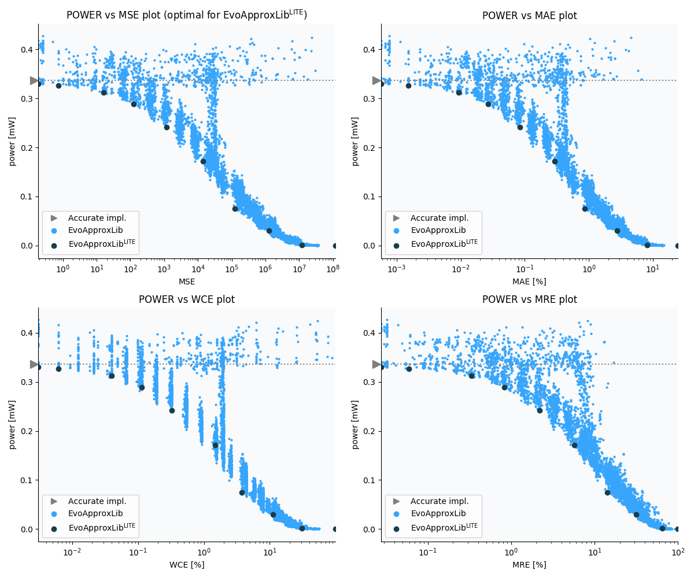

Selected circuits
===================
 - **Circuit**: 8x7-bit unsigned multiplier
 - **Selection criteria**: pareto optimal sub-set wrt. pwr and mse parameters

Parameters of selected circuits
----------------------------

| Circuit name | MAE% | WCE% | EP% | MRE% | MSE | Download |
| --- |  --- | --- | --- | --- | --- | --- | 
| mul8x7u_0V5 | 0.00 | 0.00 | 0.00 | 0.00 | 0 |  [[Verilog](mul8x7u_0V5.v)]  [[C](mul8x7u_0V5.c)] |
| mul8x7u_2SG | 0.00057 | 0.0031 | 18.75 | 0.028 | 0.19 |  [[Verilog](mul8x7u_2SG.v)]  [[C](mul8x7u_2SG.c)] |
| mul8x7u_5FH | 0.0015 | 0.0061 | 37.50 | 0.059 | 0.75 |  [[Verilog](mul8x7u_5FH.v)]  [[C](mul8x7u_5FH.c)] |
| mul8x7u_44Q | 0.0093 | 0.04 | 83.11 | 0.33 | 16 |  [[Verilog](mul8x7u_44Q.v)]  [[C](mul8x7u_44Q.c)] |
| mul8x7u_3VV | 0.027 | 0.11 | 89.15 | 0.83 | 123 |  [[Verilog](mul8x7u_3VV.v)]  [[C](mul8x7u_3VV.c)] |
| mul8x7u_6YT | 0.084 | 0.32 | 93.81 | 2.19 | 1200 |  [[Verilog](mul8x7u_6YT.v)]  [[C](mul8x7u_6YT.c)] |
| mul8x7u_635 | 0.29 | 1.47 | 97.33 | 5.73 | 14382 |  [[Verilog](mul8x7u_635.v)]  [[C](mul8x7u_635.c)] |
| mul8x7u_125 | 0.86 | 3.75 | 98.45 | 14.27 | 124595 |  [[Verilog](mul8x7u_125.v)]  [[C](mul8x7u_125.c)] |
| mul8x7u_0YY | 2.74 | 11.27 | 98.77 | 31.30 | 12776.178e2 |  [[Verilog](mul8x7u_0YY.v)]  [[C](mul8x7u_0YY.c)] |
| mul8x7u_1AG | 8.05 | 30.62 | 98.83 | 64.51 | 11896.765e3 |  [[Verilog](mul8x7u_1AG.v)]  [[C](mul8x7u_1AG.c)] |
| mul8x7u_4MC | 24.71 | 98.83 | 98.83 | 100.00 | 11722.021e4 |  [[Verilog](mul8x7u_4MC.v)]  [[C](mul8x7u_4MC.c)] |
    
Parameters
--------------

References
--------------
   - V. Mrazek, L. Sekanina, Z. Vasicek "Libraries of Approximate Circuits: Automated Design and Application in CNN Accelerators" IEEE Journal on Emerging and Selected Topics in Circuits and Systems, Vol 10, No 4, 2020

             