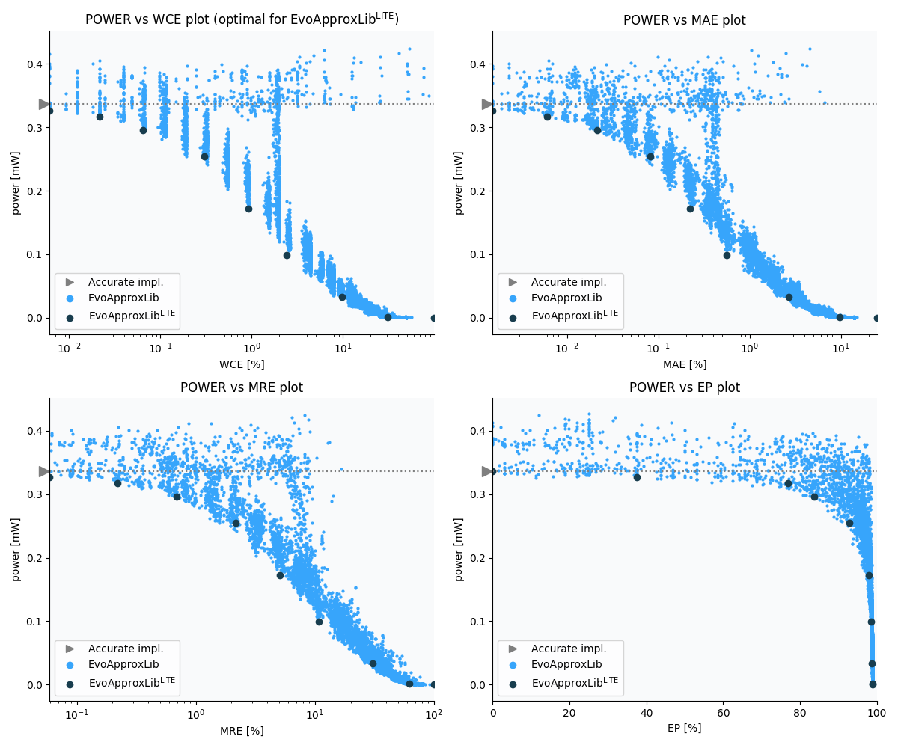

Selected circuits
===================
 - **Circuit**: 8x7-bit unsigned multiplier
 - **Selection criteria**: pareto optimal sub-set wrt. pwr and wce parameters

Parameters of selected circuits
----------------------------

| Circuit name | MAE% | WCE% | EP% | MRE% | MSE | Download |
| --- |  --- | --- | --- | --- | --- | --- | 
| mul8x7u_11N | 0.00 | 0.00 | 0.00 | 0.00 | 0 |  [[Verilog](mul8x7u_11N.v)]  [[C](mul8x7u_11N.c)] |
| mul8x7u_3YT | 0.0015 | 0.0061 | 37.50 | 0.059 | 0.75 |  [[Verilog](mul8x7u_3YT.v)]  [[C](mul8x7u_3YT.c)] |
| mul8x7u_6AA | 0.006 | 0.021 | 76.95 | 0.22 | 7.0 |  [[Verilog](mul8x7u_6AA.v)]  [[C](mul8x7u_6AA.c)] |
| mul8x7u_3Y2 | 0.021 | 0.064 | 83.59 | 0.69 | 79 |  [[Verilog](mul8x7u_3Y2.v)]  [[C](mul8x7u_3Y2.c)] |
| mul8x7u_711 | 0.081 | 0.30 | 92.92 | 2.16 | 1105 |  [[Verilog](mul8x7u_711.v)]  [[C](mul8x7u_711.c)] |
| mul8x7u_4DC | 0.22 | 0.92 | 97.83 | 5.13 | 8076 |  [[Verilog](mul8x7u_4DC.v)]  [[C](mul8x7u_4DC.c)] |
| mul8x7u_6EP | 0.56 | 2.39 | 98.57 | 10.75 | 51673 |  [[Verilog](mul8x7u_6EP.v)]  [[C](mul8x7u_6EP.c)] |
| mul8x7u_01Z | 2.66 | 9.76 | 98.77 | 30.68 | 11319.049e2 |  [[Verilog](mul8x7u_01Z.v)]  [[C](mul8x7u_01Z.c)] |
| mul8x7u_31P | 9.73 | 30.62 | 98.83 | 62.41 | 16898.093e3 |  [[Verilog](mul8x7u_31P.v)]  [[C](mul8x7u_31P.c)] |
| mul8x7u_589 | 24.71 | 98.83 | 98.83 | 100.00 | 11722.021e4 |  [[Verilog](mul8x7u_589.v)]  [[C](mul8x7u_589.c)] |
    
Parameters
--------------

References
--------------
   - V. Mrazek, L. Sekanina, Z. Vasicek "Libraries of Approximate Circuits: Automated Design and Application in CNN Accelerators" IEEE Journal on Emerging and Selected Topics in Circuits and Systems, Vol 10, No 4, 2020

             