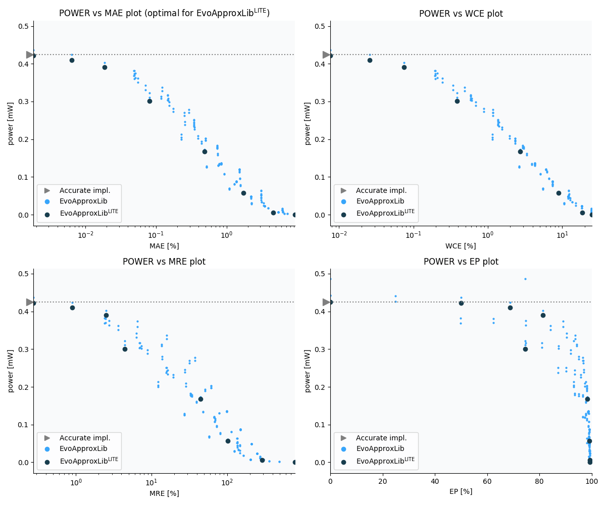

Selected circuits
===================
 - **Bitwidth**: 8
 - **Pareto filtration critera**: pwr - mae

Parameters of selected circuits
----------------------------

| Circuit name | MAE | WCE | EP | MRE | Download |
| --- |  --- | --- | --- | --- | --- | 
| mul8s_pwr_0_425_mae_00_0000 | 0.0 | 0 | 0.0 | 0.0 |  [Verilog generic](mul8s_pwr_0_425_mae_00_0000_gen.v) [Verilog PDK45](mul8s_pwr_0_425_mae_00_0000_pdk45.v)  [C](mul8s_pwr_0_425_mae_00_0000.c) |
| mul8s_pwr_0_422_mae_00_0018 | 1.2 | 5 | 50.0 | 0.2751742102 |  [Verilog generic](mul8s_pwr_0_422_mae_00_0018_gen.v) [Verilog PDK45](mul8s_pwr_0_422_mae_00_0018_pdk45.v)  [C](mul8s_pwr_0_422_mae_00_0018.c) |
| mul8s_pwr_0_410_mae_00_0064 | 4.2 | 17 | 68.75 | 0.9023975799 |  [Verilog generic](mul8s_pwr_0_410_mae_00_0064_gen.v) [Verilog PDK45](mul8s_pwr_0_410_mae_00_0064_pdk45.v)  [C](mul8s_pwr_0_410_mae_00_0064.c) |
| mul8s_pwr_0_391_mae_00_0186 | 12.2 | 49 | 81.25 | 2.5296091936 |  [Verilog generic](mul8s_pwr_0_391_mae_00_0186_gen.v) [Verilog PDK45](mul8s_pwr_0_391_mae_00_0186_pdk45.v)  [C](mul8s_pwr_0_391_mae_00_0186.c) |
| mul8s_pwr_0_301_mae_00_0814 | 53.33398 | 255 | 74.609375 | 4.4119727217 |  [Verilog generic](mul8s_pwr_0_301_mae_00_0814_gen.v) [Verilog PDK45](mul8s_pwr_0_301_mae_00_0814_pdk45.v)  [C](mul8s_pwr_0_301_mae_00_0814.c) |
| mul8s_pwr_0_167_mae_00_4892 | 320.6 | 1793 | 98.291015625 | 44.4568415648 |  [Verilog generic](mul8s_pwr_0_167_mae_00_4892_gen.v) [Verilog PDK45](mul8s_pwr_0_167_mae_00_4892_pdk45.v)  [C](mul8s_pwr_0_167_mae_00_4892.c) |
| mul8s_pwr_0_057_mae_01_7374 | 1138.6 | 5889 | 99.0844726562 | 101.608734242 |  [Verilog generic](mul8s_pwr_0_057_mae_01_7374_gen.v) [Verilog PDK45](mul8s_pwr_0_057_mae_01_7374_pdk45.v)  [C](mul8s_pwr_0_057_mae_01_7374.c) |
| mul8s_pwr_0_006_mae_04_6026 | 3016.36792 | 12159 | 99.2065429688 | 291.099890989 |  [Verilog generic](mul8s_pwr_0_006_mae_04_6026_gen.v) [Verilog PDK45](mul8s_pwr_0_006_mae_04_6026_pdk45.v)  [C](mul8s_pwr_0_006_mae_04_6026.c) |
| mul8s_pwr_0_000_mae_09_3260 | 6111.9 | 16383 | 99.21875 | 793.383662914 |  [Verilog generic](mul8s_pwr_0_000_mae_09_3260_gen.v) [Verilog PDK45](mul8s_pwr_0_000_mae_09_3260_pdk45.v)  [C](mul8s_pwr_0_000_mae_09_3260.c) |
    
Parameters
--------------

             