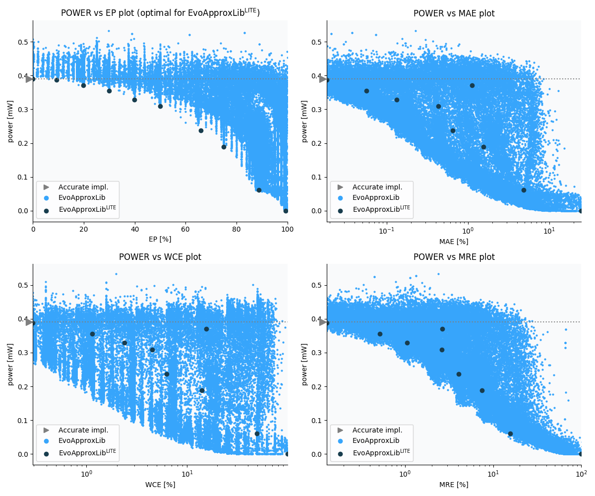

Selected circuits
===================
 - **Circuit**: 8-bit unsigned multiplier
 - **Selection criteria**: pareto optimal sub-set wrt. pwr and ep parameters

Parameters of selected circuits
----------------------------

| Circuit name | MAE% | WCE% | EP% | MRE% | MSE | Download |
| --- |  --- | --- | --- | --- | --- | --- | 
| mul8u_1JJQ | 0.00 | 0.00 | 0.00 | 0.00 | 0 |  [[Verilog](mul8u_1JJQ.v)] [[VerilogPDK45](mul8u_1JJQ_pdk45.v)] [[C](mul8u_1JJQ.c)] |
| mul8u_12KA | 0.018 | 0.29 | 9.38 | 0.13 | 1792 |  [[Verilog](mul8u_12KA.v)]  [[C](mul8u_12KA.c)] |
| mul8u_4TF | 1.12 | 15.53 | 19.82 | 2.64 | 55767.68e2 |  [[Verilog](mul8u_4TF.v)]  [[C](mul8u_4TF.c)] |
| mul8u_874 | 0.057 | 1.14 | 29.93 | 0.51 | 12684 |  [[Verilog](mul8u_874.v)]  [[C](mul8u_874.c)] |
| mul8u_8U3 | 0.13 | 2.38 | 39.93 | 1.04 | 52863 |  [[Verilog](mul8u_8U3.v)]  [[C](mul8u_8U3.c)] |
| mul8u_BG1 | 0.43 | 4.48 | 49.91 | 2.61 | 386332 |  [[Verilog](mul8u_BG1.v)]  [[C](mul8u_BG1.c)] |
| mul8u_1DMU | 0.65 | 6.23 | 65.97 | 4.05 | 645336 |  [[Verilog](mul8u_1DMU.v)]  [[C](mul8u_1DMU.c)] |
| mul8u_GJM | 1.54 | 13.92 | 74.91 | 7.46 | 36892.825e2 |  [[Verilog](mul8u_GJM.v)]  [[C](mul8u_GJM.c)] |
| mul8u_Z9D | 4.84 | 49.22 | 88.71 | 15.66 | 33602.746e3 |  [[Verilog](mul8u_Z9D.v)]  [[C](mul8u_Z9D.c)] |
| mul8u_TD3 | 24.81 | 99.22 | 99.22 | 100.00 | 47164.981e4 |  [[Verilog](mul8u_TD3.v)]  [[C](mul8u_TD3.c)] |
    
Parameters
--------------

References
--------------
   - V. Mrazek, R. Hrbacek, Z. Vasicek and L. Sekanina, "EvoApprox8b: Library of approximate adders and multipliers for circuit design and benchmarking of approximation methods". Design, Automation & Test in Europe Conference & Exhibition (DATE), 2017, Lausanne, 2017, pp. 258-261. doi: [10.23919/DATE.2017.7926993](https://dx.doi.org/10.23919/DATE.2017.7926993)

             