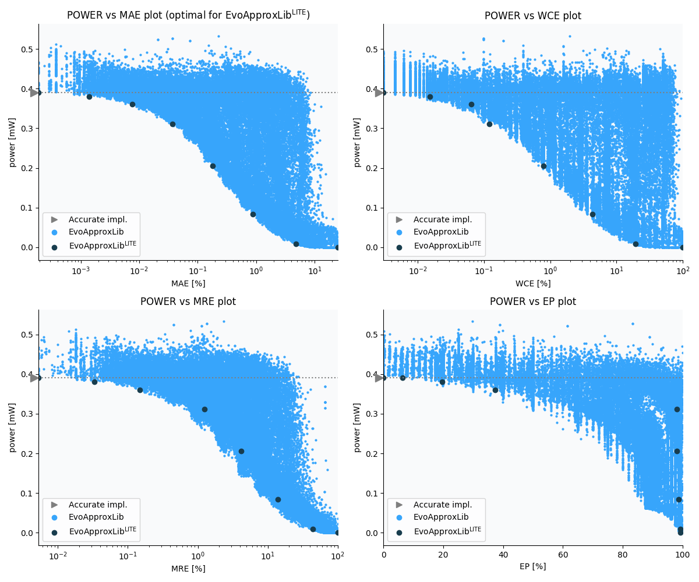

Selected circuits
===================
 - **Circuit**: 8-bit unsigned multiplier
 - **Selection criteria**: pareto optimal sub-set wrt. pwr and mae parameters

Parameters of selected circuits
----------------------------

| Circuit name | MAE% | WCE% | EP% | MRE% | MSE | Download |
| --- |  --- | --- | --- | --- | --- | --- | 
| mul8u_1JJQ | 0.00 | 0.00 | 0.00 | 0.00 | 0 |  [[Verilog](mul8u_1JJQ.v)] [[VerilogPDK45](mul8u_1JJQ_pdk45.v)] [[C](mul8u_1JJQ.c)] |
| mul8u_ZB3 | 0.00019 | 0.0031 | 6.25 | 0.0053 | 0.25 |  [[Verilog](mul8u_ZB3.v)]  [[C](mul8u_ZB3.c)] |
| mul8u_4X5 | 0.0014 | 0.015 | 19.53 | 0.033 | 5.0 |  [[Verilog](mul8u_4X5.v)]  [[C](mul8u_4X5.c)] |
| mul8u_DG8 | 0.0079 | 0.04 | 64.26 | 0.24 | 58 |  [[Verilog](mul8u_DG8.v)]  [[C](mul8u_DG8.c)] |
| mul8u_GTR | 0.045 | 0.19 | 84.95 | 1.23 | 1507 |  [[Verilog](mul8u_GTR.v)]  [[C](mul8u_GTR.c)] |
| mul8u_L93 | 0.24 | 1.19 | 94.98 | 4.52 | 39812 |  [[Verilog](mul8u_L93.v)]  [[C](mul8u_L93.c)] |
| mul8u_18UH | 1.18 | 5.30 | 99.15 | 17.98 | 919691 |  [[Verilog](mul8u_18UH.v)]  [[C](mul8u_18UH.c)] |
| mul8u_17MJ | 6.53 | 27.15 | 99.21 | 53.17 | 29320.446e3 |  [[Verilog](mul8u_17MJ.v)]  [[C](mul8u_17MJ.c)] |
| mul8u_TD3 | 24.81 | 99.22 | 99.22 | 100.00 | 47164.981e4 |  [[Verilog](mul8u_TD3.v)]  [[C](mul8u_TD3.c)] |
    
Parameters
--------------

References
--------------
   - V. Mrazek, R. Hrbacek, Z. Vasicek and L. Sekanina, "EvoApprox8b: Library of approximate adders and multipliers for circuit design and benchmarking of approximation methods". Design, Automation & Test in Europe Conference & Exhibition (DATE), 2017, Lausanne, 2017, pp. 258-261. doi: [10.23919/DATE.2017.7926993](https://dx.doi.org/10.23919/DATE.2017.7926993)

             