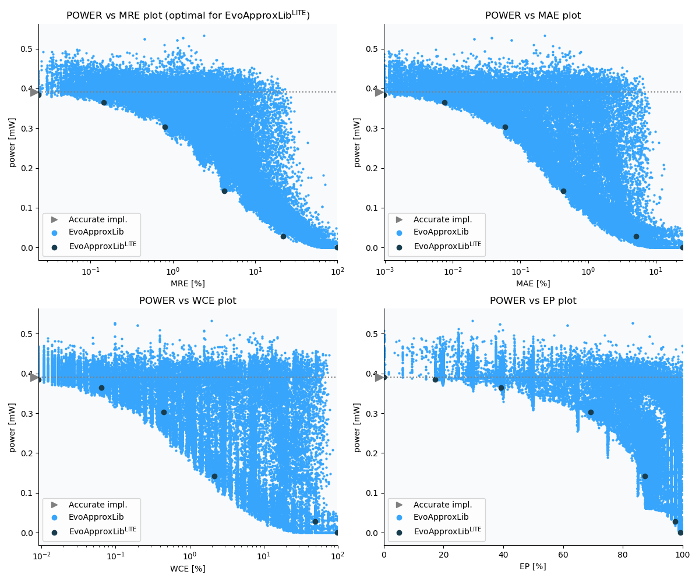

Selected circuits
===================
 - **Circuit**: 8-bit unsigned multiplier
 - **Selection criteria**: pareto optimal sub-set wrt. pwr and mre parameters

Parameters of selected circuits
----------------------------

| Circuit name | MAE% | WCE% | EP% | MRE% | MSE | Download |
| --- |  --- | --- | --- | --- | --- | --- | 
| mul8u_1JJQ | 0.00 | 0.00 | 0.00 | 0.00 | 0 |  [[Verilog](mul8u_1JJQ.v)] [[VerilogPDK45](mul8u_1JJQ_pdk45.v)] [[C](mul8u_1JJQ.c)] |
| mul8u_12YX | 0.00076 | 0.0092 | 14.06 | 0.019 | 2.0 |  [[Verilog](mul8u_12YX.v)]  [[C](mul8u_12YX.c)] |
| mul8u_ZDF | 0.0067 | 0.052 | 40.43 | 0.13 | 61 |  [[Verilog](mul8u_ZDF.v)]  [[C](mul8u_ZDF.c)] |
| mul8u_XFM | 0.067 | 0.40 | 72.03 | 0.82 | 3843 |  [[Verilog](mul8u_XFM.v)]  [[C](mul8u_XFM.c)] |
| mul8u_2NDH | 0.44 | 4.13 | 98.68 | 5.03 | 172520 |  [[Verilog](mul8u_2NDH.v)]  [[C](mul8u_2NDH.c)] |
| mul8u_R36 | 5.84 | 49.27 | 98.75 | 31.87 | 37620.441e3 |  [[Verilog](mul8u_R36.v)]  [[C](mul8u_R36.c)] |
| mul8u_TD3 | 24.81 | 99.22 | 99.22 | 100.00 | 47164.981e4 |  [[Verilog](mul8u_TD3.v)]  [[C](mul8u_TD3.c)] |
    
Parameters
--------------

References
--------------
   - V. Mrazek, R. Hrbacek, Z. Vasicek and L. Sekanina, "EvoApprox8b: Library of approximate adders and multipliers for circuit design and benchmarking of approximation methods". Design, Automation & Test in Europe Conference & Exhibition (DATE), 2017, Lausanne, 2017, pp. 258-261. doi: [10.23919/DATE.2017.7926993](https://dx.doi.org/10.23919/DATE.2017.7926993)
   - M. Ceska, J. Matyas, V. Mrazek, and T. Vojnar,  Designing Approximate Arithmetic Circuits with Combined Error Constraints. In: Proceeding of 25th Euromicro Conference on Digital System Design 2022 (DSD'22). Gran Canaria, 2022.

             