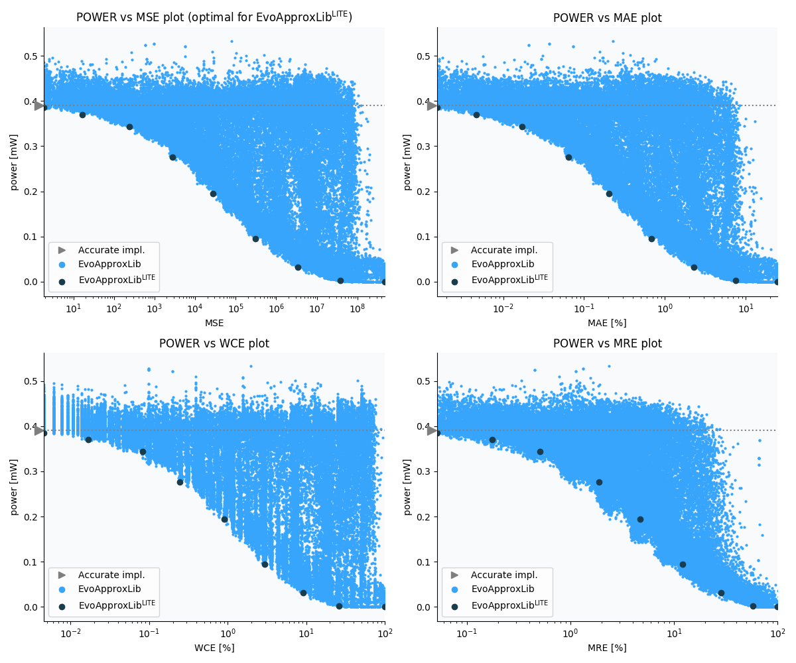

Selected circuits
===================
 - **Circuit**: 8-bit unsigned multiplier
 - **Selection criteria**: pareto optimal sub-set wrt. pwr and mse parameters

Parameters of selected circuits
----------------------------

| Circuit name | MAE% | WCE% | EP% | MRE% | MSE | Download |
| --- |  --- | --- | --- | --- | --- | --- | 
| mul8u_1JJQ | 0.00 | 0.00 | 0.00 | 0.00 | 0 |  [[Verilog](mul8u_1JJQ.v)] [[VerilogPDK45](mul8u_1JJQ_pdk45.v)] [[C](mul8u_1JJQ.c)] |
| mul8u_27Y | 0.0013 | 0.0031 | 56.25 | 0.053 | 1.5 |  [[Verilog](mul8u_27Y.v)]  [[C](mul8u_27Y.c)] |
| mul8u_LK8 | 0.0046 | 0.017 | 75.00 | 0.18 | 17 |  [[Verilog](mul8u_LK8.v)]  [[C](mul8u_LK8.c)] |
| mul8u_C67 | 0.013 | 0.10 | 50.00 | 0.27 | 213 |  [[Verilog](mul8u_C67.v)]  [[C](mul8u_C67.c)] |
| mul8u_NLX | 0.065 | 0.25 | 96.37 | 1.90 | 2764 |  [[Verilog](mul8u_NLX.v)]  [[C](mul8u_NLX.c)] |
| mul8u_19XF | 0.23 | 0.96 | 97.85 | 5.10 | 33655 |  [[Verilog](mul8u_19XF.v)]  [[C](mul8u_19XF.c)] |
| mul8u_17R6 | 0.67 | 2.94 | 99.05 | 12.14 | 305440 |  [[Verilog](mul8u_17R6.v)]  [[C](mul8u_17R6.c)] |
| mul8u_1A0M | 2.88 | 10.99 | 99.20 | 34.69 | 54543.296e2 |  [[Verilog](mul8u_1A0M.v)]  [[C](mul8u_1A0M.c)] |
| mul8u_1SX | 9.71 | 37.58 | 99.86 | 82.45 | 69878.211e3 |  [[Verilog](mul8u_1SX.v)]  [[C](mul8u_1SX.c)] |
| mul8u_TD3 | 24.81 | 99.22 | 99.22 | 100.00 | 47164.981e4 |  [[Verilog](mul8u_TD3.v)]  [[C](mul8u_TD3.c)] |
    
Parameters
--------------

References
--------------
   - V. Mrazek, R. Hrbacek, Z. Vasicek and L. Sekanina, "EvoApprox8b: Library of approximate adders and multipliers for circuit design and benchmarking of approximation methods". Design, Automation & Test in Europe Conference & Exhibition (DATE), 2017, Lausanne, 2017, pp. 258-261. doi: [10.23919/DATE.2017.7926993](https://dx.doi.org/10.23919/DATE.2017.7926993)

             