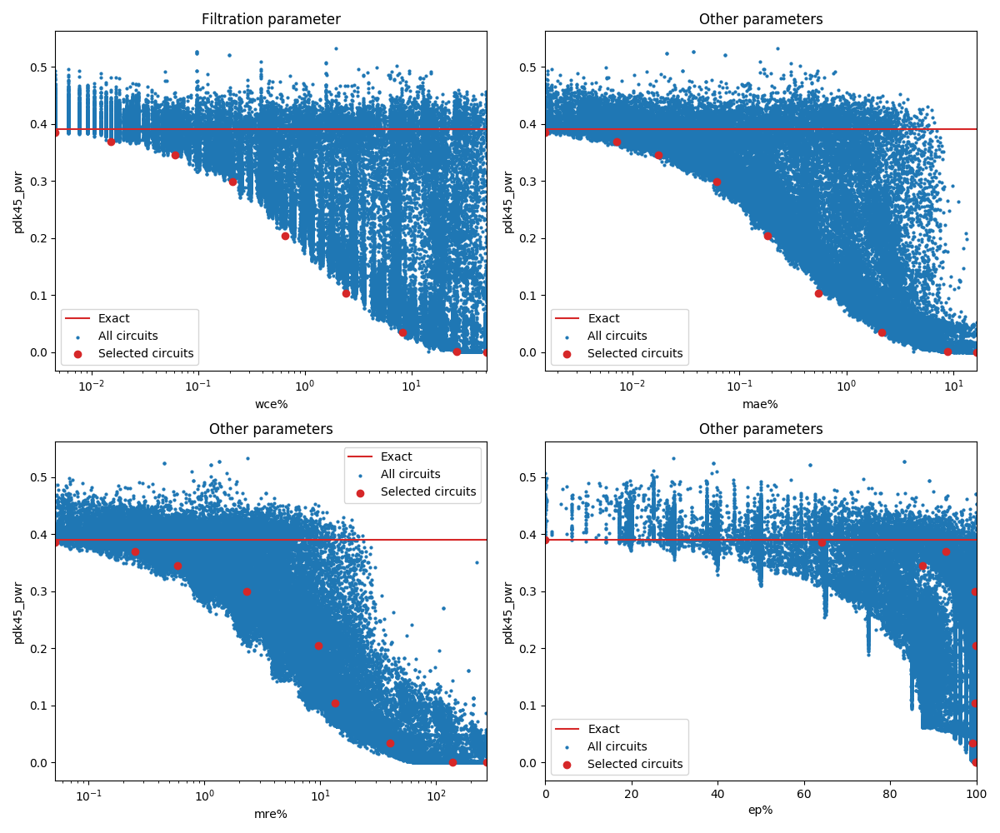

Selected circuits
===================
 - **Circuit**: 8-bit unsigned multiplier
 - **Selection criteria**: pareto optimal sub-set wrt. pwr and wce parameters

Parameters of selected circuits
----------------------------

| Circuit name | MAE% | WCE% | EP% | MRE% | MSE | Download |
| --- |  --- | --- | --- | --- | --- | --- | 
| mul8u_1JFF | 0.00 | 0.00 | 0.00 | 0.00 | 0 |  [[Verilog](mul8u_1JFF.v)] [[VerilogPDK45](mul8u_1JFF_pdk45.v)] [[C](mul8u_1JFF.c)] |
| mul8u_2P7 | 0.0015 | 0.0046 | 64.06 | 0.052 | 1.9 |  [[Verilog](mul8u_2P7.v)]  [[C](mul8u_2P7.c)] |
| mul8u_KEM | 0.0046 | 0.017 | 75.00 | 0.18 | 17 |  [[Verilog](mul8u_KEM.v)]  [[C](mul8u_KEM.c)] |
| mul8u_CK5 | 0.017 | 0.061 | 87.54 | 0.59 | 212 |  [[Verilog](mul8u_CK5.v)]  [[C](mul8u_CK5.c)] |
| mul8u_2HH | 0.057 | 0.18 | 97.72 | 2.56 | 2008 |  [[Verilog](mul8u_2HH.v)]  [[C](mul8u_2HH.c)] |
| mul8u_19DB | 0.18 | 0.66 | 98.37 | 4.42 | 21037 |  [[Verilog](mul8u_19DB.v)]  [[C](mul8u_19DB.c)] |
| mul8u_17KS | 0.56 | 2.41 | 98.99 | 10.85 | 209723 |  [[Verilog](mul8u_17KS.v)]  [[C](mul8u_17KS.c)] |
| mul8u_JV3 | 2.15 | 8.21 | 99.16 | 39.78 | 30865.11e2 |  [[Verilog](mul8u_JV3.v)]  [[C](mul8u_JV3.c)] |
| mul8u_17QU | 8.01 | 27.24 | 99.22 | 59.69 | 42811.074e3 |  [[Verilog](mul8u_17QU.v)]  [[C](mul8u_17QU.c)] |
| mul8u_199Z | 24.81 | 99.22 | 99.22 | 100.00 | 47164.981e4 |  [[Verilog](mul8u_199Z.v)]  [[C](mul8u_199Z.c)] |
    
Parameters
--------------

References
--------------
   - V. Mrazek, R. Hrbacek, Z. Vasicek and L. Sekanina, "EvoApprox8b: Library of approximate adders and multipliers for circuit design and benchmarking of approximation methods". Design, Automation & Test in Europe Conference & Exhibition (DATE), 2017, Lausanne, 2017, pp. 258-261. doi: [10.23919/DATE.2017.7926993](https://dx.doi.org/10.23919/DATE.2017.7926993)

             